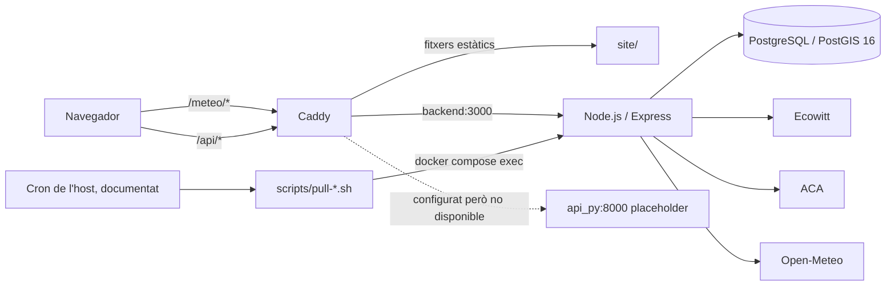

# INSPECCIO-00 - Entorn i arquitectura real de MeteoLord

**Versió:** 1.1
**Estat:** COMPLETADA
**Data d'inspecció:** 2026-09-03
**Abast:** inspecció de només lectura i documentació; sense arrencar serveis, executar migracions, consultar proveïdors externs ni desplegar

## 1. Fonts i criteri d'evidència

S'han llegit íntegrament abans d'inspeccionar el repositori:

- `SPEC-00-mapa-estacions-meteolord.md`, versió 0.3, `CANDIDATA A REFINAMENT`;
- `SPIKE-04-descoberta-grafana-i2cat.md`, versió 1.1, `COMPLETAT`, decisió `VIABLE AMB CONDICIONS`.

La prioritat d'evidència d'aquest document és:

1. codi i configuració versionats;
2. scripts versionats;
3. documentació operativa del repositori;
4. contractes candidats de `SPEC-00` i conclusions condicionals de `SPIKE-04`.

Les afirmacions de la documentació que no tenen un artefacte executable equivalent es classifiquen com a documentades, no com a funcionament verificat. No s'ha llegit cap `.env`, ni s'han mostrat o copiat credencials. Els fitxers de dades històriques s'han classificat per nom i mida, sense incorporar-ne registres a aquesta documentació.

## 2. Repositori i estat inicial

| Element | Resultat comprovat | Evidència |
|---|---|---|
| Arrel | `/home/lab-host/tecnolord-apps` | `pwd` i `git rev-parse --show-toplevel` |
| Branca | `main` | `git branch --show-current` |
| Commit inspeccionat | `ff671611f2bb6ed99dd90fd256306b250b2846ca` | `git rev-parse HEAD` |
| Relació amb remot | `main...origin/main`, tres commits per davant | `git status --short --branch` |
| Working tree inicial | onze fitxers modificats sota `speclord/` | `git status --porcelain=v1` |
| Canvis previs de l'usuari | codi, specs i proves de `speclord/`; no pertanyen a MeteoLord | estat Git inicial |
| `docs/sdd/` | no existia | comprovació de presència abans de documentar |
| `.env` | absent i ignorat per Git | comprovació de presència i `git check-ignore` |
| `.env.example` | present i versionat | `git ls-files --error-unmatch .env.example` |

No s'ha modificat cap canvi preexistent de `speclord/`.

Després del tall tècnic de la inspecció, el commit `beb6aa3 feat: complete T7 markdown recognition speclord` ha passat a ser el `HEAD` observat durant el QA documental. És un canvi legítim, validat i incorporat per l'usuari dins de Speclord; no pertany a MeteoLord, no altera les conclusions tècniques d'aquesta inspecció i no s'ha d'investigar, revertir ni tractar com a canvi inesperat.

## 3. Estructura observada

| Ruta | Funció observada | Estat |
|---|---|---|
| `site/` | frontend MeteoLord estàtic, HTML, CSS i mòduls JavaScript | actiu a la configuració Caddy |
| `backend/` | API Node.js/Express, accés PostgreSQL i ingestes | servei actiu a Compose |
| `backend/db/` | pool PostgreSQL, SQL d'inicialització i un esquema alternatiu | fonts no unificades |
| `pyapi/` | imatge Python | placeholder; no conté una API implementada |
| `scripts/` | ingestes des de cron, alerta, desplegament i migració legacy | scripts operatius/manuals, amb riscos detallats més avall |
| `infra/` | esquema separat per funcionalitats ML | fora del camí d'inicialització de MeteoLord |
| `migration/` | SQL de migració legacy i bolcats de dades | procés manual i incompatible amb part de l'esquema actual |
| `docs/` | documentació històrica de fases, Git i desplegament | parcialment desactualitzada respecte del codi |
| `logs/` | destí local dels scripts de cron i alertes | contingut no inspeccionat |
| `docker-compose.yml` | topologia compartida de tots els serveis Tecnolord | orientada a servidor, no aïllada per a MeteoLord local |
| `Caddyfile` | reverse proxy de dominis productius i servidor estàtic | muntat pel servei `caddy` |
| `Caddyfile.pyapi` | configuració Caddy alternativa per `:80` | no muntada per Compose |

El repositori és un monorepo. A més de MeteoLord hi conviuen OrientaTrack, Entrenador Personal, Opos, Biblioteca, PaP i Umami. El `caddy` de Compose depèn d'aquests serveis veïns, fet que amplia innecessàriament el perímetre d'una arrencada local de MeteoLord. Evidència: [`docker-compose.yml`](../../docker-compose.yml), línies 67-208.

## 4. Arquitectura confirmada

### 4.1 Components i versions confirmables

| Component | Tecnologia/versió confirmable | Evidència i límit |
|---|---|---|
| Backend | Node.js, imatge `node:20-alpine` | [`backend/Dockerfile`](../../backend/Dockerfile), línia 1; la versió de pedaç no està fixada |
| Framework backend | Express `^4.19.2` | [`backend/package.json`](../../backend/package.json), línies 10-16 |
| Driver DB | `pg` `^8.16.3` | [`backend/package.json`](../../backend/package.json), línia 15 |
| Frontend | HTML5, CSS i mòduls JavaScript natius | [`site/index.html`](../../site/index.html), línies 1-25; `site/src/` |
| Base de dades MeteoLord | `postgis/postgis:16-3.4` | [`docker-compose.yml`](../../docker-compose.yml), línies 32-46 |
| Reverse proxy | imatge `caddy:2` | [`docker-compose.yml`](../../docker-compose.yml), línies 176-203; versió menor no fixada |
| API Python | imatge `python:3.11-slim` | [`pyapi/Dockerfile`](../../pyapi/Dockerfile), però només executa un missatge de placeholder |
| Eines de l'host inspeccionat | Git 2.43.0, Node 22.22.2, npm 10.9.7, Python 3.12.3, Docker 29.1.3 i Compose 5.5.0 | comprovació de versions; no són necessàriament les versions productives |

No hi ha `package-lock.json` per al backend i `.gitignore` ignora explícitament aquest tipus de fitxer. Les dependències del backend es resolen amb rangs i el Dockerfile usa `npm install --omit=dev` quan no hi ha lockfile. Per tant, un build futur pot resoldre versions diferents.

### 4.2 Serveis Compose rellevants

| Servei | Funció | Dependències | Estat observat |
|---|---|---|---|
| `db` | PostgreSQL/PostGIS | volum `pgdata`, `backend/db/init.sql` | declarat i sense port publicat |
| `backend` | API Express | `db`, `.env` | declarat; port intern 3000 |
| `caddy` | TLS, proxy i estàtics | backend i tots els serveis web del monorepo | declarat; usa el `Caddyfile` productiu |
| `api_py` | API Python segons Caddy/SPEC | `db` | servei comentat; implementació placeholder |
| `worker` | Prefect | `db` | comentat |
| `mlflow` | servidor MLflow | volum propi | comentat |

Els serveis veïns actius a la mateixa topologia són `orientatrack`, `entrenador_personal_web`, `opos_web`, `biblioteca_web`, `umami_db`, `umami` i `pap_backend`.

## 5. Ports, xarxa i volums

### 5.1 Ports

| Component | Port intern | Publicació host | Evidència |
|---|---:|---|---|
| `backend` | 3000 | no publicat; només `expose` | `docker-compose.yml`, línies 48-65 |
| `db` | 5432 per defecte PostgreSQL | no publicat | imatge de DB i `backend/db/pool.js`, línies 4-10 |
| `api_py` | 8000 | no publicat; servei comentat | `docker-compose.yml`, línies 2-10 |
| `caddy` | 80, 443 i 2019 | `80:80`, `443:443`, `443:443/udp`, `127.0.0.1:2019:2019` | `docker-compose.yml`, línies 176-185 |

En el moment de la inspecció no hi havia cap listener TCP a 80, 443, 2019, 3000, 5432 o 8000. Això només descriu aquell instant; no reserva els ports per a una execució posterior.

### 5.2 Volums

| Volum/muntatge | Ús | Observació de separació |
|---|---|---|
| `pgdata` | dades PostgreSQL de `db` | nom Compose genèric; l'aïllament depèn del nom de projecte Compose |
| `caddy_data` | estat i certificats Caddy | no és específic de local |
| `caddy_config` | configuració interna Caddy | no és específic de local |
| `umami_pgdata` | DB d'Umami | no pertany a MeteoLord |
| `./backend/db/init.sql` | bootstrap automàtic de `db` | només crea `public.measurement`, insuficient per al backend actual |
| `./Caddyfile` | configuració Caddy | conté dominis productius |
| `./site` | estàtics sota `/srv` | muntatge d'escriptura; altres muntatges estàtics sí són `:ro` |

No hi ha cap mecanisme versionat que garanteixi que els noms de projecte, volums, secrets i xarxes locals siguin diferents dels del servidor.

## 6. Rutes confirmades

### 6.1 Caddy

| Ruta/host | Destí |
|---|---|
| `https://tecnolord.cat/meteo*` | `site/` mitjançant `handle_path`, amb fallback a `index.html` |
| `/` a `tecnolord.cat` | redirecció 302 a `/meteo/` |
| `/api/*` i `/api/v1/*` | `backend:3000` |
| `/api/v1/kpis*`, `/api/v1/forecast*`, `/health` | `api_py:8000` |

Evidència: [`Caddyfile`](../../Caddyfile), línies 49-69. La ruta `/health` queda capturada pel handler Python abans del handler general, però `api_py` no és un servei actiu de Compose.

`Caddyfile.pyapi` defineix una topologia diferent a `:80` i envia `/health` al backend Node, però Compose no el munta. No és la configuració efectiva declarada.

### 6.2 Backend Node

| Mètode i ruta | Protecció | Funció |
|---|---|---|
| `GET /api/ping` | pública | resposta de vida simple |
| `GET /health` | pública | prova `SELECT 1`; retorna HTTP 200 i `ok: true` fins i tot amb DB caiguda |
| `GET /api/v1/mesures/darreres` | pública | mesures meteo crues o agregades per hora |
| `GET /api/v1/hidro/darreres` | pública | lectures hidrològiques, rang i fallback |
| `GET /api/v1/previ/48h` | pública | darrera previsió desada |
| `GET /api/v1/previ/past48-next48` | pública | finestra de previsió i passat |
| `POST /api/tasks/pull-ecowitt` i `/tasks/pull-ecowitt` | `INGEST_API_KEY` | ingesta Ecowitt i ACA |
| `POST /api/tasks/pull-aca` i `/tasks/pull-aca` | `INGEST_API_KEY` | ingesta ACA |
| `POST /api/tasks/pull-previ` i `/tasks/pull-previ` | `INGEST_API_KEY` | ingesta Open-Meteo |

Evidència: [`backend/server.js`](../../backend/server.js), línies 100-113, i `backend/routes/`.

Contràriament al que diu `readme.md`, `/api/tasks/*` no és privat de xarxa: el patró públic `/api/*` de Caddy el pot encaminar al backend. La mutació està protegida per API key, però el middleware també accepta la clau al query string, que és més fàcil de filtrar en logs i historials. Evidència: [`backend/middleware/authApiKey.js`](../../backend/middleware/authApiKey.js), línies 1-6.

## 7. Frontend i vista actual de l'estació

El frontend és una SPA sense framework ni pas de build. `site/index.html` fixa `<base href="/meteo/">`; el JavaScript usa endpoints same-origin. No hi ha encaminador client: les pantalles es canvien en memòria, i les rutes `/meteo/cabals` i `/meteo/historics` només s'emeten com a pageviews d'analítica.

La pantalla principal:

- consulta `GET /api/v1/mesures/darreres`;
- accepta `estacio` o `station_id` al query string de la pàgina;
- refresca cada 30 segons;
- mostra antiguitat de l'última dada;
- mostra cards, en aquest ordre: vent, temperatura, pluja, pressió relativa, humitat i índex UV;
- inclou velocitat i ràfega de vent, direcció, sensació, punt de rosada, màxima/mínima diària, pluja de taxa/dia/hora/esdeveniment/setmana/mes/any, pressió absoluta, radiació solar i gràfiques diàries quan hi ha dades;
- representa absència amb un guió llarg, no amb zero.

`CONFIG.defaultEstacio` declara `home`, però la pantalla llegeix l'estació de l'store, que inicialment és buida, i no usa aquest valor per defecte. Sense paràmetre d'estació, l'API retorna mesures de totes les estacions ordenades globalment per instant. En un futur multiestació, aquest comportament s'haurà de tractar explícitament sense assumir que `home` ja s'aplica.

Evidència: [`site/src/config.js`](../../site/src/config.js), línies 14-22; [`site/src/ui/screens/meteoScreen.js`](../../site/src/ui/screens/meteoScreen.js), línies 83-363.

La pantalla `Històrics` ofereix períodes avui, ahir, 7 dies, 30 dies i personalitzat; combina gràfiques meteo/hidro amb taules. L'API agrega per hora quan el rang meteo supera tres dies. Evidència: `site/src/ui/screens/historicsScreen.js` i [`backend/routes/mesures.js`](../../backend/routes/mesures.js), línies 33-44.

El header renderitza un botó “Inicia sessió”, però no se n'ha trobat cap listener ni cap API associada. No hi ha mapa, registre, aprovació, fitxa multiestació ni adaptador Grafana implementats.

El HTML carrega analítica des del domini productiu de Tecnolord i la pantalla principal conté enllaços absoluts cap a producció i un enllaç comercial extern. Això és trànsit extern possible en una prova local de navegador.

## 8. Flux Ecowitt existent

1. Un cron de l'host està documentat com a origen de `scripts/pull-ecowitt.sh` cada 15 minuts. El crontab real no és versionat i no s'ha inspeccionat.
2. L'script executa Node dins del contenidor `backend` i fa `POST http://localhost:3000/api/tasks/pull-ecowitt` amb `x-api-key`.
3. La ruta executa primer Ecowitt i després ACA.
4. El servei Ecowitt exigeix, per al prefix principal, `APPLICATION_KEY`, `API_KEY` i `MAC`; si la font falla o és buida, prova el prefix de fallback quan està configurat.
5. La consulta usa l'endpoint Ecowitt v3 `device/real_time`, `call_back=all`, unitats configurables i timeout per defecte de 15 segons.
6. El servei crea o actualitza implícitament un usuari administratiu, una estació i la pertinença de propietari.
7. Normalitza temperatura, sensació, rosada, humitat, solar, UV, pluja, vent, pressió, bateria i un subconjunt `extres`.
8. Converteix vent de km/h a m/s.
9. Usa l'instant de la resposta Ecowitt i, si no és numèric, l'instant actual en ISO.
10. Insereix a `mesures` i aplica `ON CONFLICT (estacio_id, instant) DO NOTHING`.
11. Si principal i fallback fallen, no insereix i retorna `skipped: true`; la ruta respon 200 en aquest cas.

Evidència principal: [`backend/services/ecowittService.js`](../../backend/services/ecowittService.js) i [`scripts/pull-ecowitt.sh`](../../scripts/pull-ecowitt.sh).

Riscos del contracte actual:

- expressions com `+valor || null` converteixen valors numèrics zero en `null`;
- una marca temporal invàlida cau silenciosament a “ara”;
- el contracte de camps no té tests automatitzats;
- la resposta pública fa `SELECT m.*`, inclòs `extres`, sense capa de projecció pública;
- la ingesta crea un usuari administratiu per efecte lateral i usa un correu per defecte si falta configuració;
- la freqüència de 15 minuts és documentada, però el scheduler real és extern al repositori.

## 9. Planificador, scripts i logs

| Artefacte | Funció confirmada | Límit/risc |
|---|---|---|
| `scripts/pull-ecowitt.sh` | invoca la tasca Ecowitt+ACA i escriu `logs/pull-ecowitt.log` | exigeix contenidor en marxa i API key |
| `scripts/pull-previ.sh` | invoca la tasca de previsió i escriu `logs/pull-previ.log` | exigeix contenidor en marxa i API key |
| `scripts/alerts.sh` | salut web/API, antiguitat de dades, disc/DB i notificació Telegram | acoblat a contenidor i paths de servidor; carrega `.env` |
| `scripts/migrate_legacy.sh` | converteix/importa un bolcat MySQL i migra dades | escriu la sortida a `meteo.sql` dins el directori actual; pot sobreescriure el bolcat si aquest té el mateix nom; usa taules divergents |
| `scripts/deploy.sh` | conté instruccions que es reescriuen a si mateixes i després defineixen un deploy destructiu | executaria `git reset --hard`, build, recreació i prune; no és segur per a aquesta fase ni com a porta de promoció |

El `readme.md` documenta cron de l'usuari `deploy`: Ecowitt cada 15 minuts i previsió cada hora. Com que el crontab no és al repositori, la seva instal·lació i estat són `PENDENT DE CONFIRMAR`.

## 10. Base de dades i migracions

### 10.1 Esquemes trobats

| Fitxer | Objectes principals | Ús automàtic |
|---|---|---|
| `backend/db/init.sql` | `public.measurement` i índex | sí, muntat al directori d'init de PostgreSQL |
| `backend/db/003-esquema-ca.sql` | `auth.usuaris`, `auth.aplicacions`, `auth.membres_app`, `meteo.estacions`, `meteo.membres_estacio`, `meteo.mesures`, `meteo.estacions_hidro`, `meteo.lectures_hidro` | no |
| `scripts/previ.sql` | `forecast_run`, `forecast_hourly`, `forecast_feedback`, sense esquema qualificat | no |
| `infra/schema_ml.sql` | `ml.predictions`, `ml.features` | no |
| `migration/apply_legacy_to_new.sql` | usa `meteo.estacions_meteo`, `meteo.lectures_meteo` i `hidro.*` | no; noms divergents |
| `scripts/migrate_legacy.sh` | usa `meteo.estacions_meteo`, `meteo.lectures_meteo`, `meteo.estacions_hidro`, `meteo.lectures_hidro` i `meteo.pluja_diaria` | manual; noms parcialment divergents |

El backend fixa `search_path TO meteo,auth,public` en cada connexió. Les consultes de runtime esperen `estacions`, `membres_estacio`, `mesures`, `estacions_hidro`, `lectures_hidro`, `forecast_run` i `forecast_hourly`. L'únic SQL aplicat automàticament des d'una DB neta no crea cap d'aquestes relacions.

No s'ha trobat cap eina de migracions, taula de versions, ordre única de migració o test de migració des de zero. Hi ha bolcats SQL d'uns 13,4 MB i dos CSV amb dades històriques. No són fixtures sintètics i no s'han d'assumir aptes per a l'entorn local.

Conclusió: l'aplicació actual no pot arribar a un estat de DB funcional des d'un volum buit només amb `docker compose up`.

## 11. Variables d'entorn identificades

Només es documenten noms, mai valors.

### 11.1 Backend i DB

`NODE_ENV`, `PORT`, `POSTGRES_USER`, `POSTGRES_PASSWORD`, `POSTGRES_DB`, `POSTGRES_HOST`, `POSTGRES_PORT`, `INGEST_API_KEY`, `ADMIN_EMAIL`, `ESTACIO_CODI`, `ESTACIO_NOM`, `STATION_ID`, `STATION_CODE`.

### 11.2 Ecowitt

`ECW_APPLICATION_KEY`, `ECW_API_KEY`, `ECW_MAC`, `ECW_TEMP_UNITID`, `ECW_WIND_SPEED_UNITID`, `ECW_RAINFALL_UNITID`, `ECW_PRESSURE_UNITID`, `ECW_TIMEOUT_MS`.

El codi també admet el prefix de fallback `ECW_FB_` per a `APPLICATION_KEY`, `API_KEY`, `MAC` i overrides d'unitat equivalents.

### 11.3 ACA

`ACA_CODI_CARDENER`, `ACA_CODI_VALLS`, `ACA_CODI_LLOSA`, `ACA_CODI_LLOSA_CABAL`, `ACA_CODI_LLOSA_CAPACITAT`, `ACA_NOM_CARDENER`, `ACA_NOM_VALLS`, `ACA_NOM_LLOSA`.

### 11.4 Previsió

`PREVI_LAT`, `PREVI_LON`, `PREVI_MODEL`, `PREVI_SOURCE`, `PREVI_STATION_CODE`, `PREVI_HOURS`.

### 11.5 Estat de l'exemple

`.env.example` conté les variables PostgreSQL, ACA i previsió, més algunes dels serveis veïns. No conté `INGEST_API_KEY`, la configuració Ecowitt, `ADMIN_EMAIL`, la identificació completa d'estació ni totes les variables exigides pels altres serveis de Compose. A més, proposa `NODE_ENV` i URLs orientats a producció i acaba amb una línia de comentari `//...`, no amb sintaxi de comentari `.env` estàndard.

L'estat de definició real de totes les variables és `PENDENT DE CONFIRMAR`: no existeix `.env` local i no s'ha inspeccionat cap entorn productiu.

## 12. Autenticació i autorització actuals

Fets comprovats:

- les mutacions d'ingesta usen una API key compartida;
- hi ha DDL per a usuaris, hash de contrasenya i membresies amb rols `admin`, `editor` i `lector`;
- la ingesta Ecowitt crea un registre d'usuari administratiu;
- el frontend mostra un botó “Inicia sessió”.

No s'ha trobat:

- endpoint de registre o login;
- verificació de hash de contrasenya;
- sessió, cookie, JWT o revocació;
- middleware d'usuari o rol;
- estats `PENDING`, `APPROVED`, `REJECTED`, `SUSPENDED`;
- rol `SUPERADMIN`;
- protecció CSRF;
- traçabilitat d'aprovacions.

Per tant, el mecanisme d'identitat de `SPEC-00` no està implementat i `DCF-01` continua obert.

## 13. Scripts de desenvolupament, build i proves

| Capacitat | Estat confirmat |
|---|---|
| Arrencada backend | `npm start` → `node server.js` |
| Desenvolupament backend | `npm run dev` → `node --watch server.js` |
| Build backend | inexistent |
| Build frontend | inexistent; estàtics directes |
| Tests backend | cap script ni fitxer de test trobat |
| Tests frontend | cap manifest ni configuració de test |
| Tests DB/migracions | no trobats |
| Tests end-to-end | no trobats |
| Validació Caddy | eina `caddy` no instal·lada a l'host inspeccionat |
| Lint shell/Docker | `shellcheck` i `hadolint` no disponibles |

Validacions de només lectura executades:

- `node --check` sobre tots els `.js` de `backend/` i `site/src/`: sintaxi correcta;
- `bash -n` sobre tots els `scripts/*.sh`: sintaxi correcta;
- `docker compose config --quiet`: fallida perquè falta `.env` i diverses variables no estan definides;
- inventari de ports escoltant: cap coincidència en els ports rellevants en aquell moment.

No s'han executat `npm install`, build d'imatges, serveis, migracions, consultes DB, crons, ingestes, peticions a producció ni cap consulta Grafana.

## 14. Contradiccions i desalineacions

| ID | Fonts en tensió | Resultat de la inspecció | Acció documental proposada |
|---|---|---|---|
| CT-01 | `SPEC-00` diu que `api_py:8000` és accessible | Compose el té comentat i el Dockerfile és placeholder | corregir la descripció de plataforma abans d'aprovar `SPEC-00` |
| CT-02 | Caddy envia `/health` a `api_py` | `api_py` no existeix a la topologia efectiva | definir una única ruta de salut local/productiva |
| CT-03 | Compose promet bootstrap PostgreSQL | el SQL muntat crea `public.measurement`, no les taules del backend | seleccionar un esquema canònic i una cadena de migracions |
| CT-04 | fitxers SQL representen “esquema nou” | hi ha almenys tres vocabularis incompatibles (`measurement`; `estacions/mesures`; `estacions_meteo/lectures_meteo` i `hidro.*`) | no executar migracions fins a resoldre el model canònic |
| CT-05 | README diu `frontend/` | el directori real i muntat és `site/` | actualitzar documentació en una fase autoritzada |
| CT-06 | README diu que `/api/tasks/*` no és públic | Caddy deriva `/api/*` al backend | tractar-lo com a endpoint externament accessible protegit per clau |
| CT-07 | README descriu cron “actual” | el crontab és extern i no versionat | confirmar-lo al servidor només en una fase autoritzada |
| CT-08 | `SPEC-00` pressuposa autenticació/rol futur | el repositori només té API key d'ingesta i DDL no connectat | mantenir `DCF-01` obert i bloquejar el PoC amb `SUPERADMIN` fins que existeixi el control |
| CT-09 | `SPEC-00` exigeix entorn local reproduïble | Compose exigeix `.env`, dominis productius i serveis veïns; la configuració no valida | `SPEC-10` ha de convertir-ho en porta verificable |
| CT-10 | `SPIKE-04` permet PoC local condicionat | no existeixen aïllament local, adaptador, allowlist ni superfície `SUPERADMIN` | no executar el PoC encara |
| CT-11 | `scripts/deploy.sh` es presenta com a deploy | el fitxer és un generador autoescrit i inclou `reset --hard` i prune | no usar-lo; redissenyar-lo en un PLAN posterior |
| CT-12 | `scripts/migrate_legacy.sh` promet conversió | la sortida fixa `meteo.sql` pot coincidir amb l'entrada i destruir-la | no executar-lo sense correcció i prova sobre còpia temporal |

## 15. Riscos prioritzats

| Risc | Nivell | Evidència/impacte |
|---|---|---|
| Inicialització neta de DB impossible | crític | el backend falla perquè falten relacions de runtime |
| Barreja local/producció | crític | dominis Caddy productius, volums genèrics, absència de configuració local i links/analítica productius |
| Publicació accidental futura de Grafana | crític | no existeix encara model `INTERNAL_ONLY` ni filtre públic; el PoC queda bloquejat |
| Deploy destructiu | crític | `scripts/deploy.sh` usa `git reset --hard` i prune i es reescriu |
| Migració legacy destructiva/inconsistent | crític | pot sobreescriure `meteo.sql` i apunta a taules divergents |
| API Python fantasma | alt | Caddy deriva rutes i salut a un servei inexistent |
| Secrets/configuració incomplets | alt | `.env.example` no cobreix el backend ni Compose complet |
| Sense proves automatitzades | alt | no hi ha protecció de regressió, migració o no-publicació |
| Dependències no reproduïbles | alt | rangs de versions i lockfile absent/ignorat |
| Tasques accessibles a través del proxy | alt | la clau és l'únic control; també s'accepta al query string |
| Salut amb fals positiu | alt | DB caiguda retorna HTTP 200 i `ok: true` |
| Zero convertit a nul a Ecowitt | mitjà/alt | pot perdre mesures legítimes de pluja, vent o temperatura |
| Dades reals versionades com a bolcats/CSV | mitjà/alt | no són fixtures sintètics i poden contaminar proves o distribució |
| Scheduler fora del repositori | mitjà | freqüències i execució real no són reproduïbles localment |
| Dependències externes del frontend | mitjà | analítica, enllaços productius i comercials actius en local |
| CORS global permissiu | mitjà | `cors()` s'aplica a tota l'API sense política específica |

## 16. Hipòtesis descartades

- No és cert que hi hagi una API Python funcional al checkout inspeccionat.
- No és cert que `docker compose up` sobre un checkout net prepari l'esquema requerit.
- No és cert que hi hagi un sistema de migracions únic i versionat.
- No és cert que el botó de login impliqui autenticació implementada.
- No és cert que `/api/tasks/*` sigui privat de xarxa darrere del Caddy actual.
- No és cert que hi hagi proves automatitzades de MeteoLord.
- No és cert que `.env.example` sigui suficient per arrencar la topologia declarada.
- No és cert que hi hagi un perfil Compose local limitat a MeteoLord.
- No és cert que hi hagi cap codi, configuració o dada Grafana al repositori inspeccionat.
- No es pot donar per confirmada la freqüència operativa del cron només perquè estigui documentada.

## 17. Elements pendents de confirmar

- esquema PostgreSQL canònic i procedència real de l'esquema productiu;
- ordre i eina futura de migracions;
- crontab efectiu i concurrència de les ingestes;
- contracte Ecowitt productiu complet, inclosos camps, zeros, timestamps i límits (`DCF-05`);
- definició de totes les variables locals i quines són obligatòries per perfil;
- host i port publicat local sense conflictes (`DCF-09`);
- mecanisme per neutralitzar analítica, links productius i egress extern en proves;
- identitat d'accés i implementació real de `SUPERADMIN` (`DCF-01`);
- regla horària (`DCF-03`) i retenció (`DCF-04`);
- límits, unitats, autenticació i abast productiu Grafana (`DCF-06`);
- motor cartogràfic (`DCF-07`) i àmbit geogràfic (`DCF-08`);
- classificació definitiva dels camps comuns/específics de la vista (`DCF-02`);
- estratègia de lockfiles i versions exactes;
- procediment segur de promoció i reversió.

## 18. Índex d'evidències inspeccionades

- arrel: `docker-compose.yml`, `Caddyfile`, `Caddyfile.pyapi`, `.env.example`, `.gitignore`, `readme.md`;
- contenidors: `backend/Dockerfile`, `pyapi/Dockerfile`, `.devcontainer/devcontainer.json`;
- backend: `backend/server.js`, `backend/package.json`, `backend/db/pool.js`, `backend/middleware/authApiKey.js`, `backend/routes/*.js`, `backend/services/*.js`, `backend/utils/*.js`;
- DB: `backend/db/init.sql`, `backend/db/003-esquema-ca.sql`, `scripts/previ.sql`, `infra/schema_ml.sql`, `migration/apply_legacy_to_new.sql`;
- dades/migració classificades sense reutilitzar-ne registres: `scripts/meteo.sql`, `migration/legacy_inserts_mysql.sql`, `migration/legacy_inserts_pg.sql`, `backend/db/*.csv`;
- operació: `scripts/pull-ecowitt.sh`, `scripts/pull-previ.sh`, `scripts/migrate_legacy.sh`, `scripts/deploy.sh`, `scripts/alerts.sh`, `scripts/readme.md`;
- frontend: `site/index.html`, `site/src/config.js`, `site/src/main.js`, `site/src/services/*.js`, `site/src/state/store.js`, `site/src/ui/screens/*.js`, `site/src/ui/components/*.js`, `site/src/ui/format.js`, `site/src/ui/dom.js`;
- documentació existent: `docs/FASE0-1.md`, `docs/github.md`.

## 19. Historial de versions

| Versió | Data | Canvis |
|---|---|---|
| 1.0 | 2026-09-03 | Inspecció inicial del checkout MeteoLord al commit `ff67161`. |
| 1.1 | 2026-09-03 | Nota de traçabilitat sobre `beb6aa3`: commit legítim i validat de Speclord incorporat per l'usuari, aliè a MeteoLord i fora de qualsevol investigació o reversió. Sense canvis a les conclusions tècniques de la inspecció. |

## 20. Conclusió

La base funcional existent és un frontend estàtic sota `/meteo`, una API Express a `backend:3000`, PostgreSQL/PostGIS 16 i ingestes Ecowitt/ACA/Open-Meteo activades mitjançant endpoints de tasca. El checkout no disposa encara d'un entorn MeteoLord local complet, reproduïble i aïllat: falta un esquema canònic migrable des de zero, configuració local completa, un perímetre Compose mínim, proves automatitzades, autenticació d'usuari i una porta segura de promoció. Aquestes mancances bloquegen expressament qualsevol PoC Grafana i qualsevol desplegament.
