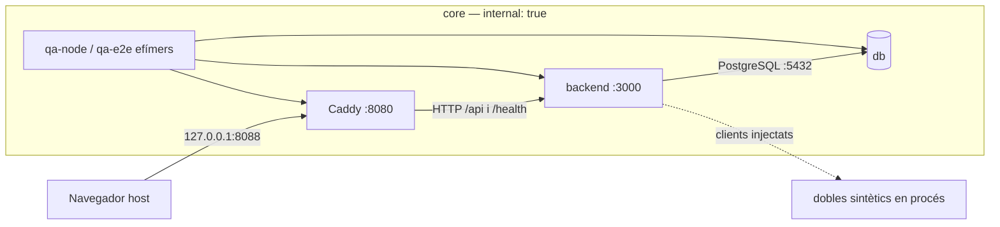

# PLAN-10 — Implementació de l'entorn local de MeteoLord, fase A

**Versió:** 0.5
**Estat:** CANDIDAT A QA
**Data:** 2026-09-05
**SPEC base:** `SPEC-10 v0.3` — APROVADA PER A LA FASE A
**Abast:** FASE A — NUCLI LOCAL
**Baseline documental:** `eeb2da29aec03fa285e018c30e28bcf63ca87f0d`

## 0. Naturalesa, autoritat i límits

Aquest document defineix com s'ha d'implementar la fase A aprovada de `SPEC-10`. No implementa cap canvi, no acredita cap criteri d'acceptació i no autoritza `TASKS-10`, fase B, fase C ni cap actuació externa. Les comandes que conté són comandes previstes per a una implementació futura; no s'han executat durant aquest refinament.

Fonts normatives i d'evidència:

- [SPEC-10 v0.3](./SPEC-10-entorn-local-proves-desplegament-segur.md), aprovada només per a la fase A;
- [QA-10 v1.3](./QA-10-PLAN-10.md), font obligatòria de les set correccions tancades d'aquesta versió;
- [SPEC-00 v0.5](./SPEC-00-mapa-estacions-meteolord.md), només per al nucli actual i l'ordre SDD;
- [INSPECCIO-00 v1.1](./INSPECCIO-00-entorn-meteolord.md);
- [PROJECT-CONTEXT-METEOLORD v1.1](./PROJECT-CONTEXT-METEOLORD.md);
- [QA-00 v1.1](./QA-00-SPEC-10.md);
- [DEFECT-01 v1.0](./DEFECT-01-zeros-ecowitt-convertits-null.md).

No formen part del PLAN: fase B; PoC, adaptador, accés o dades Grafana; `SUPERADMIN`; login; usuaris funcionals; mapa; multiestació; publicació; fase C; servidor; desplegament; promoció; baseline o migració productives; i correcció de `DEFECT-01`. `auth.usuaris` i `meteo.membres_estacio` només reprodueixen efectes del runtime Ecowitt actual i no introdueixen funcionalitat d'identitat.

No s'utilitzaran dades, CSV, bolcats, secrets, cron de l'host, `scripts/deploy.sh`, `scripts/migrate_legacy.sh` ni recursos productius.

## 1. Objectiu i resultat futur

El resultat futur és un entorn local reproduïble, descartable i sense egress que executi:

- el frontend estàtic `site/` sota `/meteo/`;
- el backend Node/Express actual;
- PostgreSQL/PostGIS 16 local;
- les vuit relacions persistents que consumeix el runtime;
- migracions forward-only des d'una DB buida;
- fixtures inventades, dobles de proveïdor i rellotge injectat;
- les tasques Ecowitt, ACA i previsió sense cron ni xarxa exterior;
- liveness, readiness real, logs d'aplicació JSONL i d'infraestructura sanejats, proves per capes i evidències de gate;
- una comprovació bloquejant que Grafana, dades reals, secrets i egress són absents.

La fase A no afirma compatibilitat amb l'esquema productiu ni prepara una promoció.

## 2. Matriu de resolució de QA-10 v1.3

| Correcció QA-10 v1.3 | Severitat | Secció PLAN modificada | Resolució adoptada | Evidència o justificació | Estat |
|---|---|---|---|---|---|
| 01 — `QA13-B01`, namespace dels holders | BLOQUEJANT | 4, 5.1, 5.2 i P10-A-09 | el wrapper resol els cinc IDs complets de contenidor, valida estat, nom, projecte, servei, labels i xarxa, i cada probe usa `--network container:<ID-validat>`; els holders QA continuen sent one-shot identificats pel run ID | cap referència `service:qa-node/qa-e2e` pot crear o seleccionar un contenidor diferent | `RESOLTA` |
| 02 — `QA13-B02`, lock i build productiu | BLOQUEJANT | 3, 4, 6, 14, 15 i P10-A-02 | `backend/Dockerfile` entra al manifest; la base productiva real `node:20-alpine` es resol per digest, es passa com a build arg amb default compatible, i el build amb `npm ci --omit=dev`, inventari i smoke és bloquejant | el lock deixa de canviar un camí productiu no acreditat | `RESOLTA` |
| 03 — `QA13-B03`, cronologia P10/P12 | BLOQUEJANT | 6.5, P10-A-10/12 i 16.1 | P10 executa explícitament `checkpoint`, només sobre evidència P01..P10 i sense declarar gates finals; P12 executa `final` després d'E2E, captura final, precheck i PF10-A-18 | els modes, inputs, artefactes i codis de sortida són disjunts i ordenats | `RESOLTA` |
| 04 — `QA13-B04`, autoescaneig PF10-A-18 | BLOQUEJANT | 13.2 i P10-A-12 | domini funcional exhaustiu separat d'una allowlist de tres fitxers de control; aquests tres reben validació lèxica/imports/URLs pròpia i no poden ser importats pel runtime | cap exclusió cega ni literal del detector pot ocultar una integració funcional | `RESOLTA` |
| 05 — `QA13-M01`, procedència npm | MAJOR | 4, 6 i P10-A-02 | s'adopta npm 11.19.0 inclòs a la imatge Node 24.20.0; no hi ha instal·lació global ni segon artefacte npm | el digest de la imatge fixa el binari i P02 n'exigeix la versió exacta | `RESOLTA` |
| 06 — `QA13-M02`, stdout/stderr | MAJOR | 4, 8.5 i P10-A-09/12 | cada contenidor es captura amb stdout i stderr separats; l'ordre es preserva dins de cada stream i els canònics es concatenen per ordinal de font; no s'afirma cap ordre total entre streams | cada font, stream, ordinal, mida i SHA-256 queda manifestat abans del cleanup | `RESOLTA` |
| 07 — recomptes derivats | MAJOR | 12–17 | el manifest queda en 58 rutes, 40 noves i 18 modificades; 23 compartides; es mantenen 12 passos, 65 traces i 18 casos després de recalcular paths i evidències | l'única ruta afegida és el Dockerfile productiu que ara rep control explícit | `RESOLTA` |

Les set correccions queden resoltes documentalment. Els digests, la disponibilitat dels tags i les proves dinàmiques continuen sent evidències bloquejants abans d'implementar, però el PLAN fixa l'algoritme, l'acceptació i la resposta a fallada; `TASKS-10` no haurà de seleccionar alternatives tècniques.

## 3. Evidència tècnica consolidada

| Àrea | Evidència observada | Conseqüència tancada |
|---|---|---|
| topologia | el Compose global inclou MeteoLord i aplicacions veïnes | Compose dedicat sense herència |
| entrada | el Caddy productiu usa dominis/TLS i `/health` no apunta al backend Node | Caddyfile local de mateix origen |
| DB | l'entrypoint existent no crea el model que usa el runtime | runner i migracions locals independents |
| runtime SQL | hi ha vuit relacions persistents consumides | només aquestes vuit més metadata local |
| dependències | rangs npm, lock absent i base productiva `node:20-alpine` flotant | Node 24 LTS per local/QA, npm incorporat, lock v3 i build productiu Node 20 resolt per digest i acreditat |
| proveïdors | els serveis usen `fetch` i temps globals | clients i rellotge injectats amb defaults reals |
| salut | `/health` pot respondre 200 sense DB | readiness local 200/503 i liveness separada |
| frontend | analítica/recursos externs, atributs `style` i un handler inline | runtime-config local, refactor CSS/listener i CSP estricta |
| dades al build | el context `backend/` conté CSV històrics | `.dockerignore`, allowlist de fixtures i inspecció |
| plataforma | Ubuntu 24.04 x86_64, Docker 29.1.3, Compose 5.5.0 | certificació inicial limitada a aquesta combinació |

## 4. Decisions tècniques finals

Totes les decisions següents tenen estat `RESOLTA AL PLAN`; cap TASK futura en pot canviar el valor sense refinar i tornar a aprovar el PLAN.

| ID | Decisió final |
|---|---|
| `DCF-09` | Ubuntu 24.04, `linux/amd64`, Docker Engine 29.1.3 i Compose 5.5.0; Node 24.20.0 LTS; Compose/Caddy/env/wrapper dedicats; origen host `http://127.0.0.1:8088` i origen E2E intern `http://caddy:8080`; ordres separades de bootstrap i runtime |
| `DLT-01` | model local limitat a les vuit relacions de runtime sota `auth` i `meteo`; metadata a `meteo_local`; no s'infereix producció |
| `DLT-02` | runner Node sobre `pg`; bootstrap intern; lock de sessió `(1297371722, 10)`; checksum SHA-256; una transacció per migració; forward-only |
| `DLT-03` | `db`, `backend`, `caddy` i runners efímers només a `core` amb `internal: true`; cap xarxa `edge`; un volum local per projecte; P09 comparteix cada namespace amb `container:<ID-complet-validat>` i només el probe positiu efímer usa la xarxa de control separada |
| `DLT-04` | Caddy publica només `127.0.0.1:${METEOLORD_HTTP_PORT:-8088}:8080`; backend i DB no publiquen ports; mateix origen per context: host loopback o DNS intern `caddy:8080` |
| `DLT-05` | runtime sense egress; `APP_ENV` és `local` o `test` i `PROVIDER_MODE=synthetic`; certificació atòmica amb un control positiu aïllat i cinc probes negatives sobre IDs inspeccionats; secrets i dades reals bloquejants |
| `DLT-06` | `node:test` de Node 24.20.0 amb cobertura V8/TAP i Playwright 1.62.1; llindars fixos; report `checkpoint` a P10 i report `final` a P12 amb contractes disjunts |
| `DLT-07` | Node local `24.20.0-alpine3.24` amb npm 11.19.0 incorporat, base productiva existent `node:20-alpine`, PostGIS `16-3.4`, Caddy 2.10.2 Alpine i Playwright 1.62.1 Noble, tots resolts per digest real i `linux/amd64`; build productiu amb lock i smoke obligatoris; package i imatge Playwright comparteixen versió |
| `DLT-08` | fixtures JSON inventades amb manifest; temps UTC injectat; cap valor zero es corregeix; `DEFECT-01` només es caracteritza |
| `DLT-09` | CLI manual `run-local-task.js` que compon les mateixes funcions que els endpoints; sense cron |
| `DLT-10` | `/api/ping` és liveness; `/health` és readiness DB local; healthchecks DB/backend/Caddy encadenats |
| `DLT-11` | logs d'aplicació JSONL schema v1 a stdout/stderr; captura crua i canònica separada per stream, amb ordre només intrastream i ordinal de font manifestat; logs d'infraestructura nadius sanejats; driver `local` 10 MiB × 3; evidència 0600 durant almenys 30 dies de rellotge host real; productiu conserva morgan/console |

### 4.1 Model canònic físic

El DDL local usa `search_path=meteo,auth,public` per conservar les consultes no qualificades del runtime, però totes les sentències de migració qualifiquen esquema. No crea `auth.aplicacions`, `auth.membres_app`, `forecast_feedback`, geometries ni objectes legacy.

| Relació | Columnes exactes | Constraints exactes | Índexs addicionals |
|---|---|---|---|
| `auth.usuaris` | `id BIGSERIAL`; `email TEXT NOT NULL`; `nom TEXT`; `actiu BOOLEAN NOT NULL DEFAULT TRUE` | `usuaris_pkey PRIMARY KEY(id)`; `usuaris_email_key UNIQUE(email)` | cap |
| `meteo.estacions` | `id SERIAL`; `codi TEXT NOT NULL`; `nom TEXT`; `creat_per_usuari BIGINT` | `estacions_pkey PRIMARY KEY(id)`; `estacions_codi_key UNIQUE(codi)`; `estacions_creador_fk FOREIGN KEY(creat_per_usuari) REFERENCES auth.usuaris(id) ON DELETE NO ACTION` | cap |
| `meteo.membres_estacio` | `usuari_id BIGINT NOT NULL`; `estacio_id INTEGER NOT NULL`; `rol TEXT NOT NULL`; `creat_el TIMESTAMPTZ NOT NULL DEFAULT now()` | `membres_estacio_pkey PRIMARY KEY(usuari_id,estacio_id)`; `membres_estacio_usuari_fk FOREIGN KEY(usuari_id) REFERENCES auth.usuaris(id) ON DELETE CASCADE`; `membres_estacio_estacio_fk FOREIGN KEY(estacio_id) REFERENCES meteo.estacions(id) ON DELETE CASCADE`; `membres_estacio_rol_check CHECK (rol IN ('propietari','editor','lector'))` | cap |
| `meteo.mesures` | `id BIGSERIAL`; `estacio_id INTEGER NOT NULL`; `instant TIMESTAMPTZ NOT NULL`; `temp_c`, `sensacio_c`, `punt_rosada_c`, `solar_wm2`, `taxa_pluja_mm_h`, `pluja_diaria_mm`, `pluja_event_mm`, `pluja_hora_mm`, `pluja_setmana_mm`, `pluja_mes_mm`, `pluja_any_mm`, `vent_ms`, `vent_rafega_ms`, `pressio_rel_hpa`, `pressio_abs_hpa` com `REAL`; `humitat_pct`, `uvi`, `vent_direccio_graus`, `bateria_pct` com `SMALLINT`; `extres JSONB` | `mesures_pkey PRIMARY KEY(id)`; `mesures_estacio_fk` a `meteo.estacions(id) ON DELETE CASCADE`; `mesures_unic UNIQUE(estacio_id,instant)` | `idx_mesures_estacio_instant(estacio_id,instant DESC)` |
| `meteo.estacions_hidro` | `id SERIAL`; `codi TEXT NOT NULL`; `nom TEXT`; `tipus TEXT NOT NULL`; `activa BOOLEAN NOT NULL DEFAULT TRUE` | `estacions_hidro_pkey PRIMARY KEY(id)`; `estacions_hidro_codi_key UNIQUE(codi)`; `estacions_hidro_tipus_check CHECK (tipus IN ('riu','panta'))` | cap |
| `meteo.lectures_hidro` | `id BIGSERIAL`; `estacio_id INTEGER NOT NULL`; `instant TIMESTAMPTZ NOT NULL`; `cabal_m3s REAL`; `capacitat_pct REAL`; `nivell_m REAL`; `extres JSONB` | `lectures_hidro_pkey PRIMARY KEY(id)`; `lectures_hidro_estacio_fk` a `meteo.estacions_hidro(id) ON DELETE CASCADE`; `lectures_hidro_unic UNIQUE(estacio_id,instant)` | `idx_hidro_estacio_instant(estacio_id,instant DESC)` |
| `meteo.forecast_run` | `id BIGSERIAL`; `source TEXT NOT NULL`; `model TEXT NOT NULL`; `station_code TEXT NOT NULL`; `issued_at TIMESTAMPTZ NOT NULL`; `hours INTEGER NOT NULL DEFAULT 48` | `forecast_run_pkey PRIMARY KEY(id)`; `forecast_run_unic UNIQUE(source,model,station_code,issued_at)`; `forecast_run_hours_check CHECK (hours BETWEEN 1 AND 48)` | `idx_forecast_run_lookup(station_code,source,model,issued_at DESC)` |
| `meteo.forecast_hourly` | `run_id BIGINT NOT NULL`; `valid_time TIMESTAMPTZ NOT NULL`; `temp_c`, `hum_pct`, `wind_ms`, `wind_dir`, `rain_mm` com `REAL` | `forecast_hourly_pkey PRIMARY KEY(run_id,valid_time)`; `forecast_hourly_run_fk` a `meteo.forecast_run(id) ON DELETE CASCADE` | `idx_forecast_hourly_valid(valid_time)` |

La semàntica de conflicte també forma part del contracte físic: `auth.usuaris(email)` conserva la fila i només reassigna `email=EXCLUDED.email`; `meteo.estacions(codi)` i `meteo.estacions_hidro(codi)` només omplen `nom` amb `COALESCE(EXCLUDED.nom, nom_existent)`; `meteo.membres_estacio`, `meteo.mesures` i la càrrega de fixtures fan `DO NOTHING` sobre les claus úniques respectives; `meteo.lectures_hidro` només omple cada valor existent nul amb `COALESCE(valor_existent, EXCLUDED.valor)`; `meteo.forecast_run` actualitza `hours`; i `meteo.forecast_hourly` actualitza els cinc valors meteorològics. Les proves de caracterització fixen aquest comportament abans del refactor; canviar-lo és fora d'abast.

Les columnes omeses respecte d'altres SQL del repositori no són llegides ni escrites pel runtime actual. Afegir-les requeriria una migració forward-only posterior i justificació pròpia. No s'afegeixen checks de rang nous als valors meteorològics perquè això canviaria el contracte funcional; els límits funcionals futurs resten fora de fase A.

`meteo_local.schema_migrations` és metadata del runner, no una novena relació de negoci. Té el contracte de 7.1. Queden exclosos `public.measurement`, el model legacy, taules d'identitat funcional i qualsevol objecte futur.

### 4.2 Catàleg final allowlisted

Després de `0001` i `0002`, el test de catàleg exigeix exactament:

- esquemes d'aplicació `auth`, `meteo`, `meteo_local`;
- nou taules: les vuit anteriors i `meteo_local.schema_migrations`;
- sis seqüències propietat de les columnes `id`: `usuaris_id_seq`, `estacions_id_seq`, `mesures_id_seq`, `estacions_hidro_id_seq`, `lectures_hidro_id_seq`, `forecast_run_id_seq` dins l'esquema corresponent;
- totes i només les constraints i índexs nominats a 4.1, més `schema_migrations_pkey` i `schema_migrations_filename_key`;
- cap vista, vista materialitzada, foreign table, trigger d'aplicació o funció d'aplicació.

La imatge `postgis/postgis:16-3.4` inicialitza `POSTGRES_DB` amb les extensions `plpgsql`, `postgis`, `postgis_topology`, `fuzzystrmatch` i `postgis_tiger_geocoder`; aquesta és l'allowlist completa i immutable de fase A. P10-A-02 inspecciona i registra el hook `/docker-entrypoint-initdb.d/10_postgis.sh`, i P10-A-04 exigeix exactament aquests cinc noms i versions coherents amb la imatge fixada. Si el hook o el conjunt divergeixen, la imatge és incompatible i G10-01/G10-02 bloquegen; no s'amplia l'allowlist.

Només s'exclou de l'inventari d'aplicació un objecte que `pg_depend` vinculi amb `deptype='e'` a una d'aquestes extensions allowlisted. Això inclou els seus objectes sota `public`, `topology`, `tiger` o `tiger_data`; un objecte amb el mateix nom però sense aquesta dependència no queda exclòs. Els catàlegs del sistema tampoc compten. La fase A no executa cap `CREATE EXTENSION`: valida les extensions creades per l'entrypoint i crea exclusivament els objectes d'aplicació anteriors.

## 5. Topologia final sense egress



### 5.1 Contracte de xarxa

| Element | Definició normativa |
|---|---|
| xarxa | una única xarxa Compose `core`, `internal: true` |
| serveis persistents | `db`, `backend` i `caddy`, tots només a `core` |
| runners | `qa-node` i `qa-e2e`, perfil `qa`, efímers, sense ports, només a `core`; P09 crea dos holders one-shot amb `docker compose run --detach --no-deps --name <nom-derivat>`, comanda `node test/helpers/egressProbe.js --hold` i autotancament màxim de 60 s |
| identitat dels namespaces | `docker compose ps -q` resol `db`, `backend` i `caddy`; la sortida de cada `compose run --detach` resol el holder QA. Cada ID ha de ser un únic identificador complet de 64 hex i superar `docker inspect` de nom, estat running, projecte, servei, labels de fase/run i connexió exclusiva a `core` |
| probes | un one-shot per cadascun dels cinc IDs validats amb Docker `--network container:<ID-complet>`; no s'usa `network_mode: service:<servei>` ni es torna a resoldre el servei durant la finestra. Un sisè probe de control és l'únic contenidor connectat a la xarxa efímera no interna |
| port host | només Caddy: `127.0.0.1:${METEOLORD_HTTP_PORT:-8088}:8080`; valor admès 1024–65535 |
| ports absents | cap `ports:` per a backend o PostgreSQL |
| Caddy → backend | `http://backend:3000` dins `core` |
| backend → DB | host `db`, port 5432, dins `core` |
| navegador host | origen únic `http://127.0.0.1:${METEOLORD_HTTP_PORT:-8088}`; API relativa `/api` |
| navegador `qa-e2e` | origen únic `http://caddy:8080` dins `core`; API relativa `/api`; no usa el loopback del contenidor |
| filesystem | `site/` i configuració muntats read-only; únic volum persistent `${project}_pgdata` |
| privilegis | `read_only`, `tmpfs` acotat, `cap_drop: [ALL]` i `no-new-privileges` sempre que la imatge ho permeti; qualsevol excepció exigeix nou QA |

`internal: true` impedeix que Docker instal·li connectivitat exterior per aquesta xarxa, però la publicació d'un port host és una funció separada del motor. Per això no es dona per demostrada la combinació: `topology-preflight` crea una xarxa interna temporal, arrenca per digest una resposta Caddy mínima amb `--pull=never`, publica un port loopback lliure, comprova HTTP des de l'host i prova egress des del seu namespace. No fa cap petició de proveïdor.

Si el preflight falla, l'alternativa segura ja seleccionada és el mode `qa-internal`: no publica cap port, executa HTTP i Playwright des de `qa-e2e` contra `http://caddy:8080` dins `core` i manté bloquejada l'acceptació de navegador host. No s'autoritza crear `edge`, usar `network_mode: host` ni donar egress a Caddy; caldrà refinar el PLAN abans de certificar l'accés manual.

### 5.2 Certificació atòmica d'egress

La prova no usa `.invalid` ni TEST-NET, perquè el seu fracàs no demostra aïllament. El bootstrap només resol i descarrega artefactes. La certificació d'egress s'executa una sola vegada a P10-A-09, quan els cinc namespaces existeixen, i és l'única excepció posterior: només un probe de control efímer pot tenir egress; cap servei ni runner de runtime entra mai a la seva xarxa.

`bootstrap-artifacts` selecciona un dels registres d'imatges ja necessaris com a sentinella i desa només hostname, port TLS 443 i criteri de validació, sense executar el control ni conservar adreces que podrien quedar obsoletes. No s'envien credencials ni peticions d'API.

Protocol exacte de `egress-check --all-namespaces`:

1. resol una sola vegada els IDs complets de `db`, `backend` i `caddy` amb `docker compose ps -q`; crea `qa-node` i `qa-e2e` amb `docker compose run --detach --no-deps --pull never --name "${project}-<servei>-egress-${run_id}" <servei> node test/helpers/egressProbe.js --hold`, des del `WORKDIR /app` immutable de les imatges QA, i conserva l'ID complet retornat per cada ordre;
2. per als cinc parells servei/ID, exigeix regex `^[0-9a-f]{64}$`, un sol resultat, estat `running`, nom exacte, labels Compose `project`/`service`, labels `meteolord.phase=a` i `meteolord.run-id`, i una sola xarxa igual a `${project}_core` amb `Internal=true`; qualsevol discrepància elimina només els holders validats i bloqueja abans del probe;
3. marca els cinc IDs com a variables internes read-only, registra `window_started_at` amb rellotge monotònic del wrapper i crea `meteolord-egress-control-<run-id>`, `internal: false`, amb labels de fase/run i sense connexió a cap servei runtime;
4. executa la imatge de probe fixada per digest en un contenidor one-shot connectat exclusivament a la xarxa de control; resol el hostname en aquell instant, registra les IP sanejades i exigeix connexió TCP/TLS 443 en menys de 3 s;
5. sense eliminar encara la xarxa de control, executa cinc contenidors de la mateixa imatge amb `docker run --rm --pull=never --network "container:${holder_id}"`, un per ID read-only; cada negatiu rep el hostname i les IP acabades de resoldre i intenta DNS i TCP:443 amb timeout de 3 s. No accepta nom curt, ID aportat per l'usuari, substitució de shell no validada ni referència `service:`;
6. després de cada negatiu torna a inspeccionar que l'ID holder continua running i amb la mateixa identitat; qualsevol DNS o connexió TCP reeixida és `FAIL`, i un control positiu fallit és `BLOQUEJAT PER EVIDÈNCIA`, mai PASS;
7. captura `ip route`, `/etc/resolv.conf` sanejat, el `HostConfig.NetworkMode=container:<ID>` de cada probe i `docker network inspect`; `core` ha de tenir `Internal=true`, cap runtime pot compartir la xarxa de control i cap namespace runtime pot tenir una segona xarxa o ruta exterior;
8. inspecciona el gateway de `core`: si és accessible, només es registra com a superfície host local; una sonda host temporal aleatòria comprova els ports locals exposats i falla davant hostname, mount o port productiu, sense confondre host local amb Internet;
9. registra `window_finished_at`, exigeix una durada monotònica total ≤60 s, elimina primer el probe/xarxa de control i després, per ID i nom validats, els dos holders QA; confirma que els tres IDs persistents no han canviat i que només `core` continua present;
10. P10-A-11 prova separadament la xarxa del navegador: en context host només permet el seu origin loopback; en `qa-e2e` només permet `http://caddy:8080`; qualsevol altre origin, DNS, socket, request, websocket, worker o navegació és `FAIL`.

L'únic joc canònic d'evidències de contenidor és `security/control-positive.json`, `security/namespace-{db,backend,caddy,qa-node,qa-e2e}.json` i `security/routes.json`. Tots sis resultats contenen el mateix `run_id`, `window_started_at`, `window_finished_at`, sentinella i hash de la imatge de probe. `frontend/network.json` és l'evidència posterior i separada del navegador. No existeixen `bootstrap/control-positive.json` ni `topology/control-positive.json`. Un namespace omès, una finestra superior a 60 s, un sentinella no disponible, una ruta no explicada o un recurs de control restant bloqueja G10-04.

La xarxa del runtime només s'activa després de `bootstrap-artifacts`. A partir d'aquell punt totes les ordres Compose duen `--pull never` i no inclouen `build`; l'única xarxa no interna admesa és la xarxa efímera de control creada i eliminada dins P09. Un artefacte absent o qualsevol altra excepció bloqueja amb codi 69.

## 6. Versions, artefactes, lockfile i cobertura

### 6.1 Matriu de productes seleccionats

| Producte | Referència de font seleccionada | Plataforma | Pin final obligatori | Compatibilitat |
|---|---|---|---|---|
| Node local/QA | `node:24.20.0-alpine3.24` | `linux/amd64` | digest de manifest i de plataforma | runtime LTS mantingut fins al 2028; incorpora els flags de cobertura requerits |
| npm local/QA | `11.19.0` incorporat a Node 24.20.0 | dins la imatge Node fixada | mateix digest de la imatge; evidència exacta `npm --version` | no s'instal·la ni substitueix npm; crea lockfile v3 i executa `npm ci` |
| Node productiu de compatibilitat | `node:20-alpine`, default real de `backend/Dockerfile` | `linux/amd64` | digest de manifest i de plataforma resolt al bootstrap | no selecciona una nova versió productiva; acredita el camí real amb el lock nou |
| PostgreSQL/PostGIS | `postgis/postgis:16-3.4` | `linux/amd64` | digest de manifest i de plataforma | PostgreSQL major 16 exigit |
| Caddy | `caddy:2.10.2-alpine` | `linux/amd64` | digest de manifest i de plataforma | conté Caddy i utilitat HTTP verificada al bootstrap |
| Playwright package | `@playwright/test@1.62.1` | Node 24 | entrada exacta al lockfile | coincideix exactament amb la imatge i suporta Node ≥18 |
| Playwright image | `mcr.microsoft.com/playwright:v1.62.1-noble` | `linux/amd64` | digest de manifest i de plataforma | navegadors 1.62.1 i Node major 24 verificat a P02 |

Els tags són seleccions de font, no evidència immutable. La disponibilitat, el digest i la compatibilitat encara s'han d'obtenir a P10-A-02; cap valor desconegut s'omple amb un exemple.

La selecció es justifica amb fonts oficials consultades el 2026-09-05: [Node 24.20.0](https://nodejs.org/en/blog/release/v24.20.0) és una release LTS i el seu [arxiu de distribució](https://nodejs.org/download/archive/v24.20.0) declara npm 11.19.0 incorporat; el [calendari del Node.js Release Working Group](https://github.com/nodejs/Release#release-schedule) manté Node 24 fins al 2028; els flags de llindar consten a la [CLI de Node](https://nodejs.org/api/cli.html); i [Playwright 1.62.1 Noble](https://mcr.microsoft.com/en-us/artifact/mar/playwright/tag/v1.62.1-noble) existeix amb package 1.62.1 corresponent. `node:20-alpine` no és una nova selecció funcional: és la referència literal del Dockerfile productiu actual i només es resol per construir-ne una còpia local de compatibilitat. Aquestes referències només seleccionen fonts; P02 ha de tornar-ne a demostrar disponibilitat, plataforma, versions internes i digests, sense copiar cap digest de la documentació.

### 6.2 Contracte d'`images.lock`

`config/meteolord/images.lock` és un dotenv ASCII/UTF-8 sense cometes, expansió, espais ni comentaris després del valor. Només admet les claus següents, una vegada i en aquest ordre:

```dotenv
METEOLORD_IMAGES_LOCK_VERSION=1
METEOLORD_PLATFORM=linux/amd64
NODE_SOURCE=node:24.20.0-alpine3.24
NODE_INDEX_DIGEST=sha256:<64-hex>
NODE_PLATFORM_DIGEST=sha256:<64-hex>
NODE_IMAGE=node@sha256:<64-hex>
PRODUCT_NODE_SOURCE=node:20-alpine
PRODUCT_NODE_INDEX_DIGEST=sha256:<64-hex>
PRODUCT_NODE_PLATFORM_DIGEST=sha256:<64-hex>
PRODUCT_NODE_IMAGE=node@sha256:<64-hex>
POSTGIS_SOURCE=postgis/postgis:16-3.4
POSTGIS_INDEX_DIGEST=sha256:<64-hex>
POSTGIS_PLATFORM_DIGEST=sha256:<64-hex>
POSTGIS_IMAGE=postgis/postgis@sha256:<64-hex>
CADDY_SOURCE=caddy:2.10.2-alpine
CADDY_INDEX_DIGEST=sha256:<64-hex>
CADDY_PLATFORM_DIGEST=sha256:<64-hex>
CADDY_IMAGE=caddy@sha256:<64-hex>
PLAYWRIGHT_SOURCE=mcr.microsoft.com/playwright:v1.62.1-noble
PLAYWRIGHT_INDEX_DIGEST=sha256:<64-hex>
PLAYWRIGHT_PLATFORM_DIGEST=sha256:<64-hex>
PLAYWRIGHT_IMAGE=mcr.microsoft.com/playwright@sha256:<64-hex>
NPM_VERSION=11.19.0
PLAYWRIGHT_VERSION=1.62.1
```

Els tokens `<64-hex>` només documenten el format i fan invàlid el fitxer si romanen presents. `validate-local-config.js image-lock` llegeix amb `readFile`, rebutja claus extra/absents/duplicades, exigeix `sha256:` més 64 hex minúscules, comprova que `*_IMAGE` conté exactament el repositori i `*_INDEX_DIGEST`, i emet JSON sanejat. El wrapper no usa `source`, `eval` ni substitució de shell: llegeix línia a línia amb `IFS='='`, valida la clau contra l'allowlist i passa valors entre cometes.

Consum únic:

- Compose s'invoca sempre amb `--env-file config/meteolord/images.lock` i usa `${POSTGIS_IMAGE}`, `${CADDY_IMAGE}` i `${PLAYWRIGHT_IMAGE}`;
- `backend/Dockerfile.local` declara `ARG NODE_IMAGE` abans de `FROM ${NODE_IMAGE}`;
- `backend/Dockerfile.e2e` declara `ARG PLAYWRIGHT_IMAGE` abans de `FROM ${PLAYWRIGHT_IMAGE}`;
- `backend/Dockerfile` declara `ARG NODE_IMAGE=node:20-alpine` abans de `FROM ${NODE_IMAGE}`: el default preserva la referència productiva actual, mentre P02 li passa exclusivament `${PRODUCT_NODE_IMAGE}` per al build local de compatibilitat; substitueix `COPY . ./` per una allowlist equivalent de runtime (`server.js`, `db/pool.js`, `middleware/`, `routes/`, `services/`, `utils/`, `providers/` i `lib/`) i no copia proves, fixtures, migracions locals, SQL o CSV;
- el wrapper obté els tres build args del parser validat i compara les imatges resoltes amb els digests del lock;
- cap tag o digest es duplica a Compose, Dockerfiles o un segon env.

### 6.3 Resolució, inspecció i bootstrap

Per cada `*_SOURCE`, dins un directori temporal mode 0700, `bootstrap-artifacts` executa dues vegades:

```bash
docker buildx imagetools inspect --format '{{json .Manifest}}' REFERENCIA
docker buildx imagetools inspect --raw REFERENCIA
```

`validate-local-config.js image-lock resolve --platform linux/amd64` rep els dos fitxers de cada ronda. Del primer extreu el digest de l'índex; del JSON raw selecciona exactament una entrada amb `os=linux`, `architecture=amd64` i variant absent, i n'extreu el digest de plataforma. Dues rondes han de donar els mateixos valors. Després del pull explícit, `docker image inspect` ha de confirmar `linux/amd64` i el `RepoDigest` de l'índex.

Per cada valor `locked_image` retornat pel parser i cada `inspect_name` derivat del run ID, el wrapper executa exactament:

```bash
docker image inspect --format '{{json .}}' "$locked_image"
docker history --no-trunc --format '{{json .}}' "$locked_image" > "$scan_tmp/history.jsonl"
docker image save --output "$scan_tmp/image-layers.tar" "$locked_image"
docker create --name "$inspect_name" --network none --label meteolord.phase=a --label meteolord.run-id="$run_id" "$locked_image"
docker export --output "$scan_tmp/rootfs.tar" "$container_id"
tar -tf "$scan_tmp/image-layers.tar"
tar -tf "$scan_tmp/rootfs.tar"
```

`scan_tmp` és un directori temporal 0700 sota `/tmp`, creat pel wrapper i verificat amb `realpath`; no és l'arbre d'artefactes definitiu. `container_id` ha de coincidir amb l'ID retornat per `docker create` i amb nom/labels inspeccionats abans de l'export i abans d'eliminar-lo. La imatge no s'inicia.

`validate-local-config.js image-scan` aplica tres controls acumulatius:

1. **historial:** parseja cada JSON de `docker history`, rebutja secrets, URLs amb credencials, valors sensibles a `CreatedBy`, build args no allowlisted i instruccions `ADD` remotes;
2. **capes:** valida primer que l'archive exterior i cada `layer.tar` no contenen paths absoluts, `..`, dispositius ni enllaços que escapin; llista cada capa per separat i escaneja noms i contingut via streams, inclosos whiteouts i fitxers posteriorment eliminats, sense restaurar-los al repositori;
3. **filesystem final:** escaneja el `docker export` i comprova l'allowlist final, inclòs el hook PostGIS que s'extreu només al temporal per obtenir-ne el hash i el catàleg d'extensions.

Els tres temporals són mode 0600 i s'eliminen tant en èxit com en error. Només després d'un scan sense coincidències es publiquen resultats sanejats: `bootstrap/images.json`, `bootstrap/image-history.json`, `bootstrap/image-layers.json` i `bootstrap/image-files.json`, amb hashes dels arxius temporals, paths, layer IDs i veredictes però mai contingut sensible. Qualsevol coincidència bloqueja G10-05, conserva només el tipus de detector i elimina immediatament el material cru.

Ordre:

1. validar host/plataforma i resoldre digests;
2. escriure i tornar a validar `images.lock`;
3. comprovar que la imatge Node local incorpora exactament npm 11.19.0, generar/revisar el lock amb aquest binari i executar `npm ci`, sense cap `npm install --global` ni descàrrega d'un segon npm;
4. construir les imatges local i E2E amb els build args immutables; construir també la imatge de compatibilitat amb l'ordre planificada `docker buildx build --platform linux/amd64 --pull=false --load --build-arg NODE_IMAGE="$product_node_image" --file backend/Dockerfile --tag "$product_compat_image" backend`, on ambdues variables provenen del parser read-only i el tag compleix `meteolord-product-compat:<commit>-<run-id>`; exigir que el log mostra `npm ci --omit=dev` en lloc de la branca `npm install`;
5. executar `docker image inspect` i `docker history --no-trunc`;
6. desar temporalment totes les capes amb `docker image save` i escanejar cada `layer.tar`;
7. crear un contenidor d'inspecció amb `docker create --network none`, sense `docker start`;
8. llistar i escanejar el filesystem final amb `docker export`; extreure i hashejar al temporal, sense executar-lo, `/docker-entrypoint-initdb.d/10_postgis.sh` per comprovar l'allowlist de 4.2; eliminar només el contenidor d'inspecció etiquetat i tots els temporals crus;
9. verificar Caddy `wget`, Node 24.20.0, npm 11.19.0 incorporat, package/imatge Playwright 1.62.1, Node major 24 dins `qa-e2e` i tots els flags de cobertura de 6.5; en la imatge productiva de compatibilitat, registrar la versió Node/npm fixada pel digest, executar `npm ls --omit=dev` i un smoke d'arrencada sobre la DB local sense invocar tasques ni proveïdors;
10. registrar el sentinella que usarà P09, sense executar encara cap control positiu;
11. tancar bootstrap i executar `runtime-preflight --pull never --no-build`.

Els tres outputs construïts reben només noms locals derivats del commit/run ID i labels `meteolord.phase=a`, `meteolord.purpose={runtime,e2e,product-compat}`. Tots tres passen el mateix pipeline d'`inspect`, historial, capes i filesystem final; l'output `product-compat` ha de contenir el lock, excloure devDependencies de `node_modules` i conservar `CMD ["npm","start"]`. El seu smoke s'executa només a `core`, contra la DB local, amb mode sintètic absent i sense invocar cap endpoint de tasca; només acredita arrencada, `/api/ping`, inventari npm i absència d'intent d'egress.

No es genera SBOM perquè cap eina SBOM forma part de la plataforma acreditada ni ho exigeix SPEC-10. L'inventari reproduïble és `npm ls --all --json`, `npm ls --omit=dev --json` per l'output productiu, `docker image inspect`, `docker history`, el scan de capes i la llista del filesystem exportat. Qualsevol pull, build o resolució npm després del punt 11 bloqueja. No s'accepten `latest`, tags al Compose resolt ni una plataforma diferent.

### 6.4 `package-lock.json`

La primera generació es fa en un checkout sense `node_modules`, dins la imatge Node fixada i amb el seu npm 11.19.0 incorporat, sense instal·lar o substituir npm, amb `PLAYWRIGHT_SKIP_BROWSER_DOWNLOAD=1` i:

```bash
npm install --package-lock-only --ignore-scripts
npm ci --ignore-scripts
npm ls --all --json
```

El primer lock és una baseline nova, no una reproducció acreditada de la instal·lació productiva desconeguda. S'ha de revisar que és v3, només incorpora el canvi de manifest aprovat, fixa totes les transitives, no conté URLs locals/credencials i supera els contractes de producte abans/després. Després de l'acceptació inicial, tota instal·lació és `npm ci`; queda prohibit regenerar el lock silenciosament.

Com que el lock canònic queda a `backend/package-lock.json`, P02 tracta el seu efecte productiu com a canvi compartit, no com a detall local. Abans d'acceptar-lo ha de construir `backend/Dockerfile` amb la base productiva resolta per digest, demostrar que la branca executada és `npm ci --omit=dev`, comparar `npm ls --omit=dev` amb les dependències directes de producció i superar el smoke d'arrencada local amb defaults productius. La imatge resultant només rep labels de QA, no es publica ni es desplega; qualsevol incompatibilitat obliga a refinar el PLAN o el manifest, no permet tornar silenciosament a `npm install`.

Una actualització de Node, npm, Playwright, PostGIS, Caddy, tag o digest és un canvi únic i auditable: actualitza matriu, `images.lock`, lock npm si escau, inventaris i totes les proves; no es fa automàticament.

### 6.5 Cobertura, sintaxi i rendiment

El wrapper defineix els paths absoluts validats `repo_root` i `artifact_dir`, crea primer `$artifact_dir/tests/v8` i `$artifact_dir/lint` amb `install -d -m 0700` i aplica umask 0077. P10 és inequívocament un **checkpoint**, no la gate final. El runner usa `node:test` de Node 24.20.0 i aquests sis fitxers explícits:

```bash
METEOLORD_SECURITY_MODE=checkpoint \
node --experimental-test-coverage --test \
  --test-coverage-include=server.js \
  --test-coverage-include=db/pool.js \
  --test-coverage-include=db/migrate.js \
  --test-coverage-include=scripts/validate-local-config.js \
  --test-coverage-include=scripts/load-local-fixtures.js \
  --test-coverage-include=scripts/run-local-task.js \
  --test-coverage-include=scripts/phase-a-report.js \
  --test-coverage-include=providers/syntheticProvider.js \
  --test-coverage-include=lib/logger.js \
  --test-coverage-include=middleware/requestContext.js \
  --test-coverage-include=routes/health.js \
  --test-coverage-include=routes/tasks.js \
  --test-coverage-include=services/ecowittService.js \
  --test-coverage-include=services/acaService.js \
  --test-coverage-include=services/previService.js \
  --test-coverage-exclude='test/fixtures/*' \
  --test-coverage-exclude='test/helpers/*.js' \
  --test-coverage-lines=90 \
  --test-coverage-functions=90 \
  --test-coverage-branches=85 \
  --test-reporter=tap \
  --test-reporter-destination="$artifact_dir/tests/node.tap" \
  test/unit/config.test.js \
  test/unit/providers.test.js \
  test/integration/migrations.test.js \
  test/integration/tasks.test.js \
  test/http/routes.test.js \
  test/security/logs-egress.test.js

node scripts/phase-a-report.js \
  --mode checkpoint \
  --coverage "$artifact_dir/tests/v8" \
  --evidence-root "$artifact_dir" \
  --output "$artifact_dir/tests/checkpoint.json" \
  --plan /workspace/docs/sdd/PLAN-10-entorn-local-fase-a.md \
  --fixtures test/fixtures/manifest.json
```

`repo_root` i `artifact_dir` són variables internes read-only del wrapper, no arguments ni variables d'entorn lliures. `METEOLORD_SECURITY_MODE` només admet `checkpoint` en aquesta ordre i `final` a P12; valor absent o diferent retorna 64. El wrapper estableix `NODE_V8_COVERAGE="$artifact_dir/tests/v8"` només per al primer procés. En `qa-node`, Compose munta només aquest PLAN read-only a `/workspace/docs/sdd/PLAN-10-entorn-local-fase-a.md` i el directori del run read-write; no munta tot el repositori. El report llegeix les dues taules de la secció 13; el manifest de fixtures és una entrada separada i no es presenta com a fitxer de traçabilitat.

En mode `checkpoint`, `logs-egress.test.js` només valida les fonts, la redacció i les evidències d'egress ja generades a P09; no executa PF10-A-18 ni accepta inputs substitutius. `phase-a-report.js --mode checkpoint` exigeix els 65 IDs i els 18 casos al PLAN, però només reclama evidència per requisits/casos amb pas primari P01..P10. Marca explícitament P11/P12 i G10-03/G10-05/G10-06/G10-08 com `PENDING_FINAL`, mai `PASS`; rebutja un artefacte futur present abans d'ordre i no genera `manifest.json` ni `summary.md`. Exit 0 significa només que el checkpoint és coherent i permet P11; qualsevol FAIL/BLOCKED o PASS final prematur retorna 1.

Condicions acumulatives:

- codi de sortida zero i cap test omès entre els obligatoris;
- global mínim: 90% línies, 90% funcions i 85% branques;
- els mòduls crítics `db/migrate.js`, `scripts/validate-local-config.js`, `providers/syntheticProvider.js`, `routes/health.js`, `routes/tasks.js` i els tres serveis han d'aparèixer i assolir individualment els mateixos llindars;
- el checkpoint de traçabilitat ha de trobar evidència per cada RF/RNF/CA A aplicable fins a P10 i marcar la resta `PENDING_FINAL`; només el report final de P12 pot exigir i acreditar tots els aplicables;
- cobertura de codi i traçabilitat es reporten separadament; una no compensa l'altra.

P10-A-02 executa `node --help` dins la imatge bloquejada i exigeix literalment `--experimental-test-coverage`, `--test-coverage-include`, `--test-coverage-exclude`, `--test-coverage-lines`, `--test-coverage-functions`, `--test-coverage-branches`, `--test-reporter` i `--test-reporter-destination`; després executa un microtest sintètic que força un llindar fallit i un altre que el supera. Qualsevol flag absent o llindar que no canviï el codi de sortida bloqueja abans d'implementar proves; no es permet substituir el mecanisme a les TASKS.

Sintaxi/configuració, en aquest ordre:

```bash
find backend site/src -type d -name node_modules -prune -o -type f -name '*.js' -print0 | sort -z | xargs -0 -n1 node --check
find scripts -maxdepth 1 -type f -name '*.sh' -print0 | sort -z | xargs -0 -n1 bash -n
docker compose --env-file config/meteolord/images.lock --file compose.meteolord-local.yml config --quiet
docker run --rm --network none --pull never --mount type=bind,src=/home/lab-host/tecnolord-apps/Caddyfile.meteolord-local,dst=/etc/caddy/Caddyfile,readonly CADDY_IMAGE caddy validate --config /etc/caddy/Caddyfile
```

`CADDY_IMAGE` és el valor validat del lock i el Caddyfile es munta read-only. L'SQL es valida aplicant cada migració dins una transacció sobre DB test; JSON es parseja amb Node abans de consumir-se.

RNF10-08 queda fixat així:

- `limit` per defecte 50 a meteo i 200 a hidro; màxim 5.000, igual que el runtime actual;
- finestres superiors a 3 dies conserven agregació horària;
- previsió queda entre 1 i 48 hores;
- 5 MiB (`5 * 1024 * 1024` bytes) és un llindar de la gate local sobre respostes produïdes per fixtures sintètiques, no un nou contracte ni middleware de producció;
- sobre fixtures, 2 warmups i 20 peticions seqüencials per ruta: p95 ≤ 1.000 ms i màxim ≤ 2.000 ms a la plataforma certificada;
- timeout dur per request de 3 s;
- qualsevol resposta amb més files, bytes o temps és FAIL; la gate no retalla, pagina ni substitueix la resposta i els llindars no s'apliquen a producció ni redefineixen SLO funcionals.

La mesura cobreix exactament `GET /api/ping`, `GET /health`, `GET /api/v1/mesures/darreres` en mode per defecte i en rang curt/llarg, `GET /api/v1/hidro/darreres` en modes `raw`, `latest` i rang curt/llarg, `GET /api/v1/previ/48h` i `GET /api/v1/previ/past48-next48`. Cada variant rep els mateixos 2 warmups i 20 mostres; meteo usa `estacio=synthetic-meteo-01`, hidro usa cada `codi` sintètic aplicable i previsió usa `station=synthetic-meteo-01`, `model=fixture-v1`, `source=synthetic`. El test registra status, `Buffer.byteLength` del cos HTTP exacte, files i durada de cada mostra, i verifica forma i ordre a més dels llindars.

`routes.test.js` conté dos datasets de frontera addicionals generats determinísticament en memòria, sense dades reals: `meteo-max-5000` i `hidro-max-5000`. Cada un retorna exactament 5.000 files amb tots els camps de resposta presents, els identificadors i noms sintètics literals de 8.1, nombres finits representatius, `extres={}` i timestamps UTC diferents. La prova passa aquestes files per la ruta Express i serialitza la resposta real, no una estimació; exigeix status 200, 5.000 items i mida ≤5 MiB. Una prova del report amb un cos sintètic de `5 * 1024 * 1024 + 1` bytes exigeix que la **gate** retorni FAIL, però no invoca ni modifica les rutes. Si qualsevol resposta vàlida de frontera supera 5 MiB, P10-A-10 queda bloquejat i cal refinar aquest PLAN o una SPEC separada; TASKS no pot introduir silenciosament truncament, paginació ni error 413.

## 7. Migracions locals

### 7.1 Estratègia única de bootstrap

El runner crea idempotentment la infraestructura mínima; no existeix una migració especial de metadata.

Flux normatiu:

1. valida `APP_ENV`, host `db`, nom de DB local/test i directori de migracions;
2. llegeix tots els bytes dels fitxers `NNNN-*.sql`, rebutja buits, salts/duplicats i calcula SHA-256 abans de connectar;
3. obre una sola sessió `pg`;
4. valida de nou identitat i inventaria globalment el catàleg de la DB;
5. intenta `pg_try_advisory_lock(1297371722, 10)` cada 250 ms durant un màxim de 30 s;
6. amb el lock de sessió adquirit, detecta si existeix `meteo_local.schema_migrations`;
7. si el registre no existeix, consulta tots els esquemes i objectes `pg_class` de tipus taula, taula particionada, seqüència, vista, vista materialitzada i foreign table, i totes les funcions, triggers i extensions fora de `pg_catalog`, `information_schema` i `pg_toast`; per cada objecte resol també la dependència `pg_depend` cap a `pg_extension`;
8. només considera buida d'aplicació una DB amb exactament les cinc extensions allowlisted de 4.2 i zero objectes no sistema que no siguin propietat demostrada d'una d'aquestes extensions; l'esquema `public` és admès, però qualsevol objecte no propietat d'extensió dins seu, inclòs `public.measurement`, bloqueja amb codi 66;
9. si apareix qualsevol esquema d'aplicació preexistent, objecte legacy, extensió addicional/absent o objecte sense dependència acreditada del sistema/extensió, rebutja adoptar la DB amb codi 66 i només n'informa esquema, tipus i nom sanejats;
10. només després d'aquesta comprovació crea en una transacció `meteo_local` i `schema_migrations`;
11. compara versions/nom/checksum registrats amb l'inventari congelat; qualsevol versió desconeguda, fitxer absent o checksum divergent acaba amb codi 65;
12. abans de cada aplicació recalcula el checksum del disc i exigeix que coincideixi amb el congelat;
13. per cada pendent, en ordre, inicia transacció, executa tot l'SQL, insereix versió/nom/checksum al mateix commit i confirma;
14. en error fa `ROLLBACK`, no registra la versió, allibera el lock en `finally` i tanca la mateixa sessió;
15. en finalització abrupta PostgreSQL allibera el lock en tancar la sessió.

Esquema exacte del registre:

```sql
CREATE SCHEMA IF NOT EXISTS meteo_local;
CREATE TABLE IF NOT EXISTS meteo_local.schema_migrations (
  version integer PRIMARY KEY,
  filename text NOT NULL UNIQUE,
  checksum_sha256 char(64) NOT NULL,
  applied_at timestamptz NOT NULL DEFAULT now()
);
```

La creació anterior només és admissible després del guard de DB buida. La primera migració ordinària és `0001-current-runtime.sql` i queda registrada exactament igual que la segona.

### 7.2 Cadena inicial

| Ordre | Fitxer | Contingut |
|---:|---|---|
| 0001 | `backend/db/migrations/0001-current-runtime.sql` | esquemes `auth`/`meteo`, les sis relacions no forecast i exactament les columnes/constraints/índexs de 4.1 |
| 0002 | `backend/db/migrations/0002-current-forecast.sql` | les dues relacions forecast i exactament les columnes/constraints/índexs de 4.1 |

Tot DDL és qualificat i transaccional. Es prohibeixen ordres no transaccionals o destructives, extensions, dades de fixture i objectes no inclosos a l'allowlist de 4.2. `migrations.test.js::catalog_exact` compara noms, tipus, nul·labilitat, defaults normalitzats, constraints i definicions d'índex obtingudes de `pg_catalog`; una diferència bloqueja G10-02.

Codis del runner: 0 èxit/idempotència; 64 configuració, nom o inventari de fitxers invàlid; 65 divergència de registre/checksum; 66 DB no buida o identitat insegura; 70 error de connexió/DDL/transacció; 75 timeout de lock. Cap missatge imprimeix DSN o credencials.

### 7.3 Concurrència i fallada parcial

La prova arrenca dos runners sobre la mateixa DB: un obté el lock i l'altre espera; tots dos acaben 0, cada versió apareix una sola vegada i el catàleg és complet. Una migració sintètica de prova que falla al mig no deixa ni objectes ni registre parcial. La prova de checksum altera només una còpia temporal no versionada i espera codi 65.

### 7.4 Forward-only i recreació local

Una migració registrada no es modifica, reordena ni substitueix. Un error descobert després s'arregla amb `NNNN+1-correccio.sql`.

La recreació completa només és una operació sobre DB descartable:

1. validar perfil, projecte, directori, Compose, labels, binding i nom de DB locals;
2. aturar els serveis del projecte validat;
3. inventariar i eliminar només contenidors, xarxa i volum allowlisted;
4. recrear la DB local buida;
5. reproduir tota la cadena forward-only;
6. carregar de nou únicament fixtures sintètiques.

## 8. Configuració, mode sintètic i autenticació

### 8.1 Variables i defaults

| Variable | Valors admesos | Default fora del Compose local | Regla |
|---|---|---|---|
| `APP_ENV` | `production`, `local`, `test` | `production` | qualsevol altre valor bloqueja |
| `NODE_ENV` | `production`, `development`, `test` | comportament actual | ha de correspondre respectivament a `APP_ENV` production/local/test |
| `PROVIDER_MODE` | `real`, `synthetic` | `real` | local i test exigeixen `synthetic`; production exigeix `real` |
| `CLOCK_MODE` | `real`, `fixed` | `real` | local i test exigeixen `fixed` i `FIXED_NOW_UTC` |
| `METEOLORD_LOCAL_GUARD` | literal públic `meteolord-local-synthetic-v1` | absent | obligatori només amb local/test; qualsevol altre valor bloqueja |
| `METEOLORD_HTTP_PORT` | enter 1024–65535 | 8088 al wrapper | només binding loopback |

No hi ha cap default que activi dades sintètiques. El productiu predeterminat usa `fetch` real, `Date` real i la configuració actual. El validador local només s'importa des dels entrypoints locals; no s'executa durant l'arrencada productiva.

Activar dobles exigeix simultàniament:

```text
APP_ENV=local o APP_ENV=test
PROVIDER_MODE=synthetic
METEOLORD_LOCAL_GUARD=meteolord-local-synthetic-v1
CLOCK_MODE=fixed
FIXED_NOW_UTC=<ISO-8601 UTC vàlid del manifest>
host DB=db
nom DB allowlisted com a local/test
```

Ordre de decisió, sense fallback:

1. `APP_ENV` absent només és admès a l'entrypoint productiu i selecciona `production`;
2. `production` rebutja guard local present, `synthetic`, `fixed` o fixture config i usa clients/rellotge reals;
3. `local` o `test` exigeixen totes les condicions del bloc anterior abans d'obrir pool o listener;
4. es rebutja qualsevol variable amb prefix `ECW_` o `ECW_FB_` —incloses claus, MAC, unitats i timeout— i també `PREVI_LAT` o `PREVI_LON`; ACA no té URL configurable al codi actual i el client sintètic impedeix arribar a les dues constants reals;
5. `PREVI_SOURCE`, `PREVI_MODEL`, `PREVI_STATION_CODE` i `PREVI_HOURS` han de coincidir amb `synthetic`, `fixture-v1`, `synthetic-meteo-01` i `48`;
6. els valors inventats són exactament `ADMIN_EMAIL=synthetic-admin@example.invalid`, `ESTACIO_CODI=synthetic-meteo-01`, `ESTACIO_NOM=Meteo Synthetic 01`, `ACA_CODI_CARDENER=SYN-RIVER-01`, `ACA_NOM_CARDENER=Synthetic River 01`, `ACA_CODI_VALLS=SYN-RIVER-02`, `ACA_NOM_VALLS=Synthetic River 02`, `ACA_CODI_LLOSA=SYN-RES-01`, `ACA_NOM_LLOSA=Synthetic Reservoir 01`, `ACA_CODI_LLOSA_CABAL=SYN-RES-FLOW-01` i `ACA_CODI_LLOSA_CAPACITAT=SYN-RES-CAP-01`;
7. `POSTGRES_HOST=db`, `POSTGRES_PORT=5432`, DB/projecte/run-id han de complir 11.1; `POSTGRES_PASSWORD` i `INGEST_API_KEY` han d'existir al fitxer ignorat, no ser placeholders i mai es mostren;
8. qualsevol combinació mixta o manca de fixture produeix codi 64 abans d'obrir pool, listener o client.

No hi ha cap mode local real-provider dins la fase A. Una prova externa seria opt-in, separada i requeriria un altre PLAN aprovat.

### 8.2 Injecció

Cada servei rep explícitament `{httpClient, clock, logger}`. El constructor de producte usa `globalThis.fetch`, rellotge real i logger actual; el constructor local usa un client sintètic que només resol escenaris allowlisted i falla davant qualsevol URL no declarada. No hi ha fallback del doble cap a xarxa real.

Les fixtures són JSON inventats, amb estacions, timestamps i metadades no reals. El manifest declara `synthetic: true`, llicència interna de prova, hash i escenaris. Cap fixture entra a les migracions. El cas zero de `DEFECT-01` conserva i etiqueta el comportament actual com a defecte conegut; no el converteix en PASS funcional ni el corregeix.

### 8.3 Falta de configuració

En producció, l'absència de variables locals selecciona clients i rellotge reals. En local o test, l'absència de qualsevol guard, fixture o instant requerit bloqueja. Cap error mostra secrets, DSN, payloads o headers.

### 8.4 `?key=` fora de PLAN-10

`backend/middleware/authApiKey.js` no es modifica. La compatibilitat actual amb `?key=` es conserva. El wrapper i les proves locals només usen la capçalera segura ja admesa.

La retirada global de `?key=` queda registrada només com a millora futura que necessita inventari de consumidors, document `SECURITY`, `DEFECT` o `SPEC` propi, QA i aprovació separada. No genera cap fitxer, tasca ni canvi dins la fase A.

### 8.5 Contracte exacte de logs

En local/test, `logger.js` escriu una línia JSON vàlida per esdeveniment a stdout per nivells `debug`, `info` i `warn`, i a stderr per `error`/`fatal`. No escriu fitxers des de l'aplicació. Cada línia segueix schema v1:

| Camp | Tipus | Regla |
|---|---|---|
| `schema_version` | enter | sempre `1` |
| `timestamp` | string | ISO-8601 UTC del clock injectat |
| `level` | enum | `debug`, `info`, `warn`, `error`, `fatal` |
| `service` | enum | `backend`, `migration`, `fixtures`, `ecowitt`, `aca`, `previ`, `gate` |
| `event` | string | codi allowlisted, mai text extern |
| `result` | enum | `ok`, `skipped`, `validation_error`, `source_error`, `db_error`, `blocked` |
| `request_id` | string/null | 16 bytes aleatoris en hex per request HTTP |
| `run_id` | string/null | vuit hex generats pel wrapper |
| `duration_ms` | enter/null | no negatiu, calculat amb clock monotònic |
| `rows_affected` | enter/null | no negatiu; només recompte |
| `cause_code` | string/null | enum intern, sense missatge/payload upstream |

Qualsevol camp addicional és rebutjat pels tests. Es redacten per clau, abans de serialitzar, `x-api-key`, query `key`, cookies, authorization, passwords, DSN, URLs amb query, payloads i variables amb noms sensibles. El canari s'injecta a header, query, error i env de test i no pot aparèixer ni parcialment.

Compose aplica a `db`, `backend`, `caddy` i runners:

```yaml
logging:
  driver: local
  options:
    max-size: "10m"
    max-file: "3"
```

Caddy local emet el seu log nadiu JSON a stdout/stderr amb timestamp, nivell, component, missatge i request; el filtre de log de Caddy elimina `Authorization`, `Cookie` i el valor de query `key` abans de l'emissió. PostgreSQL emet a stderr, `logging_collector=off`, timezone UTC i `log_line_prefix='%m [%p] %q%u@%d '`; `log_statement=none`, `log_connections=off` i `log_disconnections=off` eviten SQL i credencials. Aquests formats d'infraestructura no es fan passar pel schema d'aplicació.

La captura té tres nivells que no es confonen:

1. **font crua persistent:** abans de qualsevol cleanup, el wrapper resol i torna a validar l'ID complet de `backend`, `caddy` i `db`; per cada ID executa `docker logs "$container_id" >"$stdout_tmp" 2>"$stderr_tmp"`, comprova exit 0 i mou atòmicament els temporals 0600 a `logs/raw/services/<ordinal>-<servei>.stdout.log` i `.stderr.log`;
2. **font crua dels runners:** cada `docker compose run` usa un nom derivat i validat del run ID, mai `--rm`; quan acaba, el wrapper inspecciona nom, ID complet, projecte, servei i labels, executa la mateixa captura amb redireccions separades a `logs/raw/runners/<ordinal>-<servei>.stdout.log` i `.stderr.log`, i només llavors elimina aquell ID explícit;
3. **diagnòstic Compose:** després de les fonts canòniques pot capturar `docker compose logs --no-color --timestamps` a `logs/compose.log`; aquest fitxer conserva prefixos/timestamps per diagnosi, se sotmet a redacció, però mai es presenta ni es parseja com a font canònica.

Els reporters TAP/JUnit escriuen directament als paths d'artefacte muntats i no a stdout. En els runners d'aplicació, qualsevol línia no buida de cada stream ha de ser JSONL schema v1; una línia auxiliar o mal formada és FAIL. `logs-check` valida separadament cada font i stream, la redacció i els onze camps. Concatena, per l'ordinal immutable registrat en crear cada contenidor, només stdout a `logs/application.stdout.jsonl` i només stderr a `logs/application.stderr.jsonl`; preserva l'ordre i els bytes dins de cada stream i només afegeix un LF final si manca. No fusiona els dos fitxers ni afirma un ordre total stdout↔stderr. Els nivells `debug`/`info`/`warn` només són vàlids a stdout i `error`/`fatal` només a stderr.

Caddy es valida igualment per stream a `logs/caddy.stdout.jsonl` i `logs/caddy.stderr.jsonl`; PostgreSQL, sense imposar schema JSON, a `logs/postgres.stdout.log` i `logs/postgres.stderr.log`. Una font completa buida és FAIL; un stream individual buit només és vàlid si la matriu de la font ho permet i el manifest registra mida zero i SHA-256. Els sis fitxers canònics, totes les fonts crues i cada fila `{ordinal, servei, container_id, stream, bytes, sha256, first_line, last_line}` figuren al manifest. Qualsevol canvi d'ID, runner eliminat abans de capturar, sortida Docker barrejada amb logs, línia no parsejable o diferència entre font i canònic és FAIL.

P09 executa `logs-check --checkpoint` sobre tot el material existent i la certificació d'egress. P10 i P11 capturen els seus runners immediatament en acabar, sempre amb els dos streams separats. P12 executa obligatòriament `logs-check --finalize` després de l'últim runner: torna a capturar els tres serveis persistents, reconstrueix els sis fitxers canònics des de totes les fonts crues del run i només aleshores fixa els hashes finals al manifest. Un checkpoint no pot satisfer G10-05/G10-08 ni quedar marcat com a evidència final.

El directori és 0700 i tots els fitxers són 0600. `created_at` i `created_at_epoch` els genera el wrapper amb el rellotge UTC real de l'host després de validar-lo; mai usen `FIXED_NOW_UTC`, el clock injectable ni el temps d'un contenidor. No hi ha esborrat automàtic. `artifacts-clean --run-id <id-validat>` torna a llegir l'epoch UTC real de l'host, rebutja un `created_at` futur, una diferència entre les dues representacions, una edat negativa o inferior a `30 * 24 * 60 * 60` segons, i no ofereix `force` a fase A. Superada l'edat, només pot eliminar el directori exacte d'un run manifestat, mai l'arrel `artifacts/`. La funció de càlcul rep un clock fals només des de `config.test.js` per provar 29 dies 23:59:59, 30 dies exactes i timestamp futur; el CLI operatiu no accepta cap flag ni env per substituir el rellotge. El cleanup de contenidors, xarxa i volum no toca artefactes. Els logs productius continuen amb morgan/console perquè `logger.js` només se selecciona amb el guard local/test complet.

## 9. Runtime-config, frontend i CSP

### 9.1 Contracte dels dos fitxers

| Camp | `site/runtime-config.js` | `config/meteolord/runtime-config.local.js` |
|---|---|---|
| rol | default versionat de producte | overlay exclusiu del Compose local |
| consumidor | `site/src/config.js`, carregat abans de `main.js` | el mateix consumidor, perquè se serveix al mateix path |
| URL servida | `/meteo/runtime-config.js` | `/meteo/runtime-config.js` |
| mecanisme | forma part de `site/` | bind mount read-only sobre `/srv/runtime-config.js` dins Caddy |
| ordre | script extern síncron abans del mòdul principal | idèntic, perquè substitueix físicament el default només en local |
| esquema | objecte immutable global, schema v1 | mateix esquema v1 |
| camps obligatoris | `schemaVersion`, `profile`, `apiBasePath`, `analyticsEnabled`, `externalResourcesEnabled` | els mateixos |
| valors | `1`, `production`, `/api`, `true`, `true` | `1`, `local`, `/api`, `false`, `false` |
| fallback | cap fallback silenciós | cap fallback silenciós |
| si falta o és invàlid | pantalla d'error local, no inicia app, analítica ni recursos externs | mateix comportament i gate FAIL |
| cache | `Cache-Control: no-store` | `Cache-Control: no-store` |
| validació | schema, tipus, enum i path relatiu same-origin | schema més perfil exactament local i dos booleans false |
| prova | default conserva comportament productiu actual | overlay desactiva analítica/recursos i cap request surt de l'origen local actiu |

El productiu conserva els identificadors i destinació d'analítica existents sense copiar-los al PLAN. `site/src/analytics.js` només carrega el recurs existent quan el config vàlid diu `production` i `analyticsEnabled=true`. En local no crea l'element de script. `externalResourcesEnabled=false` impedeix renderitzar imatges i enllaços externs; no es limita a confiar que la CSP els bloquegi.

### 9.2 Inventari inline i refactor

L'evidència estàtica mostra atributs `style` a `meteoScreen.js`, `cabalsScreen.js` i `historicsScreen.js`, i un `onerror` inline a `tecnolordHeader.js`. Tots els estils passen a classes delimitades de `site/src/styles.css`; l'error d'imatge passa a `addEventListener` instal·lat des d'`app.js`. No s'usa `'unsafe-inline'`, nonce ni hash.

La prova estàtica falla davant `style=`, `onload=`, `onclick=`, `onerror=`, `<style>` o `<script>` sense `src` a l'arbre servit, excepte JSON no executable explícitament allowlisted.

### 9.3 CSP local exacta

El Caddy local retorna:

```text
default-src 'self';
connect-src 'self';
script-src 'self';
style-src 'self';
img-src 'self' data:;
font-src 'self';
frame-src 'none';
object-src 'none';
base-uri 'self';
form-action 'self'
```

També retorna `Referrer-Policy: no-referrer`, `X-Content-Type-Options: nosniff` i `frame-ancestors 'none'` dins la mateixa CSP. No permet cap endpoint extern. La CSP `'self'` és vàlida en els dos contexts perquè cada navegador carrega frontend i API des del mateix Caddy i usa `apiBasePath=/api` relatiu.

| Context de prova | Base URL exacta | Origin únic admès | Regla |
|---|---|---|---|
| navegador host | `http://127.0.0.1:${METEOLORD_HTTP_PORT:-8088}` | el mateix valor resolt pel wrapper | només `topology-preflight` i comprovació manual local; mai s'usa des de dins d'un contenidor |
| `qa-e2e` a `core` | `http://caddy:8080` | `http://caddy:8080` | valor literal intern, no configurable des d'env d'usuari; és `baseURL` de Playwright |

`playwright.config.js` rep el context des d'una enum interna del wrapper, no una URL lliure. P10-A-11 executa E2E dins `qa-e2e` contra `http://caddy:8080`; la comprovació host és un smoke HTTP separat i no executa Playwright. Per cada context, la instrumentació registra requests, websockets, workers, errors CSP/console i navegacions, i falla davant qualsevol origin diferent de l'origin únic de la seva fila. `127.0.0.1` dins `qa-e2e` queda explícitament prohibit perquè designaria el mateix runner, no Caddy.

## 10. Liveness, readiness i healthchecks

### 10.1 Contracte HTTP

| Ruta | Responsabilitat | Èxit | Fallada |
|---|---|---|---|
| `/api/ping` | liveness del procés Node, sense DB | 200, `{"ok":true,"msg":"pong"}` | timeout o procés absent; no converteix DB down en healthy |
| `/health` | readiness local amb `SELECT 1` i timeout 2 s | 200, `{"status":"healthy"}` | 503, `{"status":"unavailable"}` |

No hi ha stack, SQL, host, port, DSN, error intern ni secret a la resposta. `backend/routes/ping.js` no es modifica: cos i codi coincideixen amb el runtime actual. El canvi 200/503 s'activa per injecció de readiness en el perfil local; el default productiu compartit conserva el contracte anterior fins a una especificació de desplegament pròpia.

### 10.2 Compose

| Servei | Test | Interval | Timeout | Retries | Start period | Dependència |
|---|---|---:|---:|---:|---:|---|
| `db` | `pg_isready -U "$POSTGRES_USER" -d "$POSTGRES_DB"` dins el contenidor | 5 s | 3 s | 12 | 10 s | cap |
| `backend` | Node fa GET a `http://127.0.0.1:3000/health`, exigeix 200 i cos exacte | 5 s | 3 s | 12 | 15 s | `db: condition: service_healthy` |
| `caddy` | `wget` local comprova `/meteo/` i `/health`; tots dos han de ser 2xx | 5 s | 3 s | 12 | 20 s | `backend: condition: service_healthy` |
| `qa-node`/`qa-e2e` | només s'inicien després de Caddy healthy | n/a | n/a | n/a | n/a | `caddy: condition: service_healthy` |

El bootstrap verifica que el binari Caddy fixat conté la utilitat HTTP prevista; si no, la referència seleccionada és incompatible i P10-A-02 bloqueja.

Amb DB caiguda, `/api/ping` continua 200 mentre el procés viu, `/health` passa a 503, backend esdevé unhealthy i Caddy falla la seva comprovació proxificada. Amb backend caigut, Caddy rep error de proxy i és unhealthy. Amb frontend absent, falla `/meteo/`. La gate prova caiguda, recuperació i estabilitat durant dos intervals consecutius.

## 11. Neteja segura i exclusió de dades

### 11.1 Identitat immutable de l'entorn

| Guard | Valor admès |
|---|---|
| directori absolut | `/home/lab-host/tecnolord-apps` |
| fitxer Compose | `/home/lab-host/tecnolord-apps/compose.meteolord-local.yml` |
| projecte dev | literal `meteolord-local` |
| projecte test | regex `^meteolord-test-[0-9a-f]{8}$`, ID generat pel wrapper |
| prefix exacte | `meteolord-` només després de validar l'allowlist anterior |
| entorn | `APP_ENV=local` per dev o `test` per gate; mai `production` |
| DB | `meteolord_local` o `meteolord_test_<run-id>`; host literal `db` |
| xarxa | exactament `${project}_core`, label Compose del projecte |
| volum | exactament `${project}_pgdata`, label Compose del projecte |
| binding | exactament `127.0.0.1:<port-validat>:8080/tcp`, només servei Caddy |

El wrapper rebutja arguments/variables buits abans d'invocar Docker. Resol `pwd -P`, `realpath` del Compose i `docker compose config`; exigeix labels `com.docker.compose.project`, `com.docker.compose.project.working_dir`, `com.docker.compose.project.config_files` i `com.docker.compose.service`. Els serveis allowlisted són `db`, `backend`, `caddy`, `qa-node`, `qa-e2e` i els cinc probes de namespace.

La gate no accepta un nom de projecte lliure. Genera internament quatre bytes amb `od -An -N4 -tx1 /dev/urandom`, elimina només espais i el salt final amb `tr -d ' \n'`, exigeix exactament `[0-9a-f]{8}` i deriva `project=meteolord-test-<run-id>` i `POSTGRES_DB=meteolord_test_<run-id>`. Abans de crear recursos, desa aquests valors, el commit i el Compose canònic en un fitxer d'estat mode 0600 dins el directori d'artefactes mode 0700; el `trap` i una eventual recuperació de cleanup només llegeixen aquest estat després de tornar-ne a validar schema i guards. Col·lisió de run ID o indisponibilitat de `/dev/urandom` bloquegen abans de Docker.

### 11.2 Protocol de cleanup

1. valida tots els guards i que no hi ha domini, mount o nom productiu;
2. llista IDs, noms, servei, xarxa i volum afectats a l'artefacte;
3. compara l'inventari amb el Compose resolt i l'allowlist;
4. davant un recurs desconegut, label absent o discrepància, no elimina res;
5. només llavors executa `docker compose --project-name PROJECT --file FITXER down --volumes --remove-orphans`;
6. verifica que els recursos exactes ja no existeixen.

Codis: 0 èxit; 64 argument/variable buit o invàlid; 65 directori/Compose/binding/entorn no coincident; 66 inventari, nom o label discrepant; 70 error de Docker. Un `trap` invoca aquest mateix protocol després de la gate, també en fallada; el trap no salta guards.

Queden prohibits: `docker system prune`, `docker volume prune`, `docker network prune`, eliminació d'imatges, globs destructius, `rm -rf` sobre rutes àmplies i `down -v` sense els guards previs.

### 11.3 Contexts i dades

`backend/.dockerignore` exclou com a mínim `node_modules`, `.env` i variants, logs, cobertura, informes Playwright, artefactes, tots els CSV, exports, bolcats, backups i SQL legacy fora de `backend/db/migrations/`. Només `backend/test/fixtures/*.json` i el seu manifest poden entrar a la imatge de prova; la imatge runtime no copia `backend/test/`.

Els tres Dockerfiles usen `COPY` per allowlist. La imatge local rep manifest/lock, codi runtime i migracions; la imatge QA rep, a més, proves i fixtures sintètiques. El Dockerfile productiu conserva el mateix entrypoint però substitueix `COPY . ./` per paths de runtime explícits: `server.js`, `db/pool.js`, `middleware/`, `routes/`, `services/`, `utils/`, `providers/` i `lib/`; no hi entren tests, fixtures, migracions locals, SQL ni CSV. `backend/.dockerignore` continua sent defensa en profunditat, no el mecanisme que decideix el contingut productiu.

Després del build, `image-content-check` exporta els tres filesystems sense executar-los i falla si troba extensions/patrons prohibits, fitxers no inventariats, secrets, dades no marcades `synthetic: true` o qualsevol artefacte Grafana. Un test d'import closure compara els paths necessaris des de `server.js` amb l'allowlist del Dockerfile productiu i el smoke n'acredita la suficiència. No es reprodueixen al PLAN noms ni mostres dels CSV reals.

## 12. Seqüència executable futura

Cap ordre d'aquesta secció s'ha executat durant el refinament.

### P10-A-01 — Contracte local i guards

| Camp | Definició |
|---|---|
| Objectiu | fixar configuració local, identitat de projecte, wrapper i política de seguretat |
| Precondicions | checkout a la baseline legítima; cap servei iniciat; fitxer env real absent de Git |
| Dependències | cap |
| Fitxers exactes | `.gitignore`; `docs/meteolord-local.md`; `config/meteolord/local.env.example`; `scripts/meteolord-local.sh`; `backend/scripts/validate-local-config.js`; `backend/test/unit/config.test.js` |
| Canvi esperat | contracte d'env sense secrets, subordres allowlisted, guards/codis de sortida i manual coherent |
| Comandes previstes | `./scripts/meteolord-local.sh validate-config --env-file config/meteolord/local.env`; `git check-ignore config/meteolord/local.env artifacts/phase-a/probe` |
| Comprovacions | valors vàlids; buits; production; paths diferents; port ocupat; fitxer env/artefactes ignorats; lockfile no ignorat |
| Evidències | `preflight/config.json`, sense valors sensibles |
| Acceptació | casos vàlids 0; cada cas insegur retorna 64 o 65 abans de Docker |
| Bloqueig | secret, path no literal, variable buida, entorn productiu o patró Git incorrecte |
| Reversió | eliminar només fitxers locals nous i revertir patrons concrets; cap recurs existeix |
| Riscos | guard massa permissiu o document/wrapper divergents |
| Traça | `RF10-01`, `RF10-05`, `RNF10-01`, `RNF10-04`, `CA10-01`, `CA10-04`, `G10-04`, `G10-05` |

### P10-A-02 — Toolchain, lock, imatges i contexts

| Camp | Definició |
|---|---|
| Objectiu | produir artefactes immutables abans del runtime i demostrar que no contenen dades reals |
| Precondicions | P10-A-01 acceptat; egress de bootstrap autoritzat només a registres declarats |
| Dependències | P10-A-01 |
| Fitxers exactes | `config/meteolord/images.lock`; `backend/Dockerfile`; `backend/Dockerfile.local`; `backend/Dockerfile.e2e`; `backend/.dockerignore`; `backend/package.json`; `backend/package-lock.json` |
| Canvi esperat | pins exactes, npm incorporat, lock v3, imatges `linux/amd64`, build productiu de compatibilitat, contexts allowlisted i cap pull/build posterior |
| Comandes previstes | `./scripts/meteolord-local.sh bootstrap-artifacts`; `./scripts/meteolord-local.sh image-content-check`; `./scripts/meteolord-local.sh runtime-preflight --pull never --no-build` |
| Comprovacions | dues resolucions de manifest i plataforma iguals; `images.lock` estricte i consum únic; `docker image inspect`; historial complet; totes les capes; contenidor creat sense start i filesystem final exportat; Node 24.20.0/npm incorporat 11.19.0; Playwright package/imatge 1.62.1 i Node major 24 intern; `npm ci`; product Dockerfile amb base Node 20 per digest, branca `npm ci --omit=dev`, `npm ls --omit=dev` i smoke local; utilitat HTTP de Caddy; flags i microtests de cobertura; cap fitxer prohibit |
| Evidències | `bootstrap/images.json`, `bootstrap/npm-tree.json`, `bootstrap/product-build.json`, `bootstrap/image-history.json`, `bootstrap/image-layers.json`, `bootstrap/image-files.json` |
| Acceptació | tots els digests reals registrats; tres builds per digest; inspecció de plataforma, RepoDigest, historial, capes i filesystem final neta; versions/flags exactes; reinstal·lació `npm ci` determinista i build productiu compatible |
| Bloqueig | digest desconegut/canviant, tag/plataforma absent, lock divergent, npm substituït, build/smoke productiu fallit, flag absent o dada/secret detectat |
| Reversió | revertir manifest, lock i els tres Dockerfiles previstos, inclòs l'ARG/allowlist del productiu; no eliminar cap imatge ni cache, que queden fora del cleanup de fase A |
| Riscos | canvi upstream entre consultes, dependència transitiva inesperada, allowlist productiva incompleta o context massa ampli |
| Traça | `RF10-01`, `RNF10-02`, `RNF10-04`, `RNF10-09`, `CA10-01`, `CA10-21`, `G10-01`, `G10-05` |

### P10-A-03 — Compose, Caddy i preflight de xarxa

| Camp | Definició |
|---|---|
| Objectiu | materialitzar la topologia decidida i validar loopback sobre xarxa interna |
| Precondicions | artefactes P10-A-02 presents; port lliure; cap projecte homònim |
| Dependències | P10-A-01, P10-A-02 |
| Fitxers exactes | `compose.meteolord-local.yml`; `Caddyfile.meteolord-local`; `config/meteolord/runtime-config.local.js`; `scripts/meteolord-local.sh` |
| Canvi esperat | tres serveis, una xarxa interna, un volum, runners qa i només Caddy publicat |
| Comandes previstes | `./scripts/meteolord-local.sh topology-preflight`; `./scripts/meteolord-local.sh compose-config`; `./scripts/meteolord-local.sh topology-check --pull never --no-build` |
| Comprovacions | serveis/xarxes/volums/labels exactes; `Internal=true`; port loopback; backend/DB sense ports; cap xarxa addicional; origen host resolt; origen E2E intern literal; cap domini productiu |
| Evidències | `topology/config.json`, `topology/network-inspect.json`, `topology/loopback.txt`, `topology/origins.json` |
| Acceptació | HTTP host arriba al Caddy temporal; Compose resol exactament el contracte i tots els serveis runtime només declaren `core` |
| Bloqueig | preflight loopback fallit activa només `qa-internal` i manté l'acceptació host bloquejada; xarxa, port o origen divergent bloqueja |
| Reversió | cleanup guardat del projecte temporal; cap ús d'`edge` ni host network |
| Riscos | diferència de motor Docker, port ocupat o servei extra heretat |
| Traça | `RF10-02`, `RF10-03`, `RF10-04`, `RF10-08`, `RF10-DB-01`, `RF10-DB-02`, `RNF10-01`, `RNF10-03`, `CA10-02`, `CA10-03`, `CA10-07`, `G10-04` |

### P10-A-04 — Runner de migracions

| Camp | Definició |
|---|---|
| Objectiu | aplicar una cadena forward-only a una DB buida sense circularitat |
| Precondicions | topologia vàlida; DB test descartable; perfil test verificat |
| Dependències | P10-A-03 |
| Fitxers exactes | `backend/db/migrate.js`; `backend/db/migrations/0001-current-runtime.sql`; `backend/db/migrations/0002-current-forecast.sql`; `backend/test/integration/migrations.test.js` |
| Canvi esperat | bootstrap intern, lock estable, registre/checksum i dues migracions transaccionals |
| Comandes previstes | `./scripts/meteolord-local.sh migrate --target test`; `./scripts/meteolord-local.sh test migrations` |
| Comprovacions | inventari global de tots els objectes no sistema i extensions; DB realment buida; DDL físic i catàleg allowlisted exactes; idempotència; concurrència; checksum; fitxer canviat durant execució; rollback parcial; timeout lock |
| Evidències | `db/migrations.tap`, `db/catalog.json`, `db/checksums.json` |
| Acceptació | vuit relacions més metadata, columnes/tipus/defaults/constraints/índexs exactes, dues versions una sola vegada, segona execució 0 i proves negatives amb codis exactes |
| Bloqueig | DB no local o no buida globalment, objecte/extensió no allowlisted, registre divergent, lock >30 s, DDL parcial o diferència de catàleg |
| Reversió | protocol forward-only de 7.4 sobre projecte test validat |
| Riscos | adopció accidental d'una DB existent o lock en sessió diferent |
| Traça | `RF10-06`, `RF10-DB-03`, `RF10-DB-05`, `RNF10-02`, `RNF10-06`, `RNF10-07`, `CA10-05`, `CA10-06`, `G10-02` |

### P10-A-05 — Fixtures sintètiques i catàleg

| Camp | Definició |
|---|---|
| Objectiu | carregar només casos inventats i demostrar idempotència |
| Precondicions | migracions acceptades; clock UTC fixat; DB test buida o ja seedada |
| Dependències | P10-A-04 |
| Fitxers exactes | `backend/scripts/load-local-fixtures.js`; `backend/test/fixtures/manifest.json`; `backend/test/fixtures/meteo.json`; `backend/test/fixtures/hidro.json`; `backend/test/fixtures/forecast.json`; `backend/test/fixtures/provider-scenarios.json`; `backend/test/helpers/testDb.js` |
| Canvi esperat | dataset mínim, procedència sintètica, IDs ficticis i càrrega transaccional repetible |
| Comandes previstes | `./scripts/meteolord-local.sh fixtures --target test`; repetir la mateixa ordre; `./scripts/meteolord-local.sh fixture-audit` |
| Comprovacions | schema del manifest; hashes; timestamps; FK; comptatges estables; absència de patrons reals/secrets |
| Evidències | `fixtures/audit.json`, `fixtures/counts-before-after.json` |
| Acceptació | dues càrregues deixen el mateix estat i tots els registres deriven del manifest |
| Bloqueig | dada no marcada sintètica, hash inconsistent, canvi en segon seed o contacte extern |
| Reversió | recrear únicament DB test segons 7.4 |
| Riscos | fixture massa semblant a dades reals o cobertura temporal insuficient |
| Traça | `RF10-07`, `RF10-DB-04`, `RNF10-05`, `RNF10-06`, `CA10-08`, `G10-02`, `G10-05` |

### P10-A-06 — Factory, dobles i compatibilitat

| Camp | Definició |
|---|---|
| Objectiu | injectar DB, clients, rellotge i logger sense alterar defaults productius |
| Precondicions | model i fixtures acceptats; proves de caracterització escrites abans del refactor |
| Dependències | P10-A-04, P10-A-05 |
| Fitxers exactes | `backend/server.js`; `backend/db/pool.js`; `backend/providers/syntheticProvider.js`; `backend/test/helpers/clock.js`; `backend/test/helpers/fetchDouble.js`; `backend/test/unit/config.test.js`; `backend/test/unit/providers.test.js` |
| Canvi esperat | factory testable, mode fail-closed i defaults reals |
| Comandes previstes | `./scripts/meteolord-local.sh test unit`; `./scripts/meteolord-local.sh production-default-contract` |
| Comprovacions | literal `meteolord-local-synthetic-v1`; matriu completa d'env; production+synthetic/fixed/fixture/guard rebutjat; local/test incomplet o amb variables reals rebutjat; real fetch/clock per defecte; set exacte d'escenaris; zero caracteritzat |
| Evidències | `tests/unit.tap`, `compat/backend-defaults.json`, `known-defect-01.tap` |
| Acceptació | contractes previs passen; dobles només amb tots els guards; cap xarxa en unit tests |
| Bloqueig | fallback a xarxa, canvi de resposta/normalització o zero presentat com a corregit |
| Reversió | retirar factory/dobles mantenint les proves de caracterització; DB test descartable |
| Riscos | branca productiva no provada o dependència global residual |
| Traça | `RF10-08`, `RF10-09`, `RNF10-03`, `RNF10-05`, `CA10-09`, `CA10-10`, `CA10-11`, `G10-03`, `G10-04` |

### P10-A-07 — Tasques locals

| Camp | Definició |
|---|---|
| Objectiu | executar Ecowitt, ACA i previsió manualment amb la mateixa composició que HTTP |
| Precondicions | factory i dobles acceptats; fixtures carregades |
| Dependències | P10-A-05, P10-A-06 |
| Fitxers exactes | `backend/scripts/run-local-task.js`; `backend/routes/tasks.js`; `backend/services/ecowittService.js`; `backend/services/acaService.js`; `backend/services/previService.js`; `backend/test/integration/tasks.test.js` |
| Canvi esperat | CLI allowlisted, sense cron, i funció comuna per cada tasca |
| Comandes previstes | `./scripts/meteolord-local.sh task ecowitt --scenario success`; equivalents `aca` i `previ`; `./scripts/meteolord-local.sh test tasks` |
| Comprovacions | èxit, buit, zero, timeout, error HTTP, timestamp invàlid i fallback; API key absent i incorrecta; mateix resultat CLI/HTTP; persistència única i idempotència; preservació de lectures davant error; cap proveïdor real; query auth no usada |
| Evidències | `tasks/tasks.tap`, `tasks/results.json`, logs correlacionats |
| Acceptació | tres tasques persisteixen només fixtures, repetició estable i escenaris negatius controlats |
| Bloqueig | divergència CLI/HTTP, cron, egress, resposta o efecte existent alterat |
| Reversió | aturar runners i recrear DB test; codi compartit cobert per contract tests |
| Riscos | refactor funcional accidental o ordre temporal inconsistent |
| Traça | `RF10-10`, `RNF10-06`, `RNF10-07`, `CA10-10`, `CA10-14`, `G10-03`, `G10-04` |

### P10-A-08 — Salut de cap a cap

| Camp | Definició |
|---|---|
| Objectiu | distingir procés viu i readiness real i encadenar Compose |
| Precondicions | backend i DB locals funcionals; contracte productiu caracteritzat |
| Dependències | P10-A-03, P10-A-06 |
| Fitxers exactes | `backend/routes/health.js`; `backend/test/http/routes.test.js`; `compose.meteolord-local.yml`; `Caddyfile.meteolord-local` |
| Canvi esperat | conservar `/api/ping` exactament com `{"ok":true,"msg":"pong"}`; `/health`, healthchecks i `depends_on` segons secció 10 |
| Comandes previstes | `./scripts/meteolord-local.sh health-check`; `health-db-down-check`; `health-backend-down-check`; `health-recovery-check` |
| Comprovacions | cossos/codis exactes, timeout 2 s, estats Docker, frontend absent, DB/backend down i recuperació |
| Evidències | `health/routes.tap`, `health/transitions.json` |
| Acceptació | cap fals positiu i dos intervals healthy després de recuperar |
| Bloqueig | detall intern exposat, Caddy healthy sense frontend/readiness o productiu alterat per defecte |
| Reversió | restaurar DB/backend locals; cleanup guardat si no recupera |
| Riscos | race de start period o health utility absent |
| Traça | `RF10-11`, `RNF10-07`, `CA10-12`, `G10-03` |

### P10-A-09 — Logs, redacció i egress per namespace

| Camp | Definició |
|---|---|
| Objectiu | generar logs locals segurs i demostrar absència d'egress a cada contenidor |
| Precondicions | serveis i tasques funcionals; canari sintètic no secret definit; sentinella de bootstrap registrat; imatge de probe present per digest |
| Dependències | P10-A-06, P10-A-07, P10-A-08 |
| Fitxers exactes | `backend/lib/logger.js`; `backend/middleware/requestContext.js`; `backend/test/helpers/egressProbe.js`; `backend/test/security/logs-egress.test.js`; `backend/server.js`; `backend/routes/tasks.js`; `backend/services/ecowittService.js`; `backend/services/acaService.js`; `backend/services/previService.js` |
| Canvi esperat | schema JSONL v1 a stdout/stderr, captura crua/canònica separada per stream, correlació, allowlist/redacció, driver `local` 10 MiB × 3, evidència 0600 retinguda almenys 30 dies de clock host i certificació atòmica sobre cinc IDs de namespace validats |
| Comandes previstes | `./scripts/meteolord-local.sh logs-check --checkpoint`; `./scripts/meteolord-local.sh secrets-check`; una sola execució `./scripts/meteolord-local.sh egress-check --all-namespaces` |
| Comprovacions | font crua abans d'eliminar runners; stdout/stderr capturats separadament per ID; JSON parsejable i sense camps extra; bytes, ordre intrastream i hashes preservats; cap ordre total entre streams; nivells i onze camps exactes; canari absent; clock host real, mode 0600, retenció i rotació 10 MiB × 3; control positiu i cinc negatius amb `container:<ID>` dins 60 s; `Internal=true`; cap runtime a xarxa de control; DNS/TCP, rutes i gateway per cinc IDs |
| Evidències | `logs/raw/services/*.stdout.log`, `logs/raw/services/*.stderr.log`, `logs/raw/runners/*.stdout.log`, `logs/raw/runners/*.stderr.log`, `logs/application.stdout.jsonl`, `logs/application.stderr.jsonl`, `logs/caddy.stdout.jsonl`, `logs/caddy.stderr.jsonl`, `logs/postgres.stdout.log`, `logs/postgres.stderr.log`, `logs/compose.log`, `security/redaction.json`, `security/control-positive.json`, `security/namespace-db.json`, `security/namespace-backend.json`, `security/namespace-caddy.json`, `security/namespace-qa-node.json`, `security/namespace-qa-e2e.json`, `security/routes.json` |
| Acceptació | schema, fonts crues per stream, ordinals, hashes i retenció complets; cap dada sensible; control positiu i cinc negatius independents comparteixen run/sentinella/finestra ≤60 s i IDs inspeccionats; xarxa de control eliminada |
| Bloqueig | ID ambigu/canviant, runner eliminat abans de capturar, streams barrejats, línia no JSON, namespace omès, finestra excedida, connexió reeixida, recurs de control restant, payload/header/DSN en log o default productiu canviat |
| Reversió | aturar holders/probes, eliminar només xarxa de control etiquetada i conservar artefactes segons retenció; no tocar logs productius |
| Riscos | prova executada al namespace equivocat, captura posterior al cleanup o redacció després de serialitzar |
| Traça | `RF10-08`, `RF10-13`, `RNF10-01`, `RNF10-04`, `RNF10-07`, `CA10-09`, `CA10-14`, `G10-04`, `G10-05` |

### P10-A-10 — Suite backend, cobertura i checkpoint

| Camp | Definició |
|---|---|
| Objectiu | agrupar sintaxi/lint, unitàries, integració, HTTP, seguretat disponible i rendiment amb llindars, i emetre un checkpoint que no suplanti la gate final |
| Precondicions | P10-A-04..09 acceptats; artefactes immutables; DB test nova |
| Dependències | P10-A-04, P10-A-05, P10-A-06, P10-A-07, P10-A-08, P10-A-09 |
| Fitxers exactes | `backend/scripts/phase-a-report.js`; `backend/package.json`; `backend/test/unit/config.test.js`; `backend/test/unit/providers.test.js`; `backend/test/integration/migrations.test.js`; `backend/test/integration/tasks.test.js`; `backend/test/http/routes.test.js`; `backend/test/security/logs-egress.test.js` |
| Canvi esperat | ordres de sintaxi/lint i test, cobertura V8/TAP, llindars globals/per crític, RNF10-08 i checkpoint dels 65 IDs/18 casos amb P11/P12 marcats `PENDING_FINAL` |
| Comandes previstes | les ordres exactes de 6.5 mitjançant `./scripts/meteolord-local.sh lint`; `./scripts/meteolord-local.sh test backend --mode checkpoint`; `./scripts/meteolord-local.sh test performance`; `./scripts/meteolord-local.sh report --mode checkpoint` |
| Comprovacions | Node 24.20.0 i flags validats; exit 0 de sintaxi/lint; sis fitxers obligatoris no skip en mode checkpoint; 90/90/85; mòduls crítics presents; límits 50/200/5.000, agregació >3 dies, forecast 1–48 h; datasets `meteo-max-5000`/`hidro-max-5000`, bytes serialitzats ≤5 MiB i gate FAIL amb 5 MiB + 1; timeout 3 s i p95/màxim; 65 IDs/18 casos presents al PLAN; evidència exigida només fins a P10; resta `PENDING_FINAL`, mai PASS |
| Evidències | `lint/syntax.json`, `tests/node.tap`, `tests/v8/`, `tests/coverage-summary.json`, `tests/performance.json`, `tests/checkpoint.json` |
| Acceptació | totes les condicions executables de 6.5 fins a P10 i cap gate final acreditada o artefacte futur acceptat |
| Bloqueig | llindar, test, mòdul o ID absent; evidència P01..P10 absent; estat final prematur; cobertura i traça no es compensen |
| Reversió | eliminar artefactes ignorats i DB test validada; cap dependència es regenera |
| Riscos | cobertura inflada per fixtures o test crític etiquetat skip |
| Traça | `RF10-09`, `RF10-15`, `RNF10-02`, `RNF10-08`, `CA10-10`, `CA10-21`, `G10-01`, `G10-03`, `G10-08` |

### P10-A-11 — Frontend, runtime-config, CSP i E2E

| Camp | Definició |
|---|---|
| Objectiu | conservar el producte per defecte i executar local sense recursos externs ni inline |
| Precondicions | backend healthy; imatge i package Playwright 1.62.1; Node major 24 intern; overlay local validat |
| Dependències | P10-A-02, P10-A-03, P10-A-08, P10-A-10 |
| Fitxers exactes | `site/runtime-config.js`; `site/index.html`; `site/src/analytics.js`; `site/src/config.js`; `site/src/ui/screens/meteoScreen.js`; `site/src/ui/screens/cabalsScreen.js`; `site/src/ui/screens/historicsScreen.js`; `site/src/ui/screens/app.js`; `site/src/ui/components/tecnolordHeader.js`; `site/src/styles.css`; `backend/playwright.config.js`; `backend/test/e2e/frontend.spec.js`; `config/meteolord/runtime-config.local.js`; `Caddyfile.meteolord-local` |
| Canvi esperat | config schema v1, analítica/externs off en local, inline refactoritzat, CSP exacta i E2E |
| Comandes previstes | `./scripts/meteolord-local.sh frontend-static-check`; `frontend-product-contract`; `test e2e --pull never --no-build`; `browser-egress-check` |
| Comprovacions | config missing/invalid; defaults productius; zero inline; headers CSP; host smoke a l'origen loopback; E2E només a `http://caddy:8080`; API relativa same-origin; rebuig explícit de loopback dins `qa-e2e`; Meteo, Cabals i Històrics separats; camps presents/absents; antiguitat i zona del navegador; gràfiques; errors/empty/loading; requests, websocket, workers i console |
| Evidències | `frontend/static.json`, `frontend/playwright.xml`, `frontend/network.json`, captures només sintètiques |
| Acceptació | UI funcional, cap error CSP/JS, cada context restringit al seu únic origen local, cap origen extern i proves productives de no regressió |
| Bloqueig | analítica externa local, request extern, inline restant, default productiu canviat o screenshot amb dada no sintètica |
| Reversió | retirar overlay/Caddy local; canvis compartits només es reverteixen junt amb les seves contract tests |
| Riscos | diferència visual per moure CSS o enllaç extern encara renderitzat |
| Traça | `RF10-03`, `RF10-08`, `RF10-11`, `RF10-12`, `RNF10-05`, `RNF10-10`, `RNF10-11`, `CA10-03`, `CA10-13`, `CA10-16`, `G10-03`, `G10-04`, `G10-06` |

### P10-A-12 — Gate, evidència i cleanup

| Camp | Definició |
|---|---|
| Objectiu | executar l'ordre completa, consolidar evidència i eliminar només el projecte test |
| Precondicions | P10-A-01..11 acceptats individualment; arbre conegut; `/dev/urandom` disponible; cap run ID preassignat |
| Dependències | tots els passos anteriors |
| Fitxers exactes | `scripts/meteolord-local.sh`; `backend/scripts/phase-a-report.js`; `backend/test/security/logs-egress.test.js`; `docs/meteolord-local.md` |
| Canvi esperat | gate única fail-fast que genera run ID amb CSPRNG, deriva projecte/DB, desa estat mode 0600, instal·la trap guardat i, només en mode final, resumeix G10-01..06/08 |
| Comandes previstes | `./scripts/meteolord-local.sh gate --pull never --no-build`; internament, després d'E2E: `logs-check --finalize`, `manifest-precheck`, `test security --mode final` i `report --mode final`; només per recuperar una neteja fallida: `./scripts/meteolord-local.sh cleanup --run-id <vuit-hex-retornats-per-la-gate>` |
| Comprovacions | generació amb `od -An -N4 -tx1 /dev/urandom` i eliminació d'espais/salt; regex de vuit hex minúscules; preflight, migracions, fixtures, lint, backend, rendiment, salut, tasques, 18 funcionals, idempotència, única certificació egress, E2E, `logs-check --finalize` després de l'últim runner, precheck, `METEOLORD_SECURITY_MODE=final` sense skip, assertion PF10-A-18, `phase-a-report.js --mode final`, compatibilitat i inventari final; `created_at` calculat amb clock host real |
| Evidències | `artifacts/phase-a/<commit>/<run-id>/manifest.precheck.json`, `tests/security-final.tap`, `security/grafana-absence.json`, `manifest.json`, `commands.log`, `summary.md`, estat del run i artefactes dels passos |
| Acceptació | G10-01..06 i G10-08 PASS, cleanup 0 i Git sense artefactes seguits |
| Bloqueig | qualsevol control FAIL/BLOCKED, evidència absent, recurs desconegut, Grafana/dada real present o absència no demostrable |
| Reversió | trap aplica només 11.2; si els guards fallen no elimina i informa l'inventari |
| Riscos | resum que amagui un test no executat o cleanup sobre projecte equivocat |
| Traça | `RF10-14`, `RF10-15`, `RNF10-01`, `RNF10-06`, `CA10-15`, `CA10-16`, `CA10-21`, `CA10-22` només com a regla equivalent de bloqueig A, `G10-01`–`G10-06`, `G10-08` |

## 13. Traçabilitat

### 13.1 Matriu normativa individual

Cada fila té un únic ID normatiu i arriba a un pas, un fitxer primari, un control i una evidència. `N/A` preserva l'aplicabilitat de la SPEC i no converteix requisits B/C en feina de fase A.

| ID | Aplicabilitat | Pas | Fitxer primari | Prova o control | Evidència |
|---|---|---|---|---|---|
| `RF10-01` | A | P10-A-01/02 | `scripts/meteolord-local.sh` | checkout net, bootstrap documentat, npm incorporat i cap còpia externa | `preflight/checkout.json`, `bootstrap/images.json`, `bootstrap/product-build.json` |
| `RF10-02` | A | P10-A-03 | `compose.meteolord-local.yml` | topologia només `db`, `backend`, `caddy` i runners QA | `topology/config.json` |
| `RF10-03` | A | P10-A-03/11 | `Caddyfile.meteolord-local` | `/meteo/` i API relativa al mateix origen del context: host loopback o `caddy:8080` intern | `topology/origins.json`, `frontend/playwright.xml` |
| `RF10-04` | A | P10-A-03/07 | `compose.meteolord-local.yml` | serveis mínims i tasques manuals sense `api_py` ni cron | `topology/config.json`, `tasks/results.json` |
| `RF10-05` | A | P10-A-01 | `backend/scripts/validate-local-config.js` | noms obligatoris absents, sense valors, abans de xarxa/DB | `preflight/config.json`, `tests/node.tap` |
| `RF10-06` | A | P10-A-04 | `backend/db/migrate.js` | DB globalment buida cap al catàleg exacte | `db/catalog.json`, `db/migrations.tap` |
| `RF10-07` | A | P10-A-05 | `backend/scripts/load-local-fixtures.js` | fixture sintètica determinista, idempotent i sense CSV | `fixtures/audit.json`, `fixtures/counts-before-after.json` |
| `RF10-08` | A | P10-A-03/06/09/11 | `backend/providers/syntheticProvider.js` | guard fail-closed, certificació atòmica dels cinc IDs de namespace i allowlist del navegador per context | `tests/node.tap`, `security/control-positive.json`, `security/namespace-backend.json`, `frontend/network.json` |
| `RF10-09` | A | P10-A-05/06/07 | `backend/test/unit/providers.test.js` | èxit, buit, zero, timeout, HTTP, timestamp invàlid i fallback | `tests/node.tap`, `known-defect-01.tap` |
| `RF10-10` | A | P10-A-07 | `backend/scripts/run-local-task.js` | Ecowitt, ACA i previsió manuals, sense cron ni xarxa | `tasks/tasks.tap`, `tasks/results.json` |
| `RF10-11` | A | P10-A-08/10/11 | `backend/test/http/routes.test.js` | `/meteo/`, ping, health, meteo, hidro i les dues rutes de previsió | `health/routes.tap`, `tests/node.tap`, `frontend/playwright.xml` |
| `RF10-12` | A | P10-A-11 | `backend/test/e2e/frontend.spec.js` | cards, camps, absències, antiguitat i històrics | `frontend/playwright.xml`, captures sintètiques |
| `RF10-13` | A | P10-A-09 | `backend/lib/logger.js` | schema JSONL, streams separats, ordre intrastream, causes i redacció | `logs/application.stdout.jsonl`, `logs/application.stderr.jsonl`, `logs/caddy.stdout.jsonl`, `logs/caddy.stderr.jsonl`, `logs/postgres.stdout.log`, `logs/postgres.stderr.log`, `security/redaction.json` |
| `RF10-14` | A | P10-A-12 | `scripts/meteolord-local.sh` | cleanup d'un únic projecte validat | `cleanup/inventory-before-after.json` |
| `RF10-15` | A | P10-A-10/12 | `backend/scripts/phase-a-report.js` | checkpoint no final i manifest final de commit, config sanejada, versions, ordres i resultats | `tests/checkpoint.json`, `manifest.json`, `summary.md` |
| `RF10-DB-01` | A | P10-A-03/12 | `compose.meteolord-local.yml` | volum `${project}_pgdata` etiquetat i cleanup guardat | `topology/config.json`, `cleanup/inventory-before-after.json` |
| `RF10-DB-02` | A | P10-A-03 | `compose.meteolord-local.yml` | cap `ports:` al servei `db` | `topology/config.json` |
| `RF10-DB-03` | A | P10-A-01/04 | `backend/scripts/validate-local-config.js` | host, DB, credencials, paths i volums productius rebutjats | `preflight/config.json`, `db/migrations.tap` |
| `RF10-DB-04` | A | P10-A-05 | `backend/test/helpers/testDb.js` | DB `meteolord_test_<run-id>` separada de desenvolupament | `fixtures/audit.json`, `db/test-identity.json` |
| `RF10-DB-05` | A | P10-A-02/04 | `backend/.dockerignore` | historial, capes i filesystem final sense SQL/CSV legacy | `bootstrap/image-history.json`, `bootstrap/image-layers.json`, `bootstrap/image-files.json`, `db/migrations.tap` |
| `RNF10-01` | A | P10-A-01/03/12 | `scripts/meteolord-local.sh` | identitats, xarxa, volum, DB, credencials, origen i logs separats | `preflight/config.json`, `topology/config.json`, `cleanup/inventory-before-after.json` |
| `RNF10-02` | A | P10-A-02/04/05 | `config/meteolord/images.lock` | dos checkouts, pins/digests, lock, build productiu compatible, mateix catàleg i hashes de fixtures | `bootstrap/images.json`, `bootstrap/product-build.json`, `db/catalog.json`, `fixtures/audit.json` |
| `RNF10-03` | A | P10-A-03/06 | `compose.meteolord-local.yml` | només Caddy a loopback; mode sintètic impossible en production | `topology/config.json`, `compat/backend-defaults.json` |
| `RNF10-04` | A | P10-A-01/02/09 | `backend/test/security/logs-egress.test.js` | env ignorat, historial/capes/filesystem nets i canari absent | `preflight/config.json`, `bootstrap/image-history.json`, `bootstrap/image-layers.json`, `bootstrap/image-files.json`, `security/redaction.json` |
| `RNF10-05` | A | P10-A-05/06/11 | `backend/test/helpers/clock.js` | UTC fix i zona del navegador provada separadament | `fixtures/audit.json`, `frontend/playwright.xml` |
| `RNF10-06` | A | P10-A-04/05/07 | `backend/test/integration/tasks.test.js` | migracions, fixtures i tasques repetides sense duplicats | `db/migrations.tap`, `fixtures/counts-before-after.json`, `tasks/tasks.tap` |
| `RNF10-07` | A | P10-A-01/04/07/08/09 | `backend/routes/health.js` | causes diferenciades per config, DB, migració i proveïdor | `health/transitions.json`, `logs/application.stdout.jsonl`, `logs/application.stderr.jsonl` |
| `RNF10-08` | A | P10-A-10 | `backend/test/http/routes.test.js` | límits, mida, timeout, 2 warmups, 20 mostres i p95/màxim | `tests/performance.json` |
| `RNF10-09` | A | P10-A-01/02/03 | `docs/meteolord-local.md` | Ubuntu 24.04, amd64, Docker 29.1.3 i Compose 5.5.0 | `preflight/platform.json`, `bootstrap/images.json` |
| `RNF10-10` | A | P10-A-11 | `backend/test/e2e/frontend.spec.js` | navegació, etiquetes i alternativa `—` | `frontend/playwright.xml` |
| `RNF10-11` | A | P10-A-09/11/12 | `backend/test/security/logs-egress.test.js` | assertion final PF10-A-18: domini funcional net, controls estructuralment inerts, `INTERNAL_ONLY` i sense exposició | `tests/security-final.tap`, `security/grafana-absence.json`, `summary.md` |
| `CA10-01` | A | P10-A-01/02 | `scripts/meteolord-local.sh` | checkout net amb només exemple i bootstrap reproduïble | `preflight/checkout.json`, `bootstrap/images.json` |
| `CA10-02` | A | P10-A-03 | `compose.meteolord-local.yml` | cap servei veí arrencat o requerit | `topology/config.json` |
| `CA10-03` | A | P10-A-03/11 | `Caddyfile.meteolord-local` | origin host loopback i origin E2E intern, tots dos sense domini/certificat productiu | `topology/origins.json`, `frontend/network.json` |
| `CA10-04` | A | P10-A-01 | `backend/test/unit/config.test.js` | obligatori absent falla abans d'ingesta i només en mostra el nom | `tests/node.tap`, `preflight/config.json` |
| `CA10-05` | A | P10-A-04 | `backend/test/integration/migrations.test.js` | DB buida crea totes i només les relacions i backend inicia | `db/catalog.json`, `db/migrations.tap` |
| `CA10-06` | A | P10-A-04 | `backend/db/migrate.js` | segona migració no duplica i informa zero pendents | `db/migrations.tap` |
| `CA10-07` | A | P10-A-03/12 | `scripts/meteolord-local.sh` | volum resolt local i diferent de qualsevol conegut | `topology/config.json`, `cleanup/inventory-before-after.json` |
| `CA10-08` | A | P10-A-05 | `backend/test/fixtures/manifest.json` | totes sintètiques, repetibles, sense bolcat/CSV | `fixtures/audit.json`, `fixtures/counts-before-after.json` |
| `CA10-09` | A | P10-A-09/11 | `backend/test/helpers/egressProbe.js` | certificació atòmica positiva i cinc negatives sobre IDs complets validats, més allowlist del navegador per context | `security/control-positive.json`, `security/namespace-db.json`, `security/namespace-backend.json`, `security/namespace-caddy.json`, `security/namespace-qa-node.json`, `security/namespace-qa-e2e.json`, `security/routes.json`, `frontend/network.json` |
| `CA10-10` | A | P10-A-06/07 | `backend/test/unit/providers.test.js` | set complet d'escenaris, persistència/rebuig i cap font real | `tests/node.tap`, `tasks/tasks.tap` |
| `CA10-11` | A | P10-A-06 | `backend/test/unit/providers.test.js` | zero reprodueix i detecta `DEFECT-01` sense corregir-lo | `known-defect-01.tap` |
| `CA10-12` | A | P10-A-08 | `backend/test/http/routes.test.js` | `/health` 200 amb DB i 503 sense DB | `health/routes.tap`, `health/transitions.json` |
| `CA10-13` | A | P10-A-11 | `backend/test/e2e/frontend.spec.js` | Meteo i Històrics conserven cards, períodes, antiguitat, gràfiques i `—` | `frontend/playwright.xml`, captures sintètiques |
| `CA10-14` | A | P10-A-09/12 | `backend/test/security/logs-egress.test.js` | tasca autenticada fallida sense secret a resposta/log/artefacte | `security/redaction.json`, `summary.md` |
| `CA10-15` | A | P10-A-12 | `scripts/meteolord-local.sh` | només desapareixen recursos del run; cap ordre global/Git destructiva | `cleanup/inventory-before-after.json` |
| `CA10-16` | A | P10-A-09/11/12 | `backend/test/security/logs-egress.test.js` | assertion final del domini funcional i dels tres controls allowlisted, amb integració Grafana absent/desactivada i fonts `INTERNAL_ONLY` | `tests/security-final.tap`, `security/grafana-absence.json`, `summary.md` |
| `CA10-17` | N/A B/C Grafana | — | — | no s'implementa PromQL ni adaptador | declaració `N/A` a `manifest.json` |
| `CA10-18` | N/A B | — | — | PoC només backend continua bloquejat | declaració `N/A` a `manifest.json` |
| `CA10-19` | N/A B | — | — | login/rol `SUPERADMIN` fora d'abast | declaració `N/A` a `manifest.json` |
| `CA10-20` | N/A B/C Grafana | — | — | no hi ha estacions ni superfícies Grafana a provar | declaració `N/A` a `manifest.json` |
| `CA10-21` | A | P10-A-02/10/11/12 | `backend/scripts/phase-a-report.js` | builds local/E2E/productiu, lint, checkpoint, suite backend i E2E enumerats i correctes | `bootstrap/images.json`, `bootstrap/product-build.json`, `lint/syntax.json`, `tests/checkpoint.json`, `summary.md` |
| `CA10-22` | N/A promoció C; regla equivalent A | P10-A-12 | `backend/scripts/phase-a-report.js` | qualsevol FAIL/BLOCKED A impedeix acceptar la gate, sense autoritzar promoció | `manifest.json`, `summary.md` |
| `CA10-23` | N/A C | — | — | reversió d'una versió promocionada fora d'abast | declaració `N/A` a `manifest.json` |
| `CA10-24` | N/A C | — | — | cap actuació o porta de servidor a fase A | declaració `N/A` a `manifest.json` |
| `CA10-25` | N/A C | — | — | cap promoció ni activació Grafana | declaració `N/A` a `manifest.json` |
| `G10-01` | A | P10-A-02/10/11/12 | `scripts/meteolord-local.sh` | artefactes immutables, build productiu compatible, sintaxi/lint, suite i E2E | `bootstrap/images.json`, `bootstrap/product-build.json`, `lint/syntax.json`, `summary.md` |
| `G10-02` | A | P10-A-04/05 | `backend/test/integration/migrations.test.js` | DB buida, catàleg, fixtures i integració | `db/migrations.tap`, `fixtures/audit.json` |
| `G10-03` | A | P10-A-06..12 | `backend/scripts/phase-a-report.js` | unitat, integració, regressió, rendiment i E2E | `tests/node.tap`, `tests/performance.json`, `frontend/playwright.xml` |
| `G10-04` | A | P10-A-01/03/09/11/12 | `scripts/meteolord-local.sh` | identitats locals, control d'host/gateway/rutes, certificació atòmica i origins de navegador | `preflight/config.json`, `security/control-positive.json`, `security/routes.json`, `frontend/network.json`, `summary.md` |
| `G10-05` | A | P10-A-01/02/09/12 | `backend/test/security/logs-egress.test.js` | scan de config, historial/capes/filesystem d'imatges, logs per stream, domini funcional i controls | `bootstrap/image-history.json`, `bootstrap/image-layers.json`, `bootstrap/image-files.json`, `security/redaction.json`, `tests/security-final.tap`, `summary.md` |
| `G10-06` | A per absència | P10-A-09/11/12 | `backend/test/security/logs-egress.test.js` | assertion final bloquejant PF10-A-18 d'absència/desactivació, inèrcia dels controls i no exposició Grafana | `tests/security-final.tap`, `security/grafana-absence.json`, `summary.md` |
| `G10-07` | N/A C | — | — | reversió de promoció fora d'abast | declaració `N/A` a `manifest.json` |
| `G10-08` | A | P10-A-10/12 | `backend/scripts/phase-a-report.js` | checkpoint explícitament no final; després commit, versions, ordres, resultats i artefactes complets | `tests/checkpoint.json`, `manifest.json`, `summary.md` |
| `G10-09` | N/A C | — | — | baseline, còpia recuperable i migració productives continuen fora d'abast; el smoke local del lock només controla la no-regressió del fitxer compartit i no acredita G10-09 | declaració `N/A` a `manifest.json` |

La matriu conté exactament 65 files: 15 RF, 5 RF-DB, 11 RNF, 25 CA i 9 gates. Els cinc fitxers `namespace-<servei>.json` formen la família tancada `db`, `backend`, `caddy`, `qa-node` i `qa-e2e` definida a 5.2; no són una selecció lliure.

### 13.2 Inventari dels 18 casos funcionals de fase A

| Cas | Contracte executable | Pas | Fitxer de prova | Evidència |
|---|---|---|---|---|
| `PF10-A-01` | `/meteo/` carrega HTML, CSS, JavaScript i icones només des de l'origen local del context (`127.0.0.1` host o `caddy:8080` E2E) | P10-A-11 | `backend/test/e2e/frontend.spec.js` | `frontend/playwright.xml`, `frontend/network.json` |
| `PF10-A-02` | `/api/ping` retorna 200 i exactament `{"ok":true,"msg":"pong"}` | P10-A-08 | `backend/test/http/routes.test.js` | `health/routes.tap` |
| `PF10-A-03` | `/health` retorna 200/healthy amb DB i 503/unavailable sense DB | P10-A-08 | `backend/test/http/routes.test.js` | `health/routes.tap`, `health/transitions.json` |
| `PF10-A-04` | `/api/v1/mesures/darreres?estacio=synthetic-meteo-01` només retorna aquella fixture; `codi` no s'usa per meteo | P10-A-10 | `backend/test/http/routes.test.js` | `tests/node.tap` |
| `PF10-A-05` | rang curt conserva forma/ordre i rang superior a 3 dies agrega per hora, amb límits 50/200/5.000 | P10-A-10 | `backend/test/http/routes.test.js` | `tests/node.tap`, `tests/performance.json` |
| `PF10-A-06` | Meteo mostra camps presents i `—` per camps absents | P10-A-11 | `backend/test/e2e/frontend.spec.js` | `frontend/playwright.xml`, captures sintètiques |
| `PF10-A-07` | un zero Ecowitt reprodueix i detecta `DEFECT-01`, marcat defecte conegut i no correcció | P10-A-06 | `backend/test/unit/providers.test.js` | `known-defect-01.tap` |
| `PF10-A-08` | antiguitat i gràfiques deriven del clock fix i es presenten en una zona de navegador controlada | P10-A-11 | `backend/test/e2e/frontend.spec.js` | `frontend/playwright.xml` |
| `PF10-A-09` | Cabals i Històrics carreguen i representen fixtures sintètiques separadament | P10-A-11 | `backend/test/e2e/frontend.spec.js` | `frontend/playwright.xml`, captures sintètiques |
| `PF10-A-10` | previsió desada es consulta per `/api/v1/previ/48h` i `/api/v1/previ/past48-next48` amb forma/ordre acotats | P10-A-10 | `backend/test/http/routes.test.js` | `tests/node.tap`, `tests/performance.json` |
| `PF10-A-11` | cada endpoint de tasca rebutja API key absent i incorrecta sense filtrar-la | P10-A-07/09 | `backend/test/integration/tasks.test.js` | `tasks/tasks.tap`, `security/redaction.json` |
| `PF10-A-12` | una tasca sintètica reeixida persisteix exactament una vegada | P10-A-07 | `backend/test/integration/tasks.test.js` | `tasks/tasks.tap`, `tasks/results.json` |
| `PF10-A-13` | reexecutar la mateixa observació no duplica cap fila | P10-A-07 | `backend/test/integration/tasks.test.js` | `tasks/tasks.tap`, `tasks/results.json` |
| `PF10-A-14` | resposta de proveïdor buida no crea una mesura buida | P10-A-06/07 | `backend/test/integration/tasks.test.js` | `tasks/tasks.tap` |
| `PF10-A-15` | fallada de font principal activa només el fallback sintètic declarat | P10-A-06/07 | `backend/test/unit/providers.test.js` | `tests/node.tap`, `tasks/tasks.tap` |
| `PF10-A-16` | fallada del proveïdor deixa consultables i intactes les lectures ja persistides | P10-A-07/10 | `backend/test/integration/tasks.test.js` | `tasks/tasks.tap`, `tests/node.tap` |
| `PF10-A-17` | navegador no abandona l'origin local únic del seu context ni fa DNS, sockets, websockets, workers o navegació a proveïdors/producció | P10-A-11 | `backend/test/e2e/frontend.spec.js` | `frontend/network.json` |
| `PF10-A-18` | assertion executable final: domini funcional sense integració/dada Grafana i tres controls allowlisted sense imports, calls, URLs ni presència runtime; fonts declarades `INTERNAL_ONLY` | P10-A-02/09/11/12 | `backend/test/security/logs-egress.test.js` | `tests/security-final.tap`, `security/grafana-absence.json`, `summary.md` |

`PF10-A-18` separa dos dominis i no aplica cap exclusió cega:

1. **domini funcional:** tots els paths del manifest de fase A excepte els tres controls enumerats a continuació; Compose resolt, Caddyfile, runtime-configs, env sanejat, locks, manifests i fixtures; inventaris, historial, totes les capes i filesystems finals de les imatges; fonts i canònics de logs per stream; `frontend/network.json`; i tots els artefactes enumerats a `manifest.precheck.json`. Els formats JSON/JSONL es parsegen i la resta s'escaneja com a bytes/text; es comproven noms de servei/imatge/variable/path, URL, hostname, imports, claus i valors de payload. Qualsevol indicador d'integració, endpoint, datasource, dashboard, identificador o dada atribuïble a Grafana és `FAIL`;
2. **domini de control:** exactament `backend/test/security/logs-egress.test.js`, `backend/scripts/phase-a-report.js` i `docs/meteolord-local.md`. Un lexer determinista implementat i provat dins el test separa strings, comentaris, identifiers, imports i calls. Per als dos JavaScript només permet mòduls Node locals d'assert/test, `fs`, `path`, `crypto` i imports relatius de helpers de test; prohibeix `fetch`, `http`, `https`, `net`, `tls`, `dns`, `WebSocket`, subprocessos, imports dinàmics i qualsevol URL/hostname/IP/payload. Els literals detectors només poden aparèixer a la constant congelada `FORBIDDEN_TERMS`, als IDs/paths d'evidència exactes i a missatges de test; el report només pot llegir el resultat ja produït. El document operatiu se sotmet a comprovació de links/ordres i no pot contenir endpoint, credencial ni instrucció d'activació. Els tres paths han d'estar absents de la closure d'imports dels entrypoints runtime i dels filesystems de les imatges runtime/productiva.

El conjunt de tres paths és una allowlist estructural tancada: qualsevol quart path, canvi de mòdul/call permès, import des de runtime, presència en una imatge runtime o literal funcional fora de les posicions nominades és `FAIL`. Els documents SDD no formen part del manifest executable i només es comproven documentalment. `manifest.precheck.json` enumera i hasheja tots els inputs esperats, però encara no inclou `security/grafana-absence.json`, `manifest.json` o `summary.md`; així no hi ha dependència circular.

Després d'E2E i de `logs-check --finalize`, P12 executa exactament dins `qa-node`:

```bash
METEOLORD_SECURITY_MODE=final \
node --test \
  --test-reporter=tap \
  --test-reporter-destination="$artifact_dir/tests/security-final.tap" \
  test/security/logs-egress.test.js

node scripts/phase-a-report.js \
  --mode final \
  --evidence-root "$artifact_dir" \
  --precheck "$artifact_dir/manifest.precheck.json" \
  --security-result "$artifact_dir/security/grafana-absence.json" \
  --plan /workspace/docs/sdd/PLAN-10-entorn-local-fase-a.md \
  --fixtures test/fixtures/manifest.json
```

El mode final no reutilitza l'exit 0 del checkpoint: torna a executar totes les assertions de seguretat, exigeix `sources_visibility=INTERNAL_ONLY`, `functional_forbidden_matches=[]`, `control_structure_violations=[]`, els hashes de tots els inputs i cap test skipped. Mode o arguments invàlids retornen 64; input absent, no parsejable, fora d'ordre o omès retorna 69 i queda `BLOQUEJAT PER EVIDÈNCIA`; una assertion negativa retorna 1; només el conjunt complet retorna 0. Només després, `phase-a-report.js --mode final` aplica els mateixos codis, exigeix evidència dels 65 IDs, els 18 casos i G10-01..06/08, genera `manifest.json` i `summary.md`, incorpora el hash del resultat ja produït i rebutja qualsevol `PENDING_FINAL`. No substitueix l'assertion.

Cap cas funcional depèn de login, `SUPERADMIN`, un adaptador Grafana o una font real. Tots divuit són obligatoris; un cas omès, saltat o sense l'evidència nominada bloqueja G10-03 i G10-08.

## 14. Manifest mínim de fitxers previstos

El conjunt recalculat conté **58 rutes úniques**: 40 noves i 18 modificades. D'aquestes, 23 són compartides amb el producte, incloent fitxers nous i modificats. L'única addició respecte de v0.4 és `backend/Dockerfile`, necessari per acreditar de manera immutable l'efecte del lock canònic sobre el build productiu real. `backend/middleware/authApiKey.js`, una migració de metadata i les tres rutes de lectura que no necessiten canvi continuen retirades. No hi ha cap fitxer exclusiu de fase B o C.

Llegenda: `N` nou, `M` modificat; `S` compartit amb el producte, `N/S` exclusiu local/test.

| # | Fitxer | Estat | Pas primari | Decisió | Prova | Àmbit | Risc productiu | Alternativa considerada |
|---:|---|---|---|---|---|---|---|---|
| 1 | `.gitignore` | M | 01 | DCF-09 | config.test | N/S | ignorar lock per error | excepcions exactes, no patró global |
| 2 | `docs/meteolord-local.md` | N | 01 | DCF-09 | doc/gate parity | N/S | document divergent | generar ajuda del wrapper, però menys llegible |
| 3 | `compose.meteolord-local.yml` | N | 03 | DLT-03/04/10 | topology/health | N/S | recursos mal aïllats | override global descartat |
| 4 | `Caddyfile.meteolord-local` | N | 03 | DLT-04/10 | Caddy/E2E | N/S | rutes/CSP errònies | Caddy productiu descartat |
| 5 | `config/meteolord/local.env.example` | N | 01 | DLT-05 | config.test | N/S | placeholder usat com secret | schema sense valors sensibles |
| 6 | `config/meteolord/runtime-config.local.js` | N | 03 | DLT-05 | config/E2E | N/S | overlay no muntat | config únic descartat perquè canviaria default productiu |
| 7 | `config/meteolord/images.lock` | N | 02 | DLT-07 | schema/parser/consum/digests | N/S | digest obsolet o ambigu | tags sols descartats |
| 8 | `scripts/meteolord-local.sh` | N | 01 | DCF-09 | config/cleanup | N/S | cleanup incorrecte | ordres manuals descartades |
| 9 | `backend/Dockerfile.local` | N | 02 | DLT-07 | build arg immutable + history/layers/export | N/S | context amb dades | reutilitzar el Dockerfile productiu per al runtime local descartat |
| 10 | `backend/Dockerfile.e2e` | N | 02 | DLT-06/07 | Playwright 1.62.1, Node 24, digest/plataforma/E2E | N/S | navegador divergent | instal·lar al runtime descartat |
| 11 | `backend/.dockerignore` | N | 02 | DLT-07 | allowlist + historial/capes/filesystem | N/S | CSV/secret dins imatge | confiar només en COPY descartat |
| 12 | `backend/package.json` | M | 02 | DLT-06/07 | npm/test | S | scripts/deps runtime alterats | runner separat sense manifest descartat |
| 13 | `backend/package-lock.json` | N | 02 | DLT-07 | npm ci | S | transitives diferents | instal·lació sense lock descartada |
| 14 | `backend/server.js` | M | 06 | DLT-08/11 | contract/unit | S | arrencada/respostes | wrapper extern insuficient |
| 15 | `backend/db/pool.js` | M | 06 | DLT-01 | DB contract | S | search_path/connexió | monkey patch descartat |
| 16 | `backend/db/migrate.js` | N | 04 | DLT-02 | migrations.test | N/S | DB equivocada | framework extern descartat |
| 17 | `backend/db/migrations/0001-current-runtime.sql` | N | 04 | DLT-01/02 | DDL físic + catàleg exacte | N/S | esquema incomplet | SQL legacy descartat |
| 18 | `backend/db/migrations/0002-current-forecast.sql` | N | 04 | DLT-01/02 | DDL físic + catàleg exacte | N/S | forecast divergent | script manual descartat |
| 19 | `backend/scripts/validate-local-config.js` | N | 01 | DLT-05 | config.test | N/S | fals positiu | validació shell sola descartada |
| 20 | `backend/scripts/load-local-fixtures.js` | N | 05 | DLT-08 | seed/idempotency | N/S | DB/dada errònia | SQL amb dades descartat |
| 21 | `backend/scripts/run-local-task.js` | N | 07 | DLT-09 | tasks.test | N/S | divergència HTTP | cron descartat |
| 22 | `backend/scripts/phase-a-report.js` | N | 10 | DLT-06 | checkpoint P10 + final P12, 65 IDs + 18 casos + gates | N/S | PASS final prematur | resum manual descartat |
| 23 | `backend/providers/syntheticProvider.js` | N | 06 | DLT-05/08 | providers.test | S | synthetic productiu | proxy extern descartat |
| 24 | `backend/lib/logger.js` | N | 09 | DLT-11 | schema/streams/redacció | S | filtració/canvi log | logger local duplicat descartat |
| 25 | `backend/middleware/requestContext.js` | N | 09 | DLT-11 | request ID i log schema | S | header nou | correlació només al wrapper insuficient |
| 26 | `backend/routes/health.js` | M | 08 | DLT-10 | routes.test | S | 200/503 productiu | readiness injectada per perfil |
| 27 | `backend/routes/tasks.js` | M | 07 | DLT-09/11 | tasks/contract | S | cos/codi divergent | duplicar lògica CLI descartat |
| 28 | `backend/services/ecowittService.js` | M | 07 | DLT-08/11 | providers/tasks | S | normalització/zero | xarxa mock global descartada |
| 29 | `backend/services/acaService.js` | M | 07 | DLT-08/11 | providers/tasks | S | fallback/camps | xarxa mock global descartada |
| 30 | `backend/services/previService.js` | M | 07 | DLT-08/11 | providers/tasks | S | transacció/model | xarxa mock global descartada |
| 31 | `site/runtime-config.js` | N | 11 | DLT-05 | product contract | S | analítica desactivada | valors hardcoded locals descartats |
| 32 | `site/index.html` | M | 11 | DLT-05 | CSP/E2E | S | ordre de càrrega | loader inline descartat |
| 33 | `site/src/analytics.js` | N | 11 | DLT-05 | product/local contract | S | analítica duplicada | script extern incondicional descartat |
| 34 | `site/src/config.js` | M | 11 | DLT-05 | config.test/E2E | S | endpoints canviats | dues configs consumidores descartades |
| 35 | `site/src/ui/screens/meteoScreen.js` | M | 11 | DLT-05 | visual/E2E | S | links/estils | `unsafe-inline` descartat |
| 36 | `site/src/ui/screens/cabalsScreen.js` | M | 11 | DLT-05 | visual/E2E | S | link/estils | `unsafe-inline` descartat |
| 37 | `site/src/ui/screens/historicsScreen.js` | M | 11 | DLT-05 | visual/E2E | S | gràfics/estils | hashes inline descartats |
| 38 | `site/src/ui/screens/app.js` | M | 11 | DLT-05 | header/E2E | S | init/listener | handler inline mantingut descartat |
| 39 | `site/src/ui/components/tecnolordHeader.js` | M | 11 | DLT-05 | static/E2E | S | fallback imatge | `onerror` inline descartat |
| 40 | `site/src/styles.css` | M | 11 | DLT-05 | visual/static | S | regressió visual | stylesheet addicional descartat |
| 41 | `backend/playwright.config.js` | N | 11 | DLT-06/07 | base URL interna exacta i E2E config | N/S | origen/retries | defaults implícits descartats |
| 42 | `backend/test/fixtures/manifest.json` | N | 05 | DLT-08 | fixture audit | N/S | procedència falsa | metadades disperses descartades |
| 43 | `backend/test/fixtures/meteo.json` | N | 05 | DLT-08 | tasks/API | N/S | semblança real | CSV descartat |
| 44 | `backend/test/fixtures/hidro.json` | N | 05 | DLT-08 | tasks/API | N/S | semblança real | CSV descartat |
| 45 | `backend/test/fixtures/forecast.json` | N | 05 | DLT-08 | tasks/API | N/S | temps incoherent | resposta real descartada |
| 46 | `backend/test/fixtures/provider-scenarios.json` | N | 05 | DLT-08 | providers.test | N/S | contracte incomplet | captures reals descartades |
| 47 | `backend/test/helpers/clock.js` | N | 06 | DLT-08 | providers/tasks | N/S | temps no injectat | fake timers globals descartats |
| 48 | `backend/test/helpers/fetchDouble.js` | N | 06 | DLT-05 | providers/egress | N/S | fallback xarxa | interceptació global descartada |
| 49 | `backend/test/helpers/testDb.js` | N | 05 | DLT-02 | integration teardown | N/S | neteja ampla | DB compartida descartada |
| 50 | `backend/test/helpers/egressProbe.js` | N | 09 | DLT-03/05 | certificació atòmica: control + cinc namespaces | N/S | fals positiu/cronologia | curl dins cada imatge descartat |
| 51 | `backend/test/unit/config.test.js` | N | 01 | DLT-05 | node:test | N/S | combinació no coberta | revisió manual descartada |
| 52 | `backend/test/unit/providers.test.js` | N | 06 | DLT-08 | node:test | N/S | canvi funcional ocult | només E2E descartat |
| 53 | `backend/test/integration/migrations.test.js` | N | 04 | DLT-02 | node:test | N/S | concurrència omesa | prova manual descartada |
| 54 | `backend/test/integration/tasks.test.js` | N | 07 | DLT-09 | node:test | N/S | idempotència omesa | només HTTP descartat |
| 55 | `backend/test/http/routes.test.js` | N | 08 | DLT-06/10 | rutes, `estacio`, auth, frontera 5.000/5 MiB i rendiment | N/S | contracte incomplet | smoke manual descartat |
| 56 | `backend/test/security/logs-egress.test.js` | N | 09 | DLT-05/11 | checkpoint, logs per stream, egress per ID i PF10-A-18 estructural final | N/S | namespace/secret/input omès o auto-coincidència | scan textual sol descartat |
| 57 | `backend/test/e2e/frontend.spec.js` | N | 11 | DLT-06 | casos visuals i xarxa Playwright | N/S | flaky/egress | navegador manual descartat |
| 58 | `backend/Dockerfile` | M | 02 | DLT-07 | build per digest, `npm ci --omit=dev`, COPY allowlist, import closure i smoke | S | lock incompatible amb Node 20, fitxer runtime omès o canvi del default | ignorar l'efecte productiu descartat |

## 15. Compatibilitat productiva dels 23 fitxers compartits

L'activació local sempre és explícita; les proves de no regressió s'executen amb les variables locals absents i `APP_ENV=production`. Els fitxers no inclosos aquí són exclusius local/test i no entren al desplegament productiu.

| Fitxer compartit | Canvi previst | Necessitat local | Comportament productiu abans | Comportament productiu després | Prova de no regressió |
|---|---|---|---|---|---|
| `backend/Dockerfile` | `ARG NODE_IMAGE=node:20-alpine` abans de `FROM`; `COPY . ./` passa a allowlist runtime | construir per digest el camí que consumirà el lock i excloure dades/tests | base flotant literal, install per rang i còpia de tot el context | mateix default literal; amb lock executa `npm ci --omit=dev`; només copia la closure runtime; P02 només sobreescriu l'ARG en la còpia QA | build per digest, log de branca, import closure, inventari, `npm ls --omit=dev` i smoke local |
| `backend/package.json` | scripts test i Playwright dev exactes; `start` intacte | runner | start i deps runtime actuals | iguals | start/manifest contract |
| `backend/package-lock.json` | closure npm v3 nova generada amb npm incorporat 11.19.0 | build reproduïble | instal·lació per rang | mateixes directes, transitives fixades amb `npm ci`; també consumides pel Dockerfile productiu | `npm ls` local/productiu, build per digest, smoke i contract |
| `backend/server.js` | factory i injecció | tests/local | arrencada directa, clients reals | entrypoint productiu arrenca igual amb reals | production-default-contract |
| `backend/db/pool.js` | factory tancable | DB test | pool/search path actual | singleton productiu equivalent | query/search_path contract |
| `backend/providers/syntheticProvider.js` | doble guarded | sense egress | inexistent | no activable en production | production+synthetic rebutjat |
| `backend/lib/logger.js` | logger JSONL seleccionable | evidència local | morgan/console actual | default productiu manté logger actual | snapshot de logs productius |
| `backend/middleware/requestContext.js` | correlació seleccionable | logs locals | cap context nou | no s'activa per default productiu | headers/resposta contract |
| `backend/routes/health.js` | readiness injectable | DB down local | contracte actual 200 | default productiu preservat; local 200/503 | dos perfils en routes.test |
| `backend/routes/tasks.js` | compon funcions comunes | CLI | endpoints/cossos actuals | mateixos endpoints/cossos/codis | contract + equivalència CLI |
| `backend/services/ecowittService.js` | client/clock/logger injectables | doble | fetch/Date actuals | mateix default i mateixa normalització | caracterització inclòs zero |
| `backend/services/acaService.js` | client/clock/logger injectables | doble | fetch/Date/fallback actuals | mateix default/fallback | contract d'escenaris |
| `backend/services/previService.js` | client/clock/logger injectables | doble | fetch/Date/transacció actuals | mateix default/transacció | contract d'escenaris |
| `site/runtime-config.js` | default productiu schema v1 | overlay local | valors al codi/HTML | analítica i externs continuen actius | frontend-product-contract |
| `site/index.html` | carrega config abans del mòdul | selecció local | analítica externa incondicional | condicional però activa amb default productiu | DOM/request productiu |
| `site/src/analytics.js` | encapsula loader existent | off local | script existent des d'HTML | mateixa destinació/identificador en productiu | una càrrega exacta |
| `site/src/config.js` | valida runtime config | same-origin local | endpoints actuals | endpoints idèntics amb default productiu | snapshot CONFIG |
| `site/src/ui/screens/meteoScreen.js` | classes i externs condicionals | CSP/no egress | UI i externs actuals | mateixos amb config productiu | visual + links contract |
| `site/src/ui/screens/cabalsScreen.js` | classes i link condicional | CSP/no egress | UI/link actuals | mateixos amb config productiu | visual + link contract |
| `site/src/ui/screens/historicsScreen.js` | mou inline a CSS | CSP | UI/gràfics actuals | mateix DOM calculat/estil | visual regression |
| `site/src/ui/screens/app.js` | instal·la listener i valida config | CSP | inicialització actual | mateixa amb default vàlid | init/header contract |
| `site/src/ui/components/tecnolordHeader.js` | elimina handler inline | CSP | fallback d'imatge inline | mateix fallback via listener | error-image E2E |
| `site/src/styles.css` | classes equivalents | CSP | estil inline + full existent | estil computat equivalent | screenshots/dimensions |

Un canvi compartit que no superi la seva prova es retira o obliga a refinar el PLAN; no es pot acceptar amb l'afirmació genèrica que “no afecta producció”.

## 16. Ordre de gate, evidència i riscos residuals

### 16.1 Ordre immutable

1. validació de directori, env, Git i disponibilitat de CSPRNG;
2. generació del run ID, projecte i DB, amb estat 0600 i `trap` guardat;
3. resolució de versions/digests, npm incorporat, lock i builds local/E2E/productiu de compatibilitat;
4. `npm ci --omit=dev`, inventari i smoke productiu; inspecció d'historial, capes i filesystem final de totes les imatges, i tancament del bootstrap;
5. sintaxi/lint exactes de JavaScript, shell, SQL, JSON, Compose i Caddy;
6. preflight loopback/interna, Compose resolt i runtime `--pull never --no-build`;
7. DB test globalment buida, migracions i catàleg físic exacte;
8. fixtures i auditoria;
9. unitàries, matriu sintètica i contracte productiu;
10. tasques, API, auth negativa i idempotència;
11. salut, caigudes i recuperació;
12. captura crua per stream, redacció i certificació atòmica d'egress: control positiu i cinc negatius sobre IDs validats dins 60 s;
13. cobertura backend, datasets de frontera, límit local de 5 MiB, rendiment RNF10-08 i report `checkpoint`, amb P11/P12 en `PENDING_FINAL`;
14. frontend estàtic, CSP, E2E a `http://caddy:8080`, smoke host loopback, zona i xarxa de navegador per context;
15. captura separada stdout/stderr dels runners restants i `logs-check --finalize` sobre totes les fonts crues;
16. verificació dels 18 casos funcionals i de les dues rutes de previsió;
17. `manifest.precheck.json` amb llista i hash de tots els inputs, sense resultats finals circulars;
18. `METEOLORD_SECURITY_MODE=final`, nou test sense skip i assertion PF10-A-18 sobre domini funcional i domini de control;
19. `phase-a-report.js --mode final`, manifest/informe finals dels 65 IDs, 18 casos i G10-01..06/08, incorporant el hash de PF10-A-18 i rebutjant `PENDING_FINAL`;
20. cleanup guardat i inventari final.

`manifest.json` registra commit, run ID, plataforma, digests, hashes de configuració no sensible i cada ordre/codi. `commands.log` no inclou valors env. Cap control omès, no executat o sense artefacte pot aparèixer com a PASS.

### 16.2 Riscos residuals controlats

| ID | Risc residual | Control | Senyal bloquejant | Gate |
|---|---|---|---|---|
| RP10-01 | tag/digest/versió no disponible | doble resolució i microtests P10-A-02 | digest, Node/Playwright o flag absent/canviant | G10-01 |
| RP10-02 | loopback incompatible amb internal | preflight P10-A-03 | host no arriba o hi ha egress | G10-04 |
| RP10-03 | esquema incomplet | catàleg i totes les rutes | relació/camp absent | G10-02/03 |
| RP10-04 | DB no local | guards de nom/host/catàleg | identitat divergent | G10-04 |
| RP10-05 | synthetic productiu | doble guard i prova negativa | combinació acceptada | G10-03/04 |
| RP10-06 | regressió productiva compartida | matriu de 22 contractes | default/contracte divergent | G10-03 |
| RP10-07 | migració parcial o reescrita | transacció/checksum/lock | objecte parcial/divergència | G10-02 |
| RP10-08 | dada real dins imatge/evidència | `.dockerignore`, history, capes, export i scan | patró/fitxer no allowlisted en qualsevol capa | G10-05 |
| RP10-09 | CSP/origen trenca UI | zero inline + E2E intern + smoke host | error CSP/visual/JS o origin divergent | G10-03/04 |
| RP10-10 | health fals positiu | caiguda DB/backend/frontend | Caddy healthy indegudament | G10-03 |
| RP10-11 | cleanup aliè | guards/labels/inventari | discrepància o objecte desconegut | G10-04 |
| RP10-12 | egress de navegador/contenidor | certificació atòmica de cinc namespaces + Playwright per context | connexió/origen extern, finestra >60 s o xarxa de control restant | G10-04 |
| RP10-13 | secret o log incomplet | captura crua per servei/runner, allowlist/canari/scan | coincidència sensible, runner eliminat o línia/hash divergent | G10-05 |
| RP10-14 | zero interpretat com a correcció | test `known-defect` | informe el declara corregit | G10-03 |
| RP10-15 | Grafana apareix a A | scan config/codi/xarxa/evidència | presència, activació, dada o absència no demostrable | G10-06 |
| RP10-16 | probe sobre contenidor equivocat | ID complet read-only, inspect abans/després i `--network container:<ID>` | ID ambigu, canviant o identitat divergent | G10-04 |
| RP10-17 | lock incompatible amb build productiu | Dockerfile al manifest, base real per digest, `npm ci --omit=dev`, inventari i smoke | branca, install, start o deps divergents | G10-01/03 |
| RP10-18 | checkpoint presentat com a final | modes enum, inputs disjunts i `PENDING_FINAL` obligatori a P10 | PASS final, artefacte futur o manifest final abans de P12 | G10-08 |
| RP10-19 | detector s'autoexclou o oculta integració | domini funcional exhaustiu i allowlist estructural de tres controls | quart path, import/call/URL o presència runtime | G10-05/06 |
| RP10-20 | ordre de logs indeterminat | captures per stream i ordinal de font amb bytes/hash | stream barrejat, font sense ordinal o hash divergent | G10-05 |

Els riscos de disponibilitat/digest i de preflight són precondicions d'evidència, no decisions obertes. La resta té un únic control seleccionat, un senyal bloquejant i cap alternativa delegada a TASKS: el PLAN ja fixa què provar, com provar-ho i què acceptar.

## 17. QA intern del PLAN

| Control documental | Resultat esperat abans del nou QA |
|---|---|
| capçalera v0.5 i abast A | PASS |
| set correccions de QA-10 v1.3 presents una vegada | PASS |
| estats de correcció dins l'enum permès | PASS |
| `DCF-09` i `DLT-01`–`DLT-11` únics i resolts | PASS |
| Node 24.20.0 LTS, npm incorporat 11.19.0, Node productiu 20 per digest i Playwright package/imatge 1.62.1 coherents | PASS |
| certificació egress única a P09, cinc IDs validats, sis resultats dins 60 s i cap control duplicat | PASS |
| orígens host i E2E interns separats i same-origin per context | PASS |
| dotze passos P10-A-01..12 únics amb tretze camps | PASS |
| manifest de 58 rutes úniques: 40 N i 18 M | PASS |
| 23 fitxers compartits amb fila de compatibilitat | PASS |
| 65 files individuals RF/RF-DB/RNF/CA/gate, sense rangs substitutius | PASS |
| 18 casos funcionals de fase A individuals i obligatoris | PASS |
| paràmetre meteo `estacio` i `codi` només per hidro | PASS |
| captures stdout/stderr separades, scan de capes, frontera 5 MiB, PF10-A-18 estructural i clock de retenció determinats | PASS |
| modes P10 checkpoint/P12 final, inputs, ordre i codis de sortida no circulars | PASS |
| `CA10-22` separat entre errors A i promoció C | PASS |
| cap `edge`, `authApiKey.js` ni migració de metadata al manifest | PASS |
| cap secret, URL/dada Grafana o dada real | PASS |
| UTF-8, enllaços i taules coherents | PASS |

La frase normativa inequívoca és: **la presència o activació de Grafana, la presència de dades reals o la impossibilitat de demostrar-ne l'absència bloqueja la fase A**.

## 18. Decisions bloquejants i recomanació

No queda cap decisió tècnica bloquejant al document. Abans d'implementar cal obtenir evidències bloquejants de digests/compatibilitat dels artefactes seleccionats, del preflight loopback sobre `core` interna i, durant P09, de la certificació atòmica d'egress. La manca d'evidència atura el pas corresponent i no autoritza cap alternativa de runtime amb egress.

**Recomanació documental:** `PLAN-10 v0.5 CANDIDAT A QA`.

El següent pas SDD exacte és un nou QA documental i tècnic estàtic de `PLAN-10 v0.5`. No s'ha de crear `TASKS-10` ni implementar res fins que el PLAN superi aquest QA i sigui aprovat expressament.

## 19. Historial de versions

| Versió | Data | Canvis |
|---|---|---|
| 0.1 | 2026-09-03 | Primera proposta limitada a la fase A. |
| 0.2 | 2026-09-03 | Refinament complet de les quinze correccions de QA-10: xarxa interna única, bootstrap separat, migracions deterministes, forward-only, compatibilitat `?key=`, versions/lock/digests/cobertura, mode sintètic fail-closed, runtime-config/CSP, salut, cleanup, exclusió de dades, manifest de 57 fitxers, dotze passos executables, compatibilitat productiva i traça corregida de `CA10-22`. Sense implementació. |
| 0.3 | 2026-09-05 | Refinament de les dotze correccions tancades de QA-10 v1.1: sentinella d'egress amb control positiu, model físic i DB globalment buida, contracte d'imatges i cobertura, guard sintètic literal, ping alineat, 65 traces individuals, 18 casos funcionals, logs/retenció, run ID CSPRNG, inspecció d'imatges i ajustos editorials. El manifest continua en 57 rutes perquè no s'ha afegit ni retirat cap fitxer. Sense implementació. |
| 0.4 | 2026-09-05 | Refinament de les nou correccions tancades de QA-10 v1.2: Node 24.20.0 LTS i Playwright 1.62.1; certificació egress atòmica a P09; orígens host/E2E separats; paràmetre meteo `estacio`; captura crua de logs inclosos runners; scan d'historial/capes; dataset de frontera i gate 5 MiB; PF10-A-18 executable i retenció amb clock host real. Es mantenen 57 rutes i 22 fitxers compartits després de recalcular-los. Sense implementació. |
| 0.5 | 2026-09-05 | Refinament de les set correccions tancades de QA-10 v1.3: probes per ID complet i namespace `container:`, Dockerfile productiu acreditat amb el lock, npm 11.19.0 incorporat, modes checkpoint/final no circulars, PF10-A-18 amb domini funcional i control estructural, i logs separats per stream. Manifest recalculat a 58 rutes i 23 compartides. Sense implementació. |
