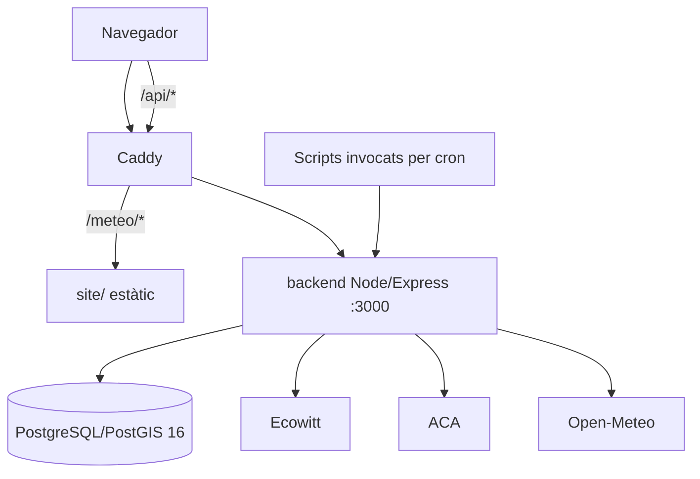

# PROJECT-CONTEXT-METEOLORD

**Versió:** 1.1
**Estat:** CONTEXT CONFIRMAT AL REPOSITORI
**Data de tall:** 2026-09-03
**Commit inspeccionat:** `ff671611f2bb6ed99dd90fd256306b250b2846ca`

El `HEAD` observat durant el QA és `beb6aa3`; aquest commit és una incorporació legítima i validada de Speclord feta per l'usuari i no modifica el context MeteoLord descrit aquí.

## 1. Límits del document

Aquest document només recull fets observables al repositori. No converteix `SPEC-00 v0.3` en una especificació aprovada, no incorpora decisions funcionals noves i no descriu com s'ha d'implementar el mapa comunitari.

Quan la documentació històrica i els artefactes executables difereixen, es descriu l'artefacte executable i s'assenyala la diferència.

## 2. Finalitat actual

MeteoLord és una aplicació web de consulta meteorològica i hidrològica integrada al monorepo Tecnolord. El sistema actual:

- publica una pantalla meteorològica sota `/meteo/`;
- consulta mesures d'una estació mitjançant una API Express;
- presenta dades actuals, gràfiques del dia i històrics;
- presenta cabals i capacitat hidrològica;
- desa i consulta previsions horàries;
- recupera dades d'Ecowitt, ACA i Open-Meteo mitjançant tasques del backend;
- persisteix dades en PostgreSQL.

Evidència: [`site/src/ui/screens/app.js`](../../site/src/ui/screens/app.js), [`backend/server.js`](../../backend/server.js) i [`readme.md`](../../readme.md).

## 3. Arquitectura



El frontend i l'API comparteixen origen públic a través de Caddy. El frontend fa peticions a rutes absolutes `/api/v1/...`; no coneix el host intern de l'API. Evidència: [`site/src/services/meteoService.js`](../../site/src/services/meteoService.js), línies 9-21.

### 3.1 Classificació dels components observats

| Classe | Components | Estat factual |
|---|---|---|
| Funcionals de MeteoLord | `site/`, `backend`, `db` | codi i declaració Compose existents; l'arrencada neta completa no està garantida perquè falta l'esquema canònic |
| Infraestructura compartida | `caddy` | funcional com a proxy/servidor estàtic, però configurat per a producció i acoblat a serveis veïns |
| Placeholder | `api_py` | rutes configurades a Caddy, servei comentat i cap API executable |
| Operació externa al Compose | scripts d'ingesta invocats per cron | scripts versionats; crontab de l'host només documentat i no verificat |
| Sistemes externs | Ecowitt, ACA, Open-Meteo | consumits pel backend; depenen de xarxa i, segons la font, de configuració o secrets |
| Serveis veïns | OrientaTrack, Entrenador Personal, Opos, Biblioteca, PaP i Umami | presents al monorepo, però no són funcionalitat MeteoLord |

## 4. Serveis

### 4.1 `caddy`

- Imatge `caddy:2`.
- Publica 80/TCP, 443/TCP, 443/UDP i l'administració 2019 només a loopback.
- Munta `Caddyfile` en mode lectura i `site/` a `/srv`.
- Serveix `/meteo*`, redirigeix l'arrel a `/meteo/` i deriva `/api/*` al backend.
- El fitxer actiu està escrit per als dominis productius de Tecnolord.

Evidència: [`docker-compose.yml`](../../docker-compose.yml), línies 176-203; [`Caddyfile`](../../Caddyfile).

### 4.2 `backend`

- Imatge pròpia basada en `node:20-alpine`.
- Aplicació Express 4 amb `morgan`, `cors`, `dotenv` i `pg`.
- Escolta `PORT`, amb 3000 per defecte.
- Té accés intern a PostgreSQL pel servei `db`.
- No publica directament el port a l'host; el declara amb `expose`.

Evidència: [`backend/Dockerfile`](../../backend/Dockerfile), [`backend/package.json`](../../backend/package.json), [`backend/server.js`](../../backend/server.js), línies 8-38.

### 4.3 `db`

- Imatge `postgis/postgis:16-3.4`.
- Usa el volum anomenat `pgdata`.
- Disposa d'un healthcheck amb `pg_isready`.
- Executa `backend/db/init.sql` només durant la inicialització d'un volum buit.

Evidència: [`docker-compose.yml`](../../docker-compose.yml), línies 32-46.

### 4.4 `api_py`

La configuració Caddy conté rutes cap a `api_py:8000`, però el servei està comentat a Compose i el seu Dockerfile només executa un missatge que indica que està pendent d'implementar. No és un servei funcional al checkout inspeccionat.

Evidència: [`pyapi/Dockerfile`](../../pyapi/Dockerfile), [`docker-compose.yml`](../../docker-compose.yml), línies 2-10.

### 4.5 Serveis veïns

El mateix Compose inclou OrientaTrack, Entrenador Personal, Opos, Biblioteca, PaP i Umami. Comparteixen la xarxa Compose i, en part, el PostgreSQL principal o Caddy. No formen part del codi funcional de MeteoLord, però el `caddy` declarat en depèn.

## 5. Estructura del codi MeteoLord

```text
site/
  index.html                 Entrada HTML i base /meteo/
  src/config.js              Endpoints, refresc i estació per defecte
  src/services/              Clients HTTP de meteo i hidro
  src/state/store.js         Estat i persistència local del navegador
  src/ui/screens/            Meteo, cabals i històrics
  src/ui/components/         Cards, taules, navegació, gràfiques i modal

backend/
  server.js                  Composició Express i dependències
  db/pool.js                 Pool pg i search_path
  routes/                    Salut, consulta i tasques
  services/                  Ecowitt, ACA i previsió
  middleware/authApiKey.js   Protecció de tasques d'ingesta
  utils/                     Períodes i normalització de model de previsió

scripts/
  pull-ecowitt.sh            Disparador Ecowitt + ACA
  pull-previ.sh              Disparador Open-Meteo
  alerts.sh                  Diagnosi i alertes de servidor
  migrate_legacy.sh          Importació legacy manual
```

## 6. Persistència

### 6.1 Connexió

El backend crea un `pg.Pool` amb variables `POSTGRES_*` i configura `search_path` com `meteo,auth,public` en connectar. Evidència: [`backend/db/pool.js`](../../backend/db/pool.js).

### 6.2 Model usat pel runtime

Les consultes del backend fan servir aquests conceptes:

- `auth.usuaris`;
- estacions meteorològiques i membres d'estació;
- mesures meteorològiques;
- estacions i lectures hidrològiques;
- execucions i punts horaris de previsió.

`backend/db/003-esquema-ca.sql` defineix els esquemes `auth` i `meteo` i la majoria de les taules meteorològiques i hidrològiques. `scripts/previ.sql` defineix les taules de previsió sense qualificar l'esquema.

### 6.3 Idempotència existent

- Les mesures meteorològiques tenen unicitat per estació i instant.
- Les lectures hidrològiques tenen unicitat per estació i instant.
- La ingesta Ecowitt ignora un conflicte de mesura existent.
- La ingesta ACA actualitza només camps prèviament nuls en cas de conflicte.
- La previsió identifica una execució per font, model, estació i instant d'emissió, i actualitza els punts d'aquella execució.

### 6.4 Inicialització real

El Compose només munta `backend/db/init.sql`, que crea una taula `public.measurement` no usada per les rutes ni serveis actuals. Els altres SQL no estan connectats a una cadena automàtica de migracions. Per això, un volum buit no adquireix automàticament el model que el backend consulta.

No hi ha framework o registre de versions de migració confirmat.

## 7. API existent

### 7.1 Lectura pública

- `GET /api/ping`;
- `GET /health`;
- `GET /api/v1/mesures/darreres`;
- `GET /api/v1/hidro/darreres`;
- `GET /api/v1/previ/48h`;
- `GET /api/v1/previ/past48-next48`.

Les rutes meteo i hidro admeten filtres temporals. En rangs meteo de més de tres dies, el backend retorna agregació horària.

### 7.2 Tasques

- `POST /api/tasks/pull-ecowitt`;
- `POST /api/tasks/pull-aca`;
- `POST /api/tasks/pull-previ`;
- àlies equivalents sota `/tasks/`.

Les tasques requereixen `INGEST_API_KEY`. El middleware accepta la clau en el header `x-api-key` o al query string. Caddy deriva el prefix `/api/` al backend, de manera que les variants `/api/tasks/...` són accessibles a través del proxy i depenen de la clau per autoritzar-se.

## 8. Ingestes

### 8.1 Ecowitt

El servei consulta l'API Ecowitt v3 de temps real. Requereix claus d'aplicació/API i MAC per a la font principal; admet una font de fallback amb prefix separat. Rebutja payloads buits, aplica timeout, transforma camps meteorològics, converteix km/h a m/s i desa una mesura amb instant UTC en format ISO.

El contracte de dades observat inclou:

- temperatura, sensació i punt de rosada;
- humitat;
- radiació solar i UV;
- taxa i acumulats de pluja;
- velocitat, ràfega i direcció del vent;
- pressió relativa i absoluta;
- indicador de bateria;
- dades indoor dins `extres`.

Evidència: [`backend/services/ecowittService.js`](../../backend/services/ecowittService.js).

### 8.2 ACA

El servei consulta dos endpoints públics ACA per cabal i capacitat, identifica els punts configurats, normalitza valors i conserva part de la resposta original a `extres`. La tasca Ecowitt també executa ACA després d'Ecowitt. Evidència: [`backend/services/acaService.js`](../../backend/services/acaService.js) i [`backend/routes/tasks.js`](../../backend/routes/tasks.js).

### 8.3 Open-Meteo

El servei consulta previsió horària en UTC per temperatura, humitat relativa, precipitació, vent i direcció. Limita l'horitzó configurat a 48 hores i desa una execució i els seus punts dins una transacció. Evidència: [`backend/services/previService.js`](../../backend/services/previService.js).

### 8.4 Programació temporal

Els scripts d'ingesta executen peticions des de dins del contenidor backend. `readme.md` documenta un cron de l'host cada 15 minuts per Ecowitt+ACA i cada hora per previsió. El cron no està versionat, de manera que aquesta freqüència és context operatiu documentat, no estat executable verificat al checkout.

## 9. Frontend i experiència actual

El frontend és una SPA estàtica, sense framework ni compilació. L'estat de selecció es desa a `localStorage`; un canvi de versió neteja només claus amb prefix Tecnolord.

Les tres pantalles actuals són:

- `Meteo`: resum actual, antiguitat, vent, temperatura, pluja, pressió, humitat, UV i gràfiques del dia;
- `Cabals`: informació hidrològica;
- `Històrics`: selectors de període, gràfiques i taules meteo/hidro.

La selecció d'estació meteo es pot aportar amb `estacio` o `station_id` al query string. `CONFIG.defaultEstacio` declara `home`, però l'store inicialitza el filtre com una cadena buida i la pantalla no consumeix aquell default; sense filtre, l'API ordena conjuntament les mesures de totes les estacions. El refresc automàtic és cada 30 segons.

Els camps absents es representen amb `—`. La presentació horària usa la zona local del navegador; els instants rebuts són dates ISO provinents de columnes `TIMESTAMPTZ` o de conversió JavaScript a ISO.

El frontend carrega un script d'analítica des de `stats.tecnolord.cat` i conté enllaços absoluts a serveis productius i un enllaç comercial.

## 10. Autenticació actual

L'única autorització aplicada per l'aplicació és l'API key de les tasques d'ingesta.

Hi ha estructura SQL per a usuaris, hash de contrasenya i membresies, i el frontend dibuixa un botó de login. No hi ha rutes de registre/login, gestió de sessió, comprovació de contrasenya, middleware de rol ni connexió funcional del botó.

## 11. Configuració

Els grups de variables utilitzats són:

- procés i DB: `NODE_ENV`, `PORT`, `POSTGRES_*`;
- tasques: `INGEST_API_KEY`;
- estació: `ADMIN_EMAIL`, `ESTACIO_*`, `STATION_ID`, `STATION_CODE`;
- Ecowitt: `ECW_*` i `ECW_FB_*`;
- ACA: `ACA_CODI_*`, `ACA_NOM_*`;
- previsió: `PREVI_*`.

`.env` no existeix al checkout inspeccionat. `.env.example` és versionat, però només cobreix una part de les variables anteriors i també conté configuració de serveis veïns.

## 12. Desplegament existent

La topologia versionada està orientada als dominis productius i a Docker Compose. Caddy és l'únic punt d'entrada publicat de MeteoLord. Els scripts de cron pressuposen el repositori i Docker al mateix host.

`scripts/deploy.sh` no representa una porta segura verificable: el fitxer comença generant una nova versió de si mateix, i aquella versió usa `git reset --hard`, reconstrueix, recrea serveis i elimina imatges antigues. No hi ha pipeline versionat de proves, migracions, promoció o reversió.

## 13. Restriccions tècniques observades

- PostgreSQL és necessari des de l'arrencada perquè el pool es crea en iniciar i les rutes depenen de taules que no es creen automàticament.
- El backend depèn de globals `fetch`, `AbortController` i `URLSearchParams` disponibles a Node 20.
- El frontend necessita servir-se sota `/meteo/` o conservar la semàntica del `<base>`.
- Les crides frontend/backend assumeixen mateix origen i prefix `/api`.
- `caddy` està acoblat a serveis no MeteoLord mitjançant `depends_on`.
- `api_py` no és executable com a API.
- No hi ha lockfile de backend, build frontend o suite de tests MeteoLord.
- Les ingestes reals depenen de xarxa externa i, per Ecowitt, de secrets.
- Els volums Compose i la configuració Caddy no diferencien explícitament local i producció.

### 13.1 Riscos factuals derivats de l'estat observat

| Risc | Evidència del context | Límit d'aquest document |
|---|---|---|
| Arrencada neta incompleta | la inicialització només crea `public.measurement`, mentre el runtime consulta altres relacions | no selecciona esquema ni eina de migració |
| Barreja accidental d'entorns | dominis productius, volums genèrics i cap configuració local completa | no defineix la futura topologia local |
| Superfície anunciada però absent | Caddy deriva rutes a `api_py`, que és un placeholder | no atribueix funcionalitat a `api_py` |
| Exposició o filtració per tasques | `/api/tasks/*` passa pel proxy i la clau també s'accepta al query string | no modifica autenticació ni xarxa |
| Regressions no detectades | no hi ha suite automatitzada MeteoLord ni prova de migració | no fixa runner ni cobertura |
| Pèrdua de zeros Ecowitt | la normalització usa expressions que poden convertir `0` en `null` | l'impacte històric és desconegut; el defecte es documenta separadament |
| Operació no reproduïble | cron extern i flux de desplegament sense porta verificable | no afirma l'estat real del servidor |

Aquests són riscos de l'estat actual, no requisits nous ni decisions d'implementació.

## 14. Funcionalitat base observable que defineix regressió

Els comportaments següents existeixen al codi i formen la base observable a comparar en canvis posteriors:

- servei estàtic sota `/meteo/` amb recursos relatius funcionals;
- navegació entre Meteo, Cabals i Històrics;
- consulta de mesures per estació i període;
- representació dels camps meteorològics descrits a la secció 9;
- representació explícita de camps absents;
- refresc automàtic;
- agregació horària per a rangs llargs;
- consulta hidrològica amb fallback fora de rang;
- consulta de previsió desada;
- ingesta Ecowitt amb fallback de font i no-inserció de payload buit;
- ingesta ACA i previsió;
- idempotència per claus úniques d'estació/instant;
- endpoints de ping i salut.

Aquest inventari no resol quins camps seran comuns a futurs proveïdors ni aprova el contracte Ecowitt; només descriu el comportament existent.

## 15. Terminologia i convencions detectades

| Terme | Ús al repositori |
|---|---|
| `estacio` / `codi` | identificació d'estació a DB i API |
| `instant` | timestamp d'una mesura o lectura |
| `mesures` | observacions meteorològiques persistides |
| `lectures_hidro` | observacions de cabal/capacitat |
| `previ` | previsió meteorològica |
| `extres` | JSONB amb dades no normalitzades o auxiliars |
| `darreres` | endpoint de consulta de lectures recents/rang |
| `pull-*` | tasca d'obtenció i persistència |
| `home` | codi d'estació per defecte |

Convencions observades:

- noms de domini en català a DB i frontend;
- `camelCase` a JavaScript i `snake_case` a SQL/JSON;
- factories `make*Service` i `make*Router` amb injecció explícita de dependències;
- consultes SQL parametritzades per als valors d'usuari;
- timestamps persistits com `TIMESTAMPTZ` als esquemes principals;
- retorn API habitual `{ ok, items }`;
- absència visual com `—`;
- scripts Bash amb `set -Eeuo pipefail` o `set -euo pipefail`.

## 16. Diferències confirmades entre checkout local i desplegament descrit

| Aspecte | Checkout local inspeccionat | Desplegament descrit/versionat |
|---|---|---|
| `.env` | absent | esperat pels serveis i scripts |
| Ports rellevants ocupats | cap listener detectat en l'instant d'inspecció | Caddy publica 80/443/2019 |
| Host Caddy | no hi ha host local al fitxer muntat | dominis `tecnolord.cat` i subdominis |
| DB | cap arrencada ni volum inspeccionat | volum `pgdata` persistent |
| Cron | no inspeccionat i no versionat | README el situa a l'host productiu |
| Secrets Ecowitt | no inspeccionats ni disponibles | necessaris per a ingesta real |
| Esquema | fonts SQL divergents, sense aplicació automàtica completa | el runtime pressuposa taules ja creades |
| API Python | placeholder i servei comentat | Caddy conserva rutes cap a `api_py:8000` |
| Suite de proves | inexistent | cap porta automatitzada documentada |

No s'ha accedit al servidor de producció; per tant, el seu estat real és `PENDENT DE CONFIRMAR` i no forma part dels fets d'aquest document.

## 17. Historial de versions

| Versió | Data | Canvis |
|---|---|---|
| 1.0 | 2026-09-03 | Context inicial derivat de la inspecció del repositori MeteoLord. |
| 1.1 | 2026-09-03 | Classificació explícita de components funcionals, placeholder, externs i veïns; riscos factuals i nota de traçabilitat de `beb6aa3`. Sense requisits funcionals ni decisions d'implementació noves. |
