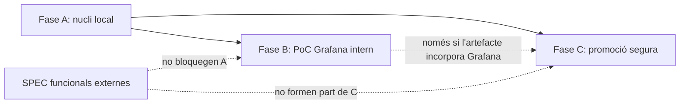

# QA-00 - Revisió i refinament de `SPEC-10`

**Versió:** 1.1
**Estat:** COMPLETAT
**Data:** 2026-09-03
**Objecte revisat:** `SPEC-10 v0.3`
**Estat de l'objecte:** `CANDIDATA A APROVACIÓ`

## 1. Objectiu del QA

Determinar si `SPEC-10 v0.3` és un contracte documental coherent i verificable per redactar, després d'una aprovació expressa, el futur `PLAN-10` limitat a la fase A. Aquest QA no aprova la SPEC en nom de l'usuari, no avalua una implementació inexistent i no autoritza la fase B, el PoC Grafana, la fase C, el servidor ni cap funcionalitat de mapa, identitat o multiestació.

## 2. Documents revisats i evidència

- [SPEC-00 v0.5](./SPEC-00-mapa-estacions-meteolord.md), `CANDIDATA A REFINAMENT`;
- [SPEC-10 v0.3](./SPEC-10-entorn-local-proves-desplegament-segur.md), `CANDIDATA A APROVACIÓ`;
- [SPIKE-04 v1.1](./SPIKE-04-descoberta-grafana-i2cat.md), `COMPLETAT`, `VIABLE AMB CONDICIONS`;
- [INSPECCIO-00 v1.1](./INSPECCIO-00-entorn-meteolord.md), `COMPLETADA`;
- [PROJECT-CONTEXT-METEOLORD v1.1](./PROJECT-CONTEXT-METEOLORD.md), `CONTEXT CONFIRMAT AL REPOSITORI`;
- [DEFECT-01 v1.0](./DEFECT-01-zeros-ecowitt-convertits-null.md), correcció pendent.

La base factual continua sent Caddy davant de `site/` i `backend`, PostgreSQL/PostGIS 16, tasques del backend disparades per scripts, `api_py` com a placeholder, inicialització DB incompleta, absència d'entorn local reproduïble, autenticació d'usuari i suite MeteoLord, i el defecte Ecowitt documentat. No s'ha accedit al servidor ni s'ha executat cap sistema.

El commit `beb6aa3 feat: complete T7 markdown recognition speclord` s'ha tractat com a legítim, validat, incorporat per l'usuari i aliè a MeteoLord. No s'ha investigat ni revertit.

## 3. Antecedent històric

La matriu de `QA-00 v1.0` avaluava `SPEC-10 v0.1` i va obtenir 23 `CORRECTE`, 9 `A REFINAR`, 22 `BLOQUEJAT`, 1 `FORA DE SPEC` i 1 `CONTRADICTORI`, sobre 56 elements. Aquest recompte es conserva només com a antecedent: no és el resultat final de la versió actual.

## 4. Resultat de QA-01 a QA-08

| Control | Resultat | Evidència en la versió resultant |
|---|---|---|
| QA-01 — Matriu residual actual | PASS | secció 5: 56 elements de `SPEC-10 v0.3` i recompte amb les cinc classificacions exigides |
| QA-02 — Fase C limitada a promoció | PASS | `SPEC-10` §2.1, §14.3, §15.3, §19 i §20: fase C és exclusivament `Promoció segura al servidor` |
| QA-03 — Canvis tècnics futurs | PASS | `SPEC-10` §0, §3 i §22.2-22.3 permet que el PLAN proposi i justifiqui canvis tècnics sense fixar-los a la SPEC |
| QA-04 — Proves separades per fase | PASS | `SPEC-10` §14 i §15 separen A, B i C; cada CA declara aplicabilitat |
| QA-05 — Caracterització del zero | PASS | `CA10-11` exigeix reproducció, registre i detecció; la correcció continua a `DEFECT-01` |
| QA-06 — Sense duplicacions | PASS | `RF-03` i `CA-15` són únics; comprovació de línies i paràgrafs consecutius sense duplicats |
| QA-07 — Ordre SDD coherent | PASS | `SPEC-00` §10 segueix SPEC-10 A → PLAN-10 A → entorn validat → SPEC funcionals; `RF-19` només exigeix el nucli actual |
| QA-08 — Esquema local i producció | PASS | `SPEC-10` §10.1-10.3 i `DLT-01`, `DLT-02`, `DLT-12`, `DLT-13` separen esquema local, baseline productiva i camí compatible |

## 5. Matriu residual completa de `SPEC-10 v0.3`

Regles aplicades:

- `PENDENT D’IMPLEMENTAR` indica un contracte correcte que encara no s'ha implementat ni provat;
- `BLOQUEJAT PER DECISIÓ` identifica un resultat que necessita una decisió explícita abans de poder-se verificar, sense implicar necessàriament un bloqueig d'aprovació;
- `CORREGIT` identifica un element afectat pel refinament v0.3;
- `CONTRADICCIÓ RESIDUAL` només s'usaria per normes vigents incompatibles;
- `CORRECTE` quedaria reservat a un element ja acreditat, i no es fa servir per inferir proves no executades.

### 5.1 Requisits funcionals

| ID | Fase | Resultat v0.3 | Decisió pendent | Moment de resolució | Bloqueja l’aprovació de fase A |
| -- | ---- | ------------- | --------------- | ------------------- | ------------------------------ |
| RF10-01 | A | PENDENT D’IMPLEMENTAR | DCF-09, DLT-07 | PLAN i implementació A | NO |
| RF10-02 | A | PENDENT D’IMPLEMENTAR | DLT-03 | PLAN i implementació A | NO |
| RF10-03 | A | PENDENT D’IMPLEMENTAR | DLT-04 | PLAN i implementació A | NO |
| RF10-04 | A | PENDENT D’IMPLEMENTAR | DLT-03, DLT-10 | PLAN i implementació A | NO |
| RF10-05 | A | PENDENT D’IMPLEMENTAR | DCF-09 | PLAN i implementació A | NO |
| RF10-06 | A | CORREGIT | DLT-01, DLT-02 | PLAN i implementació A | NO |
| RF10-07 | A | PENDENT D’IMPLEMENTAR | DLT-08 | PLAN i implementació A | NO |
| RF10-08 | A | PENDENT D’IMPLEMENTAR | DLT-05 | PLAN i implementació A | NO |
| RF10-09 | A | CORREGIT | DLT-06, DLT-08; correcció a DEFECT-01 | caracterització a A; correcció en fase separada | NO |
| RF10-10 | A | PENDENT D’IMPLEMENTAR | DLT-09 | PLAN i implementació A | NO |
| RF10-11 | A | PENDENT D’IMPLEMENTAR | DLT-10 | PLAN i implementació A | NO |
| RF10-12 | A | PENDENT D’IMPLEMENTAR | DLT-06, DLT-08 | PLAN i implementació A | NO |
| RF10-13 | A | PENDENT D’IMPLEMENTAR | DLT-11 | PLAN i implementació A | NO |
| RF10-14 | A | PENDENT D’IMPLEMENTAR | DCF-09 | PLAN i implementació A | NO |
| RF10-15 | A/C | PENDENT D’IMPLEMENTAR | DLT-06, DLT-12 | evidència a A; promoció a C | NO |

### 5.2 Requisits funcionals de DB

| ID | Fase | Resultat v0.3 | Decisió pendent | Moment de resolució | Bloqueja l’aprovació de fase A |
| -- | ---- | ------------- | --------------- | ------------------- | ------------------------------ |
| RF10-DB-01 | A | PENDENT D’IMPLEMENTAR | DLT-03 | PLAN i implementació A | NO |
| RF10-DB-02 | A | PENDENT D’IMPLEMENTAR | DLT-04 | PLAN i implementació A | NO |
| RF10-DB-03 | A | PENDENT D’IMPLEMENTAR | DLT-05 | PLAN i implementació A | NO |
| RF10-DB-04 | A | PENDENT D’IMPLEMENTAR | DLT-03, DLT-06 | PLAN i implementació A | NO |
| RF10-DB-05 | A | PENDENT D’IMPLEMENTAR | DLT-02, DLT-08 | PLAN i implementació A | NO |

### 5.3 Requisits no funcionals

| ID | Fase | Resultat v0.3 | Decisió pendent | Moment de resolució | Bloqueja l’aprovació de fase A |
| -- | ---- | ------------- | --------------- | ------------------- | ------------------------------ |
| RNF10-01 | A | PENDENT D’IMPLEMENTAR | DCF-09, DLT-03, DLT-05 | PLAN i implementació A | NO |
| RNF10-02 | A | PENDENT D’IMPLEMENTAR | DLT-07 | PLAN i implementació A | NO |
| RNF10-03 | A | PENDENT D’IMPLEMENTAR | DLT-03, DLT-04 | PLAN i implementació A | NO |
| RNF10-04 | A/B/C | PENDENT D’IMPLEMENTAR | DLT-05, DLT-11 | implementació de cada fase aplicable | NO |
| RNF10-05 | A | PENDENT D’IMPLEMENTAR | DLT-06, DLT-08 | PLAN i implementació A | NO |
| RNF10-06 | A | PENDENT D’IMPLEMENTAR | DLT-02, DLT-08, DLT-09 | PLAN i implementació A | NO |
| RNF10-07 | A | PENDENT D’IMPLEMENTAR | DLT-10, DLT-11 | PLAN i implementació A | NO |
| RNF10-08 | A/B | PENDENT D’IMPLEMENTAR | DLT-06; DCF-06 per B | PLAN A; abans de B per Grafana | NO |
| RNF10-09 | A | BLOQUEJAT PER DECISIÓ | DCF-09: plataformes suportades | PLAN A, abans de validar portabilitat | NO |
| RNF10-10 | A | PENDENT D’IMPLEMENTAR | DLT-06 | PLAN i implementació A | NO |
| RNF10-11 | A/B/C | PENDENT D’IMPLEMENTAR | DLG-01, DLG-02, DLG-03 per B | absència a A; controls abans de B/C aplicable | NO |

### 5.4 Criteris d'acceptació

| ID | Fase | Resultat v0.3 | Decisió pendent | Moment de resolució | Bloqueja l’aprovació de fase A |
| -- | ---- | ------------- | --------------- | ------------------- | ------------------------------ |
| CA10-01 | A | PENDENT D’IMPLEMENTAR | DCF-09, DLT-07 | PLAN i implementació A | NO |
| CA10-02 | A | PENDENT D’IMPLEMENTAR | DLT-03 | PLAN i implementació A | NO |
| CA10-03 | A | PENDENT D’IMPLEMENTAR | DLT-04 | PLAN i implementació A | NO |
| CA10-04 | A | PENDENT D’IMPLEMENTAR | DCF-09 | PLAN i implementació A | NO |
| CA10-05 | A | CORREGIT | DLT-01, DLT-02 | PLAN i implementació A | NO |
| CA10-06 | A | CORREGIT | DLT-02 | PLAN i implementació A | NO |
| CA10-07 | A | PENDENT D’IMPLEMENTAR | DLT-03 | PLAN i implementació A | NO |
| CA10-08 | A | PENDENT D’IMPLEMENTAR | DLT-08 | PLAN i implementació A | NO |
| CA10-09 | A | PENDENT D’IMPLEMENTAR | DLT-05 | PLAN i implementació A | NO |
| CA10-10 | A | CORREGIT | DLT-06, DLT-08 | PLAN i implementació A | NO |
| CA10-11 | A | CORREGIT | correcció funcional a DEFECT-01 | caracterització a A; correcció separada | NO |
| CA10-12 | A | PENDENT D’IMPLEMENTAR | DLT-10 | PLAN i implementació A | NO |
| CA10-13 | A | PENDENT D’IMPLEMENTAR | DLT-06, DLT-08 | PLAN i implementació A | NO |
| CA10-14 | A | PENDENT D’IMPLEMENTAR | DLT-11 | PLAN i implementació A | NO |
| CA10-15 | A | PENDENT D’IMPLEMENTAR | DCF-09 | PLAN i implementació A | NO |
| CA10-16 | A | CORREGIT | cap decisió funcional | implementació i validació A | NO |
| CA10-17 | B | BLOQUEJAT PER DECISIÓ | DLG-02, DLG-03 | abans d'autoritzar B | NO |
| CA10-18 | B | BLOQUEJAT PER DECISIÓ | DCF-06, DLG-01, DLG-02, DLG-03 | abans d'autoritzar B | NO |
| CA10-19 | B | BLOQUEJAT PER DECISIÓ | DLG-01 | abans d'autoritzar B | NO |
| CA10-20 | B | BLOQUEJAT PER DECISIÓ | DLG-01, DLG-02, DLG-03 | abans d'autoritzar B | NO |
| CA10-21 | A | CORREGIT | DLT-06, DLT-07 | PLAN i implementació A | NO |
| CA10-22 | C | CORREGIT | DLT-12, DLT-13 | abans d'autoritzar C | NO |
| CA10-23 | C | CORREGIT | DLT-12, DLT-13 | abans d'autoritzar C | NO |
| CA10-24 | C | CORREGIT | DLT-12, DLT-13 | abans d'autoritzar C | NO |
| CA10-25 | C | CORREGIT | DCF-06, DLT-12 | abans d'autoritzar C amb Grafana | NO |

### 5.5 Recompte residual

| Resultat | Nombre |
|---|---:|
| `CORRECTE` | 0 |
| `CORREGIT` | 12 |
| `PENDENT D’IMPLEMENTAR` | 39 |
| `BLOQUEJAT PER DECISIÓ` | 5 |
| `CONTRADICCIÓ RESIDUAL` | 0 |
| **Total** | **56** |

El valor zero de `CORRECTE` no és un defecte: d'acord amb la regla d'aquest QA, els contractes correctes però encara no implementats es classifiquen com `PENDENT D’IMPLEMENTAR`. Cap prova d'aplicació s'ha declarat superada.

## 6. Contradiccions i defectes residuals

No s'ha detectat cap contradicció normativa residual. La discrepància entre la salut exigida i l'aplicació actual és treball pendent d'implementació sota `DLT-10`, no una contradicció entre normes vigents.

La codificació de `SPEC-10` i `QA-00` s'ha reparat amb substitucions explícites de les seqüències mojibake inventariades. Els fitxers resultants són UTF-8 vàlid, sense patrons sospitosos observats, i conserven línies, blocs, taules i enllaços.

## 7. Decisions legítimes del futur PLAN

Per a la fase A són legítimes `DCF-09` i `DLT-01` a `DLT-11`: esquema local de runtime, migracions locals, topologia mínima, origen i ports, control d'egress, runner i evidència, resolució de dependències, fixtures, disparador de tasques, implementació del contracte de salut i format/destí de logs.

Per a fases no autoritzades, `DLG-01` a `DLG-03` pertanyen al futur pla de B, i `DLT-12` i `DLT-13` al futur pla de C. `DCF-01` a `DCF-08` continuen com a dependències de les SPEC funcionals o de l'autorització Grafana corresponent; no formen part del `PLAN-10` de fase A.

## 8. Decisions que bloquegen la redacció del PLAN de fase A

Cap. Les decisions A estan formulades com a decisions tècniques que el mateix futur `PLAN-10` haurà de proposar, justificar i traçar. Les decisions B, C i externes no bloquegen A.

## 9. Dependències entre fases

La fase A només necessita l'aprovació expressa de `SPEC-10` per a A i el posterior `PLAN-10` de la mateixa fase. B i C requereixen autoritzacions i plans separats.

## 10. Riscos i informació pendent

- Cap requisit `PENDENT D’IMPLEMENTAR` es pot presentar com a prova superada.
- La plataforma suportada s'ha de decidir al PLAN abans de validar RNF10-09.
- L'esquema local no acredita l'esquema productiu.
- Abans de C cal inventari segur, baseline, backup, compatibilitat i prova descartable.
- B continua bloquejada fins a A vàlida, autorització, allowlist, límits i accés segur.
- Grafana continua `INTERNAL_ONLY`; no s'ha incorporat cap dada real als fixtures o al QA.
- L'impacte històric de `DEFECT-01` continua `PENDENT DE CONFIRMAR`.

## 11. Canvis aplicats a `SPEC-00`

- versió 0.4 → 0.5, mantenint `CANDIDATA A REFINAMENT`;
- `RF-19` limitat al frontend/backend/DB actuals, migracions locals, fixtures, tasques simulades, logs, build i proves;
- proves de registre, mapa, multiestació i Grafana ajornades fins a les seves SPEC;
- ordre SDD corregit a SPEC-10 A → PLAN-10 A → entorn validat → SPEC funcionals;
- aclariment que les condicions d'aprovació completa de `SPEC-00` no bloquegen la fase A.

## 12. Canvis aplicats a `SPEC-10`

- versió 0.2 → 0.3, mantenint `CANDIDATA A APROVACIÓ`;
- reparació UTF-8 i referències actualitzades a `SPEC-00 v0.5`;
- fase C limitada a `Promoció segura al servidor`;
- proves automatitzades, funcionals i CA amb aplicabilitat A/B/C explícita;
- `CA10-11` convertit en caracterització del defecte, sense exigir-ne la correcció;
- esquema canònic local separat de baseline i compatibilitat productives;
- `DLT-01`, `DLT-02` i `DLT-12` precisats, i `DLT-13` creat per a producció;
- funcionalitats de mapa, identitat, usuaris, multiestació i publicació mantingudes fora de la fase C.

## 13. Validacions documentals executades

S'han comprovat UTF-8, patrons mojibake, versions, historials, referències, IDs, 56 files residuals, recompte, columnes de taules, blocs delimitats, enllaços interns, duplicacions consecutives i patrons de secrets. No s'han executat build, Docker, migracions, APIs, cron, ingestes, Grafana ni cap accés al servidor.

## 14. Recomanació final

**APROVAR SPEC-10 PER A LA FASE A**

Els vuit controls són `PASS`, no queda cap `CONTRADICCIÓ RESIDUAL`, els requisits A són complets i verificables, les seves decisions pendents corresponen legítimament al futur PLAN i B/C no bloquegen A. Aquesta recomanació no canvia l'estat candidat de `SPEC-10` ni substitueix l'aprovació expressa de l'usuari.

El següent pas SDD exacte, només després de l'aprovació expressa, és redactar `PLAN-10` exclusivament per a la fase A i traçar-hi `DCF-09` i `DLT-01` a `DLT-11`. Aquest QA no crea ni inicia el PLAN.

## 15. Historial de versions

| Versió | Data | Canvis |
|---|---|---|
| 1.0 | 2026-09-03 | QA inicial de `SPEC-10 v0.1` i refinament cap a v0.2. |
| 1.1 | 2026-09-03 | Reparació UTF-8, verificació de QA-01 a QA-08 i matriu residual completa de `SPEC-10 v0.3`; recomanació limitada a la fase A. |
