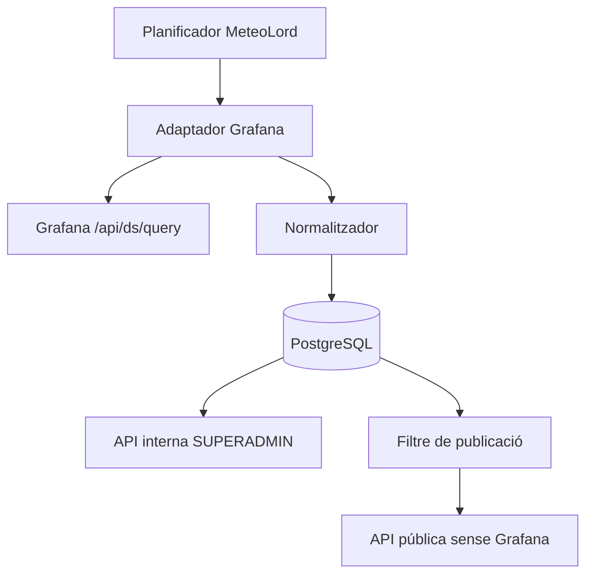

# SPIKE-04 - Descoberta de dades Grafana/i2CAT per a MeteoLord

**Versió:** 1.1  
**Estat:** COMPLETAT  
**Data:** 2026-09-02  
**Decisió:** VIABLE AMB CONDICIONS  
**SPEC relacionada:** SPEC-00 - Mapa comunitari d'estacions meteorològiques MeteoLord

---

## 1. Objectiu

Determinar si MeteoLord pot obtenir de manera programàtica les dades meteorològiques mostrades al dashboard públic de la Vall de Lord, sense scraping del DOM i amb un contracte prou controlable per alimentar una integració interna. La publicació al mapa, les fitxes o una API pública queda fora de l'autorització actual.

## 2. Resposta

Sí, tècnicament és possible. El dashboard consulta un datasource Prometheus mitjançant l'API de Grafana:

```http
POST https://grafana.commonscloud.coop/api/ds/query
Content-Type: application/json
```

L'accés observat el 2026-09-02 és anònim, amb rol `Viewer`, i permet consultar el datasource. La integració queda condicionada a:

1. Reproduir primer la petició des de l'entorn local MeteoLord.
2. Mantenir les dades i estacions Grafana com a `INTERNAL_ONLY`.
3. Concretar per escrit l'abast de consulta automatitzada i persistència fora de la prova local.
4. Obtenir una autorització separada abans de republicar qualsevol dada.
5. Acordar o respectar límits de consulta.
6. Tractar datasource, mètriques i resposta com un contracte extern susceptible de canvi.
7. Executar la prova des del servidor només després de superar la validació local.

No es recomana llegir el HTML ni el DOM renderitzat del dashboard.

### 2.1 Estat de l'autorització

L'usuari informa que Albert ha autoritzat utilitzar les dades per desenvolupar i provar la integració internament. Aquesta autorització no permet encara fer públiques les dades de Grafana. No s'ha aportat a aquest document una autorització escrita amb l'abast exacte de consulta automatitzada, persistència en producció, retenció o republicació.

Per tant:

- el PoC local es considera autoritzat dins l'abast comunicat;
- qualsevol dada recuperada en la prova queda restringida al desenvolupament local i a l'accés de `SUPERADMIN`;
- la publicació al mapa, modal, fitxa, cerca o API pública està prohibida per defecte;
- una futura autorització de republicació s'haurà de registrar com una decisió nova i explícita.

## 3. Fets confirmats

| Element | Valor observat |
|---|---|
| Dashboard | `Vall de Lord` |
| Dashboard UID | `i2cat-public-jul27` |
| Organització | `orgId=11`, `Public` |
| Grafana | `12.3.2` |
| Usuari | No autenticat, `Viewer` |
| Datasource | Prometheus |
| Datasource UID | `SWLXFBHvz` |
| Datasource id | `11` |
| Endpoint | `POST /api/ds/query` |
| Interval observat | `300000` ms |
| Sensors provats | `Meteo-001-3100044`, `Meteo-007-3100206` |
| Resultat dels dos sensors | Dades mostrades correctament al dashboard públic |
| Autorització comunicada | Ús intern i prova local autoritzats per Albert; republicació no autoritzada |

Grafana documenta `POST /api/ds/query`, el cos `queries`, `from`, `to`, `datasource.uid`, `refId`, `maxDataPoints` i `intervalMs`, i recomana inspeccionar la petició del navegador per conèixer els camps específics del datasource. És exactament el procediment aplicat en aquest spike. [Documentació oficial de l'API de datasource](https://grafana.com/docs/grafana/latest/developer-resources/api-reference/http-api/api-legacy/data_source/).

## 4. Consultes identificades

El panell `Valors Actuals` executa cinc consultes per sensor:

| Dada | Expressió observada | Unitat confirmada |
|---|---|---|
| Temperatura | `xoic_I2CAT_temperatura{tag4="<SENSOR>"}` | °C |
| Humitat | `xoic_I2CAT_humitat{tag4="<SENSOR>"}` | % |
| Màxim cop d'aire | `xoic_I2CAT_maxim_cop_aire{tag4="<SENSOR>"} * 3.6` | km/h després de la conversió |
| Direcció del vent | `xoic_I2CAT_direccio_vent{tag4="<SENSOR>"}` | graus respecte del nord |
| Pluja acumulada 24 h | `xoic_I2CAT_pluja_acumulada{tag4="<SENSOR>"} - xoic_I2CAT_pluja_acumulada{tag4="<SENSOR>"} offset 1d` | Pendent de confirmar |

El panell històric exposa també:

```text
xoic_I2CAT_bateria
xoic_I2CAT_direccio_vent
xoic_I2CAT_humitat
xoic_I2CAT_intensitat_llum
xoic_I2CAT_maxim_cop_aire
xoic_I2CAT_pluja_acumulada
xoic_I2CAT_pluviometre
xoic_I2CAT_pressio
xoic_I2CAT_temperatura
xoic_I2CAT_uv
xoic_I2CAT_velocitat_vent
```

No s'assignaran unitats a les mètriques restants fins que estiguin documentades o confirmades a la resposta.

## 5. Format de resposta

La resposta utilitza frames de Grafana. Per cada `refId`:

```text
results.<refId>.status
results.<refId>.frames[0].schema
results.<refId>.frames[0].data.values[0]  # temps, epoch ms
results.<refId>.frames[0].data.values[1]  # valor
```

L'adaptador ha d'aparellar temps i valor pel mateix índex i seleccionar l'última parella vàlida. No pot assumir que sempre hi haurà un frame, un valor o una sèrie.

## 6. Prova reproduïble pendent en local

```bash
curl --fail-with-body --silent --show-error \
  --connect-timeout 5 \
  --max-time 15 \
  -H 'Accept: application/json' \
  -H 'Content-Type: application/json' \
  -X POST \
  'https://grafana.commonscloud.coop/api/ds/query' \
  --data-binary '{
    "from": "now-15m",
    "to": "now",
    "queries": [
      {
        "refId": "T",
        "datasource": {"type": "prometheus", "uid": "SWLXFBHvz"},
        "datasourceId": 11,
        "editorMode": "code",
        "expr": "xoic_I2CAT_temperatura{tag4=\"Meteo-007-3100206\"}",
        "instant": false,
        "range": true,
        "intervalMs": 300000,
        "maxDataPoints": 100
      }
    ]
  }'
```

La forma de la petició està contrastada. La primera execució s'ha de fer des del backend de l'entorn local MeteoLord. La resposta no s'ha de retornar a cap ruta anònima ni incorporar a dades de demostració publicables.

La prova local ha de validar com a mínim:

- connectivitat i timeout;
- codi HTTP i límit de mida;
- forma dels frames;
- identificador de sensor en allowlist;
- absència de secrets o dades de resposta als logs públics;
- bloqueig de l'estació en qualsevol endpoint o vista pública.

Només després de superar el PoC local, els tests de contracte i els controls de no-publicació es podrà executar una prova equivalent des del servidor. Executar-la al servidor no autoritza activar ingesta productiva ni republicar dades.

## 7. Requisits de seguretat de l'adaptador

- El backend construeix la consulta; el client mai envia PromQL.
- `sensor_id` s'ha de validar contra les estacions externes aprovades.
- La base URL i el datasource són configuració controlada, no dades aportades per l'usuari.
- No s'accepten URLs arbitràries per evitar SSRF.
- El rang temporal i `maxDataPoints` tenen límits estrictes.
- Timeout, mida màxima de resposta i reintents són obligatoris.
- Els errors externs no s'han de retornar amb detalls interns al client.
- No s'han de consultar totes les estacions en cada visita al mapa.
- L'abast de publicació per defecte de tota font Grafana és `INTERNAL_ONLY`.
- El backend ha d'excloure aquestes dades del mapa, fitxes, cerques i endpoints públics, incloses metadades i errors que en puguin revelar informació.
- Durant el PoC, només el `SUPERADMIN` pot consultar el resultat en una superfície local autenticada.
- El mapa i les fitxes públiques no llegeixen observacions Grafana mentre no hi hagi autorització de republicació.

## 8. Sensors visibles al dashboard

El selector informa de 25 opcions i la llegenda mostra:

| Sensor | Ubicació visible |
|---|---|
| `Meteo-001-3100044` | Granja Vaques |
| `Meteo-002-3100007` | Can Pernals |
| `Meteo-003-3100338` | Cal Reli |
| `Meteo-005-5310489` | El Planàs |
| `Meteo-007-3100206` | El Vancell |
| `Meteo-008-3100134` | Casa La Mora |
| `Meteo-009-3100496` | Casa Valielles |
| `Meteo-010-54000046` | Font d'Estivella |
| `Meteo-011-3300274` | Sallord |
| `Meteo-012-3300391` | El Collell |
| `Meteo-013-3300161` | Forat Bòfia |
| `Meteo-015-4000206` | Duocastella |
| `Meteo-016-4000258` | Apartaments Casafont |
| `Meteo-017-4000161` | Casa Ventolra |
| `Meteo-018-4000158` | Can Sans-Can Costa |
| `Meteo-019-4000143` | Prat Formiu |
| `Meteo-020-4000245` | El Jou |
| `Meteo-021-000070` | Masia Guixerons |
| `Meteo-022-00368` | Cap del Verd |
| `Meteo-023-00386` | Casa Ginebres |
| `Meteo-024-00225` | Cal Samarrà |
| `Meteo-025-00279` | Codó |
| `Meteo-026-` | Cal Sec |
| `Meteo-027-` | Coll de Port |
| `Meteo-028-300127` | Serra Guixers |

Els dos identificadors incomplets no es poden activar fins que es confirmi el valor real.

## 9. Arquitectura proposada



La consulta externa s'executa de forma programada. En la fase actual, la sortida només és accessible internament. Les pàgines públiques no depenen en temps real de Grafana ni reben les dades persistides d'aquest origen.

## 10. Riscos

| Risc | Impacte | Tractament requerit |
|---|---|---|
| Accés anònim revocat | Alt | Suportar token/API acordada; mostrar darrera dada com antiga |
| Canvi de datasource UID | Alt | Configuració externa i prova de salut |
| Canvi de mètriques o resposta | Alt | Tests de contracte i alerta |
| Exposició pública no autoritzada | Crític | `INTERNAL_ONLY` per defecte, filtre al backend i proves negatives de totes les rutes públiques |
| Abast de l'autorització no documentat | Alt | Registrar per escrit consulta automatitzada, persistència, retenció i eventual republicació |
| Barreja d'entorns o dades | Alt | Base de dades, volums, secrets i fixtures locals separats de producció |
| Sense SLA | Mitjà | Cache, timeout, reintents limitats i aïllament |
| PromQL injectat des del client | Alt | Plantilles internes i allowlist |
| Excés de consultes | Mitjà/alt | Scheduler agrupat, cache i límits acordats |
| Identificador incomplet | Mitjà | No activar fins a validar |

## 11. Criteris de tancament productiu

- [x] Endpoint identificat.
- [x] Datasource identificat.
- [x] Consultes i camps actuals identificats.
- [x] Resposta observada per dos sensors.
- [x] Absència de dependència del DOM confirmada.
- [x] Autorització d'ús intern i prova local comunicada per l'usuari en nom d'Albert.
- [x] Republicació identificada explícitament com a no autoritzada en aquesta fase.
- [ ] Entorn local reproduïble i aïllat preparat.
- [ ] PoC executat des del backend local MeteoLord.
- [ ] Proves negatives d'absència de dades Grafana a totes les superfícies públiques.
- [ ] Abast escrit de consulta automatitzada i persistència fora de la prova local.
- [ ] PoC executat des del servidor MeteoLord després de superar la porta local.
- [ ] Autorització explícita de republicació; necessària només per passar a `PUBLIC_ALLOWED`.
- [ ] Límits/freqüència acordats.
- [ ] Unitats completes confirmades.
- [ ] Tests de contracte implementats.

## 12. Fonts

- [Dashboard Vall de Lord — Meteo-001-3100044](https://grafana.commonscloud.coop/d/i2cat-public-jul27/vall-de-lord?orgId=11&from=now-24h&to=now&timezone=browser&var-sensor=Meteo-001-3100044)
- [Dashboard Vall de Lord — Meteo-007-3100206](https://grafana.commonscloud.coop/d/i2cat-public-jul27/vall-de-lord?orgId=11&from=now-24h&to=now&timezone=browser&var-sensor=Meteo-007-3100206)
- [Grafana Labs — Data source HTTP API](https://grafana.com/docs/grafana/latest/developer-resources/api-reference/http-api/api-legacy/data_source/)
- [Grafana Labs — Configure anonymous access](https://grafana.com/docs/grafana/latest/setup-grafana/configure-access/configure-authentication/anonymous-auth/)
